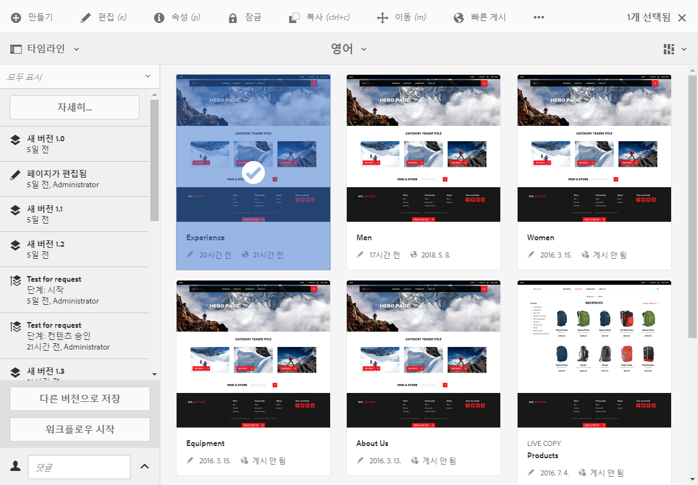
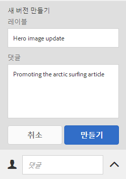
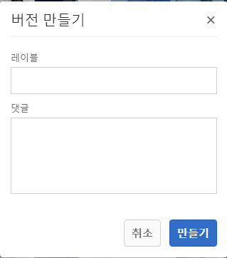
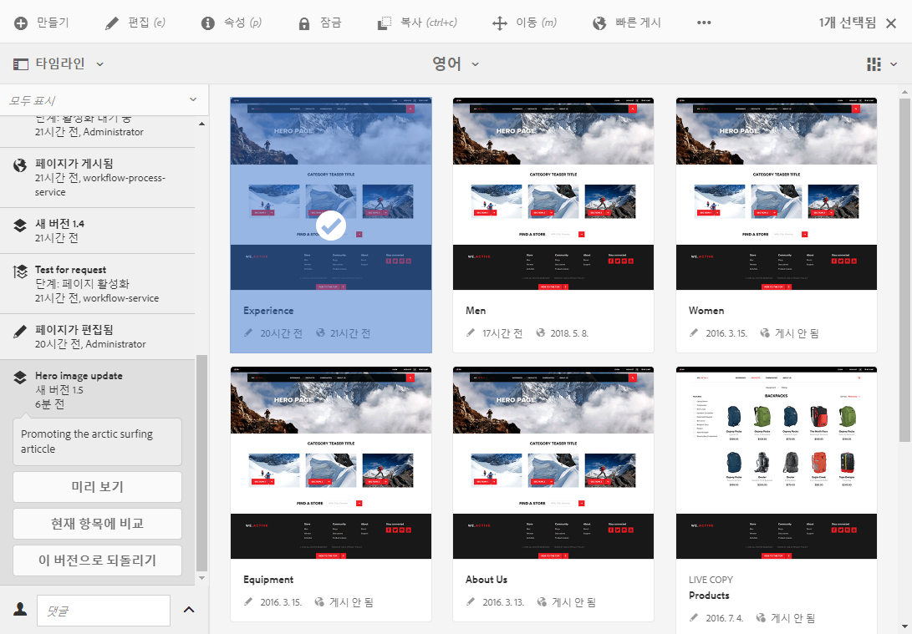
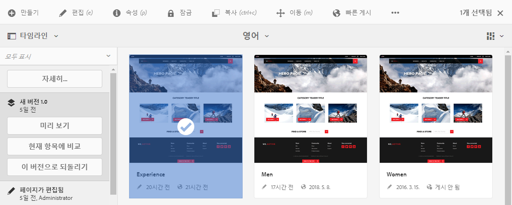
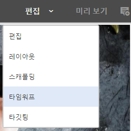
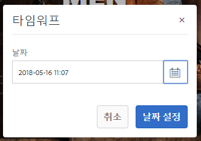
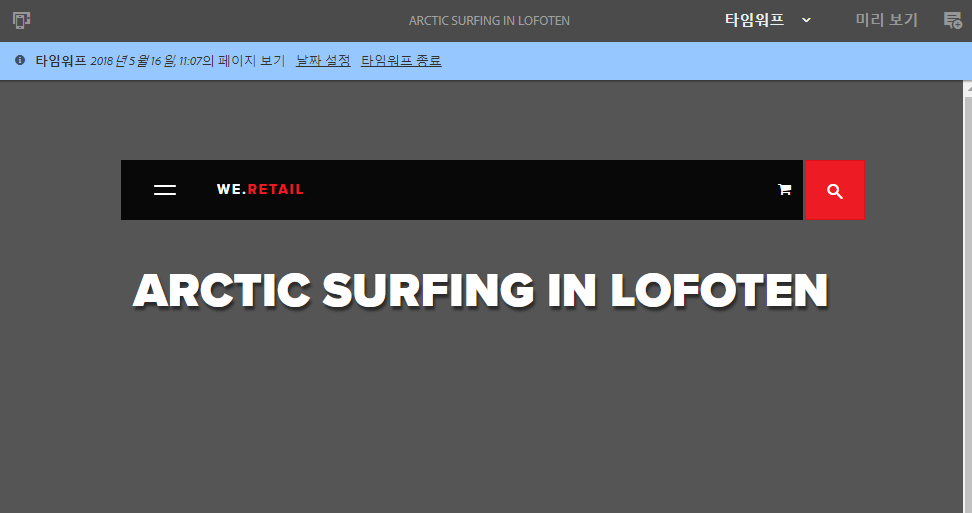

# 페이지 버전을 사용하여 작업{#working-with-page-versions}

>[!CAUTION]
>
>AEM 6.4가 확장 지원이 종료되었으며 이 설명서는 더 이상 업데이트되지 않습니다. 자세한 내용은 [기술 지원 기간](https://helpx.adobe.com/kr/support/programs/eol-matrix.html). 지원되는 버전 찾기 [여기](https://experienceleague.adobe.com/docs/).

버전 매기기를 통해 특정 시점의 페이지 &quot;스냅샷&quot;을 만들 수 있습니다. 버전 관리를 사용하여 다음 작업을 수행할 수 있습니다.

* 페이지 버전을 만듭니다.
* 예를 들어 페이지의 변경을 취소하려면 페이지를 이전 버전으로 복원합니다.
* 강조 표시된 텍스트 및 이미지의 차이점을 사용하여 페이지의 현재 버전을 이전 버전과 비교합니다.

## 새 버전 만들기 {#creating-a-new-version}

다음에서 리소스 버전을 만들 수 있습니다.

* a [타임라인 레일](#creating-a-new-version-timeline)
* a [만들기](#creating-a-new-version-create-with-a-selected-resource) 옵션(리소스를 선택한 경우)

### 새 버전 만들기 - 타임라인 {#creating-a-new-version-timeline}

1. 버전을 만들 페이지로 이동하여 표시합니다.
1. [선택 모드](/help/sites-authoring/basic-handling.md#viewing-and-selecting-resources)로 페이지를 선택합니다.
1. 를 엽니다. **타임라인** 열.
1. 주석 필드 옆에 있는 화살표 머리를 클릭/탭하여 옵션을 나열합니다.

   

1. 선택 **다른 버전으로 저장**.
1. 을(를) 입력합니다. **레이블** 및 **댓글** 필요한 경우.

   

1. **만들기**&#x200B;로 새 버전을 확인합니다.

   타임라인에 있는 정보가 새 버전을 가리키도록 업데이트됩니다.

### 새 버전 만들기 - 선택한 리소스로 만들기 {#creating-a-new-version-create-with-a-selected-resource}

1. 버전을 만들 페이지로 이동하여 표시합니다.
1. [선택 모드](/help/sites-authoring/basic-handling.md#viewing-and-selecting-resources)로 페이지를 선택합니다.
1. 을(를) 선택합니다 **만들기** 옵션 을 클릭합니다.
1. 대화 상자가 열립니다. 필요한 경우 **레이블** 및 **댓글**&#x200B;을 입력할 수 있습니다:

   

1. **만들기**&#x200B;로 새 버전을 확인합니다.

   새 버전을 나타내기 위해 업데이트된 정보가 포함된 타임라인이 열립니다.

## 페이지 버전으로 복구 {#reverting-to-a-page-version}

버전을 만들면 필요할 경우 해당 버전으로 되돌릴 수 있습니다.

>[!NOTE]
>
>페이지를 복원할 때, 만들어진 버전은 새 분기의 일부가 됩니다.
>
>예시:
>
>* 페이지의 버전을 임의로 만듭니다.
>* 초기 레이블 및 버전 노드 이름은 1.0, 1.1, 1.2 등이 됩니다.
>* 첫 번째 버전을 복원합니다. 예: 1.0
>* 새 버전을 다시 만듭니다.
>* 생성된 레이블 및 노드 이름은 이제 1.0.0, 1.0.1, 1.0.2 등이 됩니다.
>

이전 버전으로 되돌리기

1. 이전 버전으로 되돌릴 페이지로 이동하여 표시합니다.
1. [선택 모드](/help/sites-authoring/basic-handling.md#viewing-and-selecting-resources)로 페이지를 선택합니다.
1. **타임라인** 열을 연 다음 **모두 표시** 또는 **버전** 중 하나를 선택합니다. The page versions for the selected page will be listed.
1. 되돌아갈 버전을 선택합니다. 가능한 옵션이 표시됩니다.

   

1. **이 버전으로 되돌리기**&#x200B;를 선택합니다. 선택한 버전이 복원되고 타임라인의 정보가 업데이트됩니다.

## 버전 미리보기 {#previewing-a-version}

특정 버전을 미리 볼 수 있습니다.

1. 비교할 페이지로 이동하여 표시합니다.
1. [선택 모드](/help/sites-authoring/basic-handling.md#viewing-and-selecting-resources)로 페이지를 선택합니다.
1. **타임라인** 열을 연 다음 **모두 표시** 또는 **버전** 중 하나를 선택합니다.
1. 페이지 버전이 나열됩니다. 미리 볼 버전을 선택합니다.

   

1. **미리보기**&#x200B;를 선택합니다. 페이지가 새 탭에 표시됩니다.

   >[!CAUTION]
   >
   >페이지가 이동된 경우 이동 전에 만든 버전에서는 더 이상 미리보기를 수행할 수 없습니다.
   >
   >미리보기에 문제가 발생한 경우 페이지에 대한 [타임라인](/help/sites-authoring/basic-handling.md#timeline)에서 페이지가 이동되었는지 확인합니다.

## 현재 페이지와 버전 비교 {#comparing-a-version-with-current-page}

이전 버전을 현재 페이지와 비교하려면 다음 작업을 수행합니다.

1. 비교할 페이지로 이동하여 표시합니다.
1. [선택 모드](/help/sites-authoring/basic-handling.md#viewing-and-selecting-resources)로 페이지를 선택합니다.
1. **타임라인** 열을 연 다음 **모두 표시** 또는 **버전** 중 하나를 선택합니다.
1. 페이지 버전이 나열됩니다. 비교할 버전을 선택합니다.

   

1. 선택 **현재 항목에 비교**. 다음 [페이지 비교](/help/sites-authoring/page-diff.md) 가 열리고 차이점이 표시됩니다.

## 타임워프 {#timewarp}

타임워프는 과거의 특정 시점에 *게시된* 페이지의 상태를 시뮬레이션하도록 설계된 기능입니다.

이 기능의 목적은 선택한 시점에 게시된 웹 사이트를 추적할 수 있도록 하기 위한 것입니다. 여기서는 페이지 버전을 사용하여 게시 환경의 상태를 확인합니다.

이를 위해 진행되는 작업:

* 시스템이 선택한 시간에 활성 상태인 페이지 버전을 찾습니다.
* 즉, 표시된 버전이 생성/활성화되었음을 의미합니다 *이전* 타임워프에서 선택한 시점입니다.
* 삭제된 페이지로 이동하더라도 페이지의 이전 버전이 보관소에서 남아 있어 사용할 수 있는 경우에는 해당 페이지가 렌더링됩니다.
* 게시된 버전을 찾을 수 없으면 타임워프는 작성 환경의 현재 페이지 상태로 돌아갑니다. 그래야만 더 이상 검색할 수 없음을 의미하는 오류/404 페이지가 나타나지 않기 때문입니다.

### 타임워프 사용 {#using-timewarp}

타임워프는 [모드](/help/sites-authoring/author-environment-tools.md#page-modes) 페이지 편집기: 시작하려면 다른 모드처럼 전환하면 됩니다.

1. 타임워프를 시작할 페이지의 편집기를 시작한 다음 을 선택합니다 **타임워프** 모드 선택

   

1. In the dialogue set a target date and time and click or tap **Set Date**. If you do not select a time, the current time will default.

   

1. 날짜 세트를 기준으로 페이지가 표시됩니다. 창 상단에 있는 파란색 상태 표시줄을 통해 타임워프 모드가 표시됩니다. 상태 표시줄의 링크를 사용하여 새 대상 날짜를 선택하거나 타임워프 모드를 종료합니다.

   

### 타임워프 제한 사항

타임워프는 선택한 시점의 페이지를 재현하는 데 최선의 노력을 다합니다. 그러나 AEM에서 콘텐츠를 지속해서 작성하는 과정의 복잡성으로 인해 항상 그럴 수는 없습니다. 타임워프를 사용할 때에는 다음 제한 사항을 염두에 두어야 합니다.

* **타임워프는 게시된 페이지를 기반으로 작동합니다.** 타임워프는 사용자가 페이지를 이전에 게시한 적이 있는 경우에만 제대로 작동합니다. 그렇지 않으면 작성 환경에 현재 페이지가 표시됩니다.
* **타임워프는 페이지 버전을 사용합니다.** 저장소에서 제거/삭제된 페이지로 이동하더라도 페이지의 이전 버전이 저장소에 남아 있어 사용할 수 있는 경우 해당 페이지가 제대로 렌더링됩니다.
* **제거된 버전은 타임워프에 영향을 줍니다.** 저장소에서 버전이 제거되면 타임워프는 올바른 보기를 표시할 수 없습니다.
* **타임워프는 읽기 전용입니다.** 페이지의 이전 버전은 편집할 수 없으며, 볼 수만 있습니다. 이전 버전을 복원하려면 복원을 사용하여 수동으로 복원해야 합니다.
* **타임워프는 페이지 콘텐츠만을 기반으로 합니다.** 웹 사이트를 렌더링하기 위한 요소(예: 코드, css, 에셋/이미지 등)가 변경된 경우 저장소에서는 해당 항목의 버전이 관리되지 않으므로 보기가 원래와 달라집니다.

>[!CAUTION]
>
>타임워프는 작성자가 컨텐츠를 이해하고 작성하는 데 도움이 되는 도구로 설계되었습니다. 감사 로그나 법적 목적이 아닙니다.
