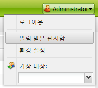
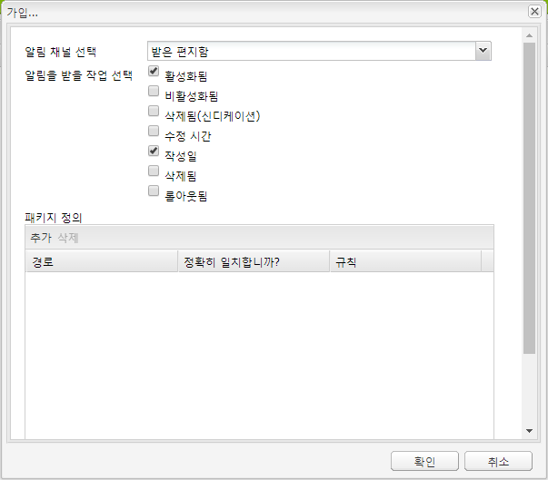

# 받은 편지함{#your-inbox}

AEM의 다양한 영역에서 알림을 받을 수 있습니다. 예를 들어 페이지 컨텐츠에서 수행해야 하는 작업을 나타내는 작업 항목이나 작업에 대한 알림을 받을 수 있습니다.

알림 유형별로 구분하여 두 개의 받은 편지함에서 이러한 알림을 수신합니다.

* 가입의 결과로 수신한 알림을 볼 수 있는 받은 편지함은 다음 섹션에 설명되어 있습니다.
* 워크플로우 항목에 대한 전문 받은 편지함은 [Workflows에 참여](/help/sites-classic-ui-authoring/classic-workflows-participating.md) 문서에 설명되어 있습니다.

## 알림 보기 {#viewing-your-notifications}

알림 보기

1. 알림 받은 편지함을 엽니다. **웹 사이트** 콘솔에서 오른쪽 위 모서리의 사용자 단추를 클릭하고 **알림 받은 편지함**&#x200B;을 선택합니다.

   

   >[!NOTE]
   >
   >다음과 같이 브라우저에서 직접 콘솔에 액세스할 수도 있습니다.
   >
   >` https://<host>:<port>/libs/wcm/core/content/inbox.html`

1. 알림이 나열됩니다. 필요한 작업을 수행할 수 있습니다.

   * [알림에 가입](#subscribing-to-notifications)
   * [알림 처리](#processing-your-notifications)

   

## 알림에 가입 {#subscribing-to-notifications}

알림에 가입하는 방법은 다음과 같습니다.

1. 알림 수신함을 엽니다. **웹 사이트** 콘솔에서 오른쪽 위 모서리의 사용자 단추를 클릭하고 **알림 수신함**&#x200B;을 선택합니다.

   

   >[!NOTE]
   >
   >다음과 같이 브라우저에서 직접 콘솔에 액세스할 수도 있습니다.
   >
   >`https://<host>:<port>/libs/wcm/core/content/inbox.html`

1. 왼쪽 위 모서리에서 **구성...**&#x200B;을 클릭하여 구성 대화 상자를 엽니다.

   

1. 알림 채널을 선택합니다.

   * **받은 편지함**: AEM 받은 편지함에 알림이 표시됩니다.
   * **이메일**: 사용자 프로필에 정의된 이메일 주소로 알림이 발송됩니다.

   >[!NOTE]
   >
   >이메일을 통해 알림을 받으려면 몇 가지 설정을 구성해야 합니다. 이메일 템플릿을 사용자 지정하거나 새 언어의 이메일 템플릿을 추가할 수도 있습니다. AEM에서 이메일 알림을 구성하려면 [이메일 알림 구성](/help/sites-administering/notification.md#configuringemailnotification)을 참조하십시오.

1. 알림을 받을 페이지 작업을 선택합니다.

   * 활성화됨: 페이지가 활성화되었을 때
   * 비활성화됨: 페이지가 비활성화되었을 때
   * 삭제됨(신디케이션): 페이지 삭제가 복제되었을 때, 즉 페이지에 수행된 삭제 작업이 복제되었을 때

      페이지가 삭제되거나 이동하면 삭제 작업이 자동으로 복제됩니다. 즉, 삭제 작업이 수행된 소스 인스턴스뿐 아니라 복제 에이전트가 정의하는 대상 인스턴스에서도 페이지가 삭제됩니다.

   * 수정됨: 페이지가 수정되었을 때
   * 작성일: 페이지가 만들어졌을 때
   * 삭제됨: 페이지 삭제 작업을 통해 페이지가 삭제되었을 때
   * 롤아웃됨: 페이지가 롤아웃되었을 때

1. 알림을 받을 페이지의 경로를 정의합니다.

   * **추가**&#x200B;를 클릭하여 표에 새 행을 추가합니다.
   * **경로** 테이블 셀을 클릭하고 경로(예: )를 입력합니다.`/content/docs`
   * 하위 트리에 속하는 모든 페이지에 대한 알림을 받으려면 **정확히 일치합니까?**&#x200B;를 **아니요**&#x200B;로 설정합니다.

      경로에 정의된 페이지의 작업에 대해서만 알림을 받으려면 **정확히 일치합니까?**&#x200B;를 **예**&#x200B;로 설정합니다.

   * 규칙을 허용하려면 **규칙**&#x200B;을 **허용**&#x200B;으로 설정합니다. **거부**&#x200B;로 설정하면 규칙이 거부되지만 제거되지는 않으므로 나중에 허용할 수 있습니다.

   정의를 제거하려면 표 셀을 클릭하여 행을 선택하고 **삭제**&#x200B;를 클릭합니다.

1. **확인**&#x200B;을 클릭하여 구성을 저장합니다.

## 알림 처리 {#processing-your-notifications}

AEM 받은 편지함에서 알림을 수신하도록 선택한 경우 받은 편지함이 알림으로 가득 찰 수 있습니다. 알림을 [본 다음, ](#viewing-your-notifications) 필요한 알림을 선택할 수 있습니다.

* **승인**&#x200B;을 클릭하여 승인합니다. **읽기** 열의 값이 **true**&#x200B;로 설정됩니다.

* **삭제**&#x200B;를 클릭하여 삭제합니다.

