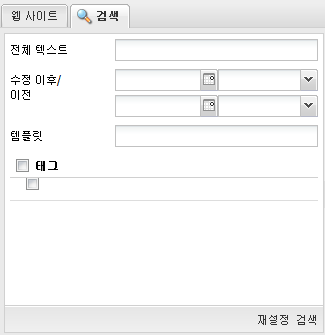

# 검색{#search-features}

>[!CAUTION]
>
>AEM 6.4가 확장 지원이 종료되었으며 이 설명서는 더 이상 업데이트되지 않습니다. 자세한 내용은 [기술 지원 기간](https://helpx.adobe.com/kr/support/programs/eol-matrix.html). 지원되는 버전 찾기 [여기](https://experienceleague.adobe.com/docs/).

AEM의 작성 환경에서는 리소스 유형에 따라 콘텐츠를 검색하기 위한 다양한 메커니즘을 제공합니다.

>[!NOTE]
>
>작성 환경 외부에서 와 같은 다른 메커니즘도 검색할 수 있습니다 [Query Builder](/help/sites-developing/querybuilder-api.md) 및 [CRXDE Lite](/help/sites-developing/developing-with-crxde-lite.md).

## 검색 기본 사항 {#search-basics}

검색 패널에 액세스하려면 **검색** 해당 콘솔의 왼쪽 창 상단에 있는 탭.

검색 패널에서 모든 웹 사이트 페이지를 검색할 수 있습니다. 여기에는 다음에 대한 필드와 위젯이 포함되어 있습니다.

* **전체 텍스트**: 지정된 텍스트를 검색합니다
* **수정 후/이전**: 특정 날짜 사이에 변경된 페이지만 검색
* **템플릿**: 지정된 템플릿을 기준으로 해당 페이지만 검색
* **태그**: 지정된 태그가 있는 페이지만 검색

>[!NOTE]
>
>인스턴스가에 대해 구성된 경우 [Lucene 검색](/help/sites-deploying/queries-and-indexing.md) 에서 다음을 사용할 수 있습니다. **전체 텍스트**:
>
>* [와일드카드](https://lucene.apache.org/core/5_3_1/queryparser/org/apache/lucene/queryparser/classic/package-summary.html#Wildcard_Searches)
>* [부울 연산자](https://lucene.apache.org/core/5_3_1/queryparser/org/apache/lucene/queryparser/classic/package-summary.html#Boolean_operators)
>
>* [정규 표현식](https://lucene.apache.org/core/5_3_1/queryparser/org/apache/lucene/queryparser/classic/package-summary.html#Regexp_Searches)
>* [필드 그룹화](https://lucene.apache.org/core/5_3_1/queryparser/org/apache/lucene/queryparser/classic/package-summary.html#Field_Grouping)
>* [증폭](https://lucene.apache.org/core/5_3_1/queryparser/org/apache/lucene/queryparser/classic/package-summary.html#Boosting_a_Term)
>

을 클릭하여 검색을 실행합니다. **검색** 창 하단에 있습니다. 클릭 **재설정** 검색 기준을 지우려면

## 필터 {#filter}

다양한 위치에서 필터를 설정(및 선택)하여 보기를 드릴다운하고 세분화할 수 있습니다.

## 찾기 및 바꾸기 {#find-and-replace}

에서 **웹 사이트** 콘솔 a **찾기 및 바꾸기** 메뉴 옵션을 사용하면 웹 사이트의 섹션 내에서 문자열을 반복하여 찾거나 바꿀 수 있습니다.

1. 찾기 및 바꾸기 작업을 수행할 루트 페이지 또는 폴더를 선택합니다.
1. 선택 **도구** 그런 다음 **찾기 및 바꾸기**:

   

1. 다음 **찾기 및 바꾸기** 대화 상자에서 다음을 수행합니다.

   * 찾기 작업이 시작되는 루트 경로를 확인합니다.
   * 찾을 단어를 정의합니다.
   * 바꿀 단어를 정의합니다.
   * 검색에서 대/소문자를 구분해야 하는지를 나타냅니다.
   * 단어 단위만 찾을지 여부를 나타냅니다(그렇지 않으면 부분 문자열도 찾음).

   클릭 **미리 보기** 용어를 찾은 위치를 나열합니다. 바꿀 특정 인스턴스를 선택하거나 지울 수 있습니다.

   

1. 클릭 **바꾸기** 를 눌러 모든 인스턴스를 실제로 바꿉니다. 작업을 확인하는 메시지가 나타납니다.

찾기 및 바꾸기 서블릿의 기본 범위에는 다음 속성이 포함됩니다.

* `jcr:title`
* `jcr:description`
* `jcr:text`
* `text`

Apache Felix 웹 관리 콘솔(예: )을 사용하면 범위를 변경할 수 있습니다. `http://localhost:4502/system/console/configMgr`). 선택 `CQ WCM Find Replace Servlet (com.day.cq.wcm.core.impl.servlets.FindReplaceServlet)` 필요에 따라 범위를 구성합니다.

>[!NOTE]
>
>표준 AEM 설치에서 찾기 및 바꾸기는 Lucene을 사용하여 검색 기능을 사용합니다.
>
>Lucene은 최대 16k 길이의 문자열 속성을 인덱싱합니다. 이 길이를 초과하는 문자열은 검색되지 않습니다.
