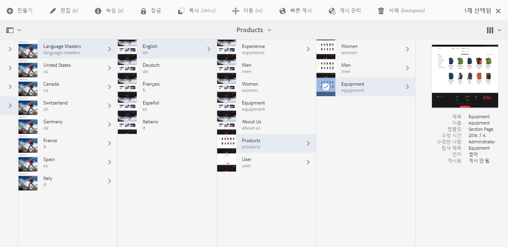
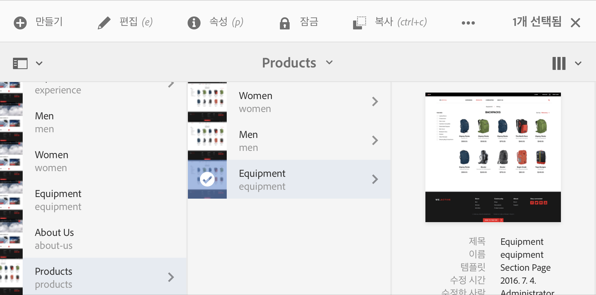

# 작성 환경 사용{#working-with-the-author-environment}

>[!CAUTION]
>
>AEM 6.4가 확장 지원이 종료되었으며 이 설명서는 더 이상 업데이트되지 않습니다. 자세한 내용은 [기술 지원 기간](https://helpx.adobe.com/kr/support/programs/eol-matrix.html). 지원되는 버전 찾기 [여기](https://experienceleague.adobe.com/docs/).

>[!NOTE]
>
>다음 설명서는 클래식 UI에 중점을 둡니다. 터치가 활성화된 최신 UI에서의 작성에 대한 자세한 내용은 [표준 작성 설명서](/help/assets/assets.md).

작성 환경을 사용하면 다음과 관련된 작업을 수행할 수 있습니다.

* [작성](/help/sites-authoring/author.md) (포함) [페이지 작성](/help/sites-authoring/qg-page-authoring.md) 및 [자산 관리](/help/assets/assets.md))

* [관리](/help/sites-administering/administer-best-practices.md) 웹 사이트에서 컨텐츠를 생성하고 유지 관리할 때 필요한 작업

이를 위해 두 개의 그래픽 사용자 인터페이스가 제공되며, 이러한 인터페이스는 최신 브라우저를 통해 액세스할 수 있습니다.

1. 클래식 UI

   * 이 UI는 오랫동안 AEM에서 사용할 수 있었습니다.
   * 주로 녹색입니다.
   * 데스크탑 장치에서 사용하도록 설계되었습니다.
   * 더 이상 유지 관리되지 않습니다.
   * 다음 설명서는 이 클래식 UI에 중점을 둡니다. 최신 터치 기반 UI에서 작성하는 방법에 대한 자세한 내용은 [표준 작성 설명서](/help/sites-authoring/author.md).
   

1. 터치 활성화 UI

   * 최신 표준 AEM UI입니다.
   * 대개 회색이며 깔끔하고 평면 인터페이스입니다.
   * 터치 및 데스크톱 장치 모두에서 사용하도록 설계되었습니다(터치에 적합). 모든 장치에서 모양과 느낌은 동일합니다 [리소스 보기 및 선택](/help/sites-authoring/basic-handling.md) 약간 다릅니다(탭과 클릭).
   * 자세한 내용은 [표준 작성 설명서](/help/sites-authoring/author.md) 를 참조하십시오. 다음 설명서는 클래식 UI에 중점을 둡니다.

   * 데스크탑:
   

   * 태블릿 장치(또는 폭이 1024픽셀 미만인 데스크톱):
   
