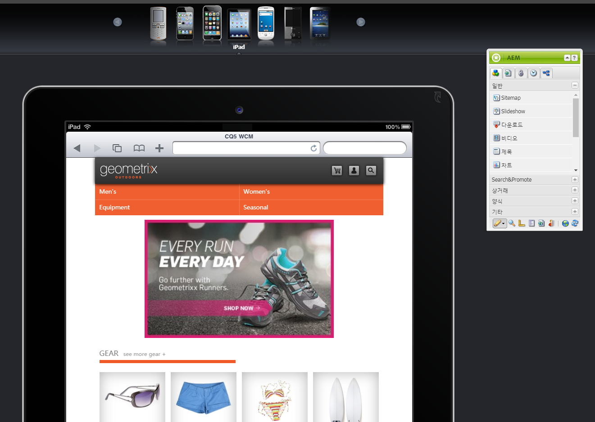

# 모바일 디바이스용 페이지 작성{#authoring-a-page-for-mobile-devices}

>[!CAUTION]
>
>AEM 6.4가 확장 지원이 종료되었으며 이 설명서는 더 이상 업데이트되지 않습니다. 자세한 내용은 [기술 지원 기간](https://helpx.adobe.com/kr/support/programs/eol-matrix.html). 지원되는 버전 찾기 [여기](https://experienceleague.adobe.com/docs/).

모바일 페이지를 작성할 때는 모바일 디바이스를 에뮬레이션하는 방식으로 페이지가 표시됩니다. 페이지를 작성할 때 여러 에뮬레이터 간을 전환하여 페이지에 액세스할 때 최종 사용자에게 표시되는 내용을 확인할 수 있습니다.

디바이스는 페이지를 렌더링할 디바이스의 기능에 따라 카테고리 기능, 스마트와 터치로 그룹화됩니다. 최종 사용자가 모바일 페이지에 액세스하면 AEM이 디바이스를 감지하여 디바이스 그룹에 해당하는 표현 데이터를 전송합니다.

>[!NOTE]
>
>기존 표준 사이트를 기반으로 모바일 사이트를 만들려면 표준 사이트의 Live Copy를 만드십시오. (자세한 내용은 [다른 채널용 Live Copy 만들기](/help/sites-administering/msm-livecopy.md))
>
>AEM 개발자는 새 디바이스 그룹을 만들 수 있습니다. (자세한 내용은 [장치 그룹 필터 만들기](/help/sites-developing/groupfilters.md))

다음 절차를 사용하여 모바일 페이지를 작성하십시오.

1. 브라우저에서 **Siteadmin** 콘솔.
1. 를 엽니다. **제품** 아래의 페이지 **웹 사이트** >> **Geometrixx 모바일 데모 사이트** >> **영어**.

1. 다른 에뮬레이터로 전환합니다. 이렇게 하려면 다음 중 하나를 수행할 수 있습니다.

   * 페이지 상단에 있는 장치 아이콘을 클릭합니다.
   * 을(를) 클릭합니다. **편집** 단추 **사이드킥입니다** 그리고 드롭다운 메뉴에서 장치를 선택합니다.

1. 을(를) 끌어다 놓습니다 **텍스트 및 이미지** 구성 요소를 생성하지 않습니다.
1. 구성 요소를 편집하고 텍스트를 추가합니다. 클릭 **확인** 변경 사항을 저장하려면 을 클릭합니다.

페이지는 다음과 동일하게 표시됩니다.

>[!NOTE]
>
>모바일 디바이스에서 작성 인스턴스의 페이지를 요청하면 에뮬레이터가 비활성화됩니다. 그런 다음 터치 지원 UI를 사용하여 작성을 수행할 수 있습니다.
