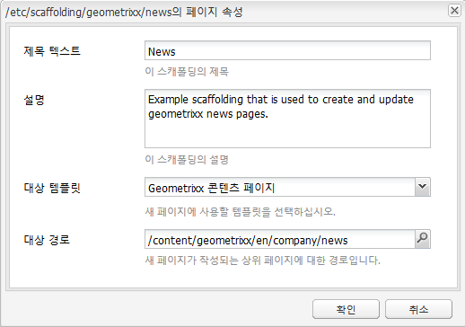
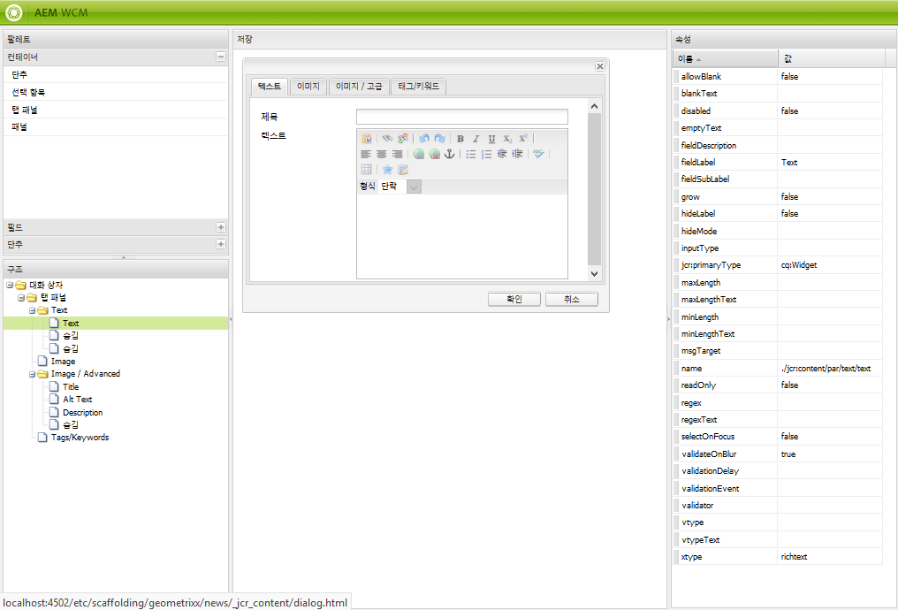
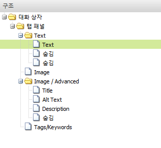
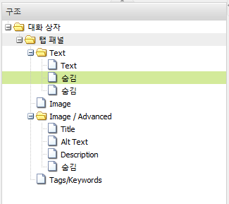
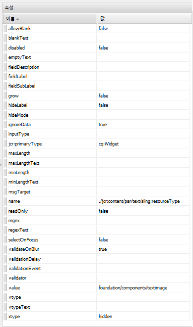

# 스캐폴딩{#scaffolding}

구조는 동일하면서 내용이 다른 페이지를 여러 개 만들어야 하는 경우가 있습니다. 표준 AEM 인터페이스를 사용하는 경우에는 각 페이지를 만들고 페이지에 해당 구성 요소를 드래그한 후 각 구성 요소를 채워야 합니다.

스캐폴딩을 사용하면 페이지에 적용할 구조를 반영하는 필드가 포함된 양식(스캐폴드)을 만든 후 이 양식을 이용하여 해당 구조를 갖는 페이지를 손쉽게 만들 수 있습니다.

>[!NOTE]
>
>스캐폴딩(클래식 UI)[은 MSM 상속을 따릅니다](#scaffolding-with-msm-inheritance).

## 스캐폴딩의 작동 원리 {#how-scaffolding-works}

스캐폴드는 사이트 관리의 **도구** 콘솔에 저장됩니다.

* **도구** 콘솔을 열고 **기본 페이지 스캐폴딩**&#x200B;을 클릭합니다.

* 아래에서 **geometrixx**&#x200B;를 클릭합니다.
* **geometrixx** 아래에 **뉴스**&#x200B;라는 *스캐폴드 페이지*&#x200B;가 있습니다. 이 페이지를 두 번 클릭하여 엽니다.

Scaffold는 작성할 페이지를 이루는 각 컨텐트 부분에 대한 필드가 포함된 양식과 Scaffold 페이지의 **페이지 속성**&#x200B;을 통해 액세스하는 중요한 4가지 매개 변수로 구성됩니다.

스캐폴딩 페이지 속성은 다음과 같습니다.

* **제목 텍스트**: 해당 스캐폴딩 페이지 자체의 이름입니다. 이 예제에서는 &quot;뉴스&quot;입니다.
* **설명**: 스캐폴딩 페이지 제목 아래에 표시됩니다.
* **타겟 템플릿**: 새 페이지를 만들 때 스캐폴드에서 사용할 템플릿입니다. 이 예제에서는 *Geometrrixx 컨텐츠 페이지* 템플릿입니다.

* **타겟 경로**: 바로 아래에 새 페이지를 만들 상위 페이지의 경로입니다. 이 예제에서 경로는 */content/geometrixx/en/news*&#x200B;입니다.

스캐폴드의 본문은 양식입니다. 스캐폴드를 사용하여 페이지를 만들려면 양식을 입력한 후 아래쪽에 있는 *만들기*&#x200B;를 클릭합니다. 양식 위의 **뉴스** 예제에는 다음과 같은 필드가 있습니다.

* **제목**: 만들 페이지의 이름입니다. 이 필드는 모든 스캐폴드에 항상 있습니다.
* **텍스트**: 이 필드는 결과 페이지의 텍스트 구성 요소에 해당합니다.
* **이미지**:이 필드는 결과 페이지의 이미지 구성 요소에 해당합니다.
* **이미지/고급**: **제목**: 이미지의 제목입니다.

* **이미지/고급**: **대체 텍스트**: 이미지의 대체 텍스트입니다.

* **이미지/고급**: **설명**:이미지의 설명입니다.

* **이미지/고급**: **크기**: 이미지의 크기입니다.

* **태그/키워드**: 이 페이지에 지정할 메타데이터입니다. 이 필드는 모든 스캐폴드에 항상 있습니다.

## 스캐폴드 만들기 {#creating-a-scaffold}

새 Scaffold를 만들려면 **도구** 콘솔로 이동한 다음 **기본 페이지 Scaffolding** 페이지를 만들고 새 페이지를 만듭니다. 단일 페이지 템플릿 유형인 *스캐폴딩 템플릿을 사용할 수 있습니다.*

*새 페이지의&#x200B;**페이지**속성으로 이동하고 위에 설명된 대로*&#x200B;제목 텍스트&#x200B;*,*&#x200B;설명&#x200B;*,* Target *템플릿 및* Target 경로&#x200B;*를 설정합니다.*

*다음으로는 이 Scaffold가 만드는 페이지의 구조를 정의해야 합니다. 이렇게 하려면 Scaffold 페이지에서 디자인 모드로 전환합니다. **대화 상자 편집기**&#x200B;에서 Scaffold를 편집할 수 있는 링크가 나타납니다.

대화 상자 편집기를 사용하여 이 스캐폴드를 사용하여 새 페이지를 만들 때마다 만들 속성을 지정합니다.

스캐폴드의 대화 상자 정의는 구성 요소의 대화 상자 정의와 비슷합니다([구성 요소](/help/sites-developing/components.md) 참조). 그러나 몇 가지 중요한 차이점이 있습니다.

* 구성 요소 대화 상자 정의는 대화 상자 편집기의 가운데 창과 같이 일반적인 대화 상자로 렌더링되는 반면, 스캐폴드 대화 상자 정의는 대화 상자 편집기에서 일반적인 대화 상자처럼 보이기는 하지만 위의 **뉴스** 스캐폴드와 같이 스캐폴드 페이지에 스캐폴드 양식으로 렌더링됩니다.
* 구성 요소 대화 상자에는 특정 구성 요소 하나의 내용을 정의하는 데 필요한 값에 대한 필드만 있습니다. 스캐폴드 대화 상자에는 작성할 페이지의 모든 단락에 있는 모든 속성에 대한 필드가 있어야 합니다.
* 구성 요소 대화 상자에서는 지정된 컨텐츠를 렌더링하는 데 사용되는 구성 요소가 정해져 있으므로 단락을 만들 때 단락의 `sling:resourceType` 속성이 자동으로 채워집니다. 스캐폴드를 사용할 때는 특정 단락의 컨텐츠와 지정된 구성 요소를 정의하는 정보를 대화 상자 자체에서 모두 제공해야 합니다. 스캐폴드 대화 상자에서는 페이지 작성 시 *숨김* 필드로 이러한 정보를 제공해야 합니다.

대화 상자 편집기에서 **뉴스** 스캐폴드 대화 상자 예제를 살펴보면 이러한 원리를 이해하는 데 도움이 됩니다. 스캐폴드 페이지에서 디자인 모드로 전환하고 대화 상자 편집기 링크를 클릭합니다.

이제 다음과 같이 대화 상자 필드 **대화 상자 > 탭 패널 > 텍스트 > 텍스트**&#x200B;를 클릭합니다.

다음과 같이 대화 상자 편집기 오른쪽에 이 필드의 속성 목록이 나타납니다.

이 필드의 이름 속성을 확인합니다. 이 필드의 값은

./jcr:content/par/text/text

이 값은 스캐폴드를 사용하여 페이지를 만들 때 이 필드의 내용으로 채울 속성의 이름입니다. 이 속성은 작성할 페이지를 나타내는 노드를 기준으로 하는 상대 경로로 지정됩니다. 이 경우에 지정되는 속성인 text는 text 노드 아래에 있고, 이 노드는 par 노드 아래에 있으며, 이 노드는 페이지 노드 아래의 jcr:content 노드 아래에 있습니다.

이 필드에 입력할 텍스트의 컨텐츠 저장 위치를 정의합니다. 그러나 이 컨텐츠의 두 가지 특성을 더 지정해야 합니다.

* 여기에 저장되는 문자열을 *리치 텍스트*&#x200B;로 해석해야 한다는 점
* 이 컨텐츠를 결과 페이지로 렌더링하는 데 사용할 구성 요소

일반적인 구성 요소 대화 상자에서는 대화 상자가 이미 특정 구성 요소에 바인딩되어 있으므로 이러한 정보를 지정할 필요가 없습니다.

이러한 두 가지 정보를 지정하려면 숨김 필드를 사용합니다. 다음과 같이 첫 번째 숨김 필드 **대화 상자 > 탭 패널 > 텍스트 > 숨김**&#x200B;을 클릭하십시오.

이 숨김 필드의 속성은 다음과 같습니다.

이 숨김 필드의 이름 속성은 다음과 같습니다.

`./jcr:content/par/text/textIsRich`

이 속성은 `./jcr:content/par/text/text.`에 저장된 텍스트 문자열을 해석하는 데 사용되는 부울 속성입니다

텍스트를 리치 텍스트로 해석해야 하므로 이 필드의 `value` 속성을 `true`로 지정합니다.

>[!CAUTION]
>
>대화 상자 편집기를 사용하면 대화 상자 정의에서 *기존* 속성의 값을 변경할 수 있습니다. 새 속성을 추가하려면 [CRXDE Lite](/help/sites-developing/developing-with-crxde-lite.md)를 사용해야 합니다. 예를 들어 대화 상자 편집기로 대화 상자 정의에 새 숨김 필드를 추가하면 필드에 *값* 속성(이름이 &quot;값&quot;인 속성)이 없습니다. 해당 숨김 필드에 기본 *값* 속성을 설정해야 하는 경우에는 CRX 도구 중 하나를 사용하여 이 속성을 직접 추가해야 합니다. 대화 상자 편집기에서는 값을 추가할 수 없습니다. 그러나 속성이 추가된 후에는 대화 상자 편집기로 값을 편집할 수 있습니다.

두 번째 숨김 필드를 보려면 다음과 같이 클릭합니다.

이 숨김 필드의 속성은 다음과 같습니다.

이 숨김 필드의 이름 속성은 다음과 같습니다.

`./jcr:content/par/text/sling:resourceType`

이 속성에 지정된 고정 값은 다음과 같습니다.

`foundation/components/textimage`

``이 값은 이 단락의 텍스트 내용을 렌더링하는 데 사용할 구성 요소가 *텍스트 이미지* 구성 요소임을 나타냅니다. 다른 숨김 필드에 지정된 `isRichText` 부울과 함께 사용하면 구성 요소는 `./jcr:content/par/text/text`에 저장된 실제 텍스트 문자열을 원하는 방식으로 렌더링할 수 있습니다.

## MSM 상속이 있는 스캐폴딩 {#scaffolding-with-msm-inheritance}

클래식 UI에서 스캐폴딩은 MSM 상속(적용 가능한 경우)과 완전히 통합됩니다.

**스캐폴딩** 모드에서 페이지를 열면(사이드 킥 하단에 있는 아이콘 사용) 상속할 수 있는 구성 요소가 다음으로 표시됩니다.

* 잠금 기호(텍스트 및 제목과 같은 대부분의 구성 요소)
* **상속을 취소하려면 클릭하십시오.** 텍스트가 표시되는 마스크(이미지 구성 요소)

이러한 항목은 상속이 취소될 때까지 구성 요소를 편집할 수 없음을 나타냅니다.

>[!NOTE]
>
>이것은 ](/help/sites-authoring/editing-content.md#inheritedcomponentsclassicui)페이지 컨텐츠를 편집할 때 상속되는 구성 요소[와 비슷합니다.

잠금 기호 또는 이미지 아이콘을 클릭하여 상속을 깰 수 있습니다.

* 기호는 열린 자물쇠로 변경됩니다.
* 잠금이 해제되면 컨텐츠를 편집할 수 있습니다.

잠금을 해제한 후 잠금 해제된 자물쇠 기호를 클릭하여 상속을 복원할 수 있습니다. 이렇게 하면 모든 편집 내용이 손실됩니다.

>[!NOTE]
>
>페이지 수준(페이지 속성의 Livecopy 탭에서)에서 상속이 취소되면 모든 구성 요소는 **Scaffolding** 모드에서 편집할 수 있습니다(잠금 해제된 상태로 표시됨).
