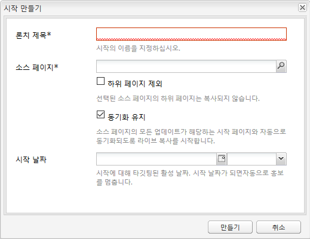
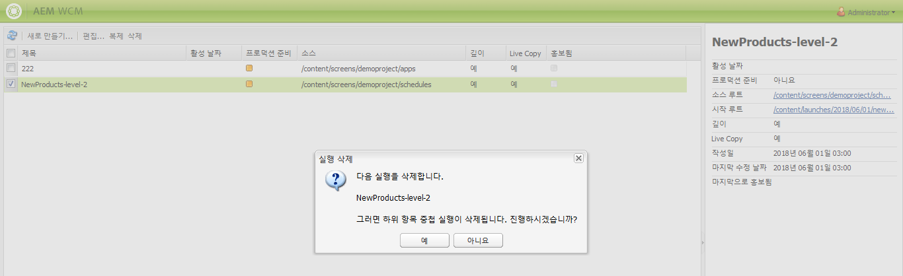

# 론치 만들기{#creating-launches}

>[!CAUTION]
>
>AEM 6.4가 확장 지원이 종료되었으며 이 설명서는 더 이상 업데이트되지 않습니다. 자세한 내용은 [기술 지원 기간](https://helpx.adobe.com/kr/support/programs/eol-matrix.html). 지원되는 버전 찾기 [여기](https://experienceleague.adobe.com/docs/).

론치를 만들어 향후 활성화할 수 있도록 기존 웹 페이지의 새 버전 업데이트를 활성화할 수 있습니다. 론치를 만들 때에는 제목과 소스 페이지를 지정합니다.

* 제목은 **사이드킥입니다**: 작성자가 액세스하여 작업할 수 있는 곳.
* 소스 페이지의 하위 페이지는 기본적으로 론치에 포함됩니다. 원하는 경우 소스 페이지만 사용할 수 있습니다.
* 기본적으로 [Live Copy](/help/sites-administering/msm.md) 소스 페이지가 변경될 때 론치 페이지가 자동으로 업데이트됩니다. 정적 사본을 만들어 자동 변경을 방지하도록 지정할 수 있습니다.

Optionally, you can specify the **Launch Date** (and time) to define when the launch pages are to be promoted and activated. However the **Launch Date** only operates in combination with the **Production Ready** flag (see [Editing a Launch Configuration](/help/sites-classic-ui-authoring/classic-launches-editing.md#editing-a-launch-configuration)); for the actions to actually occur automatically, both must be set.

## 론치 만들기 {#creating-a-launch}

다음 절차에서는 론치를 만듭니다.

1. 웹 사이트 관리 페이지([http://localhost:4502/siteadmin](http://localhost:4502/siteadmin)).
1. 클릭 **새로 만들기...** 그런 다음 **새 실행...**.
1. 에서 **론치 만들기** 대화 상자에서 다음 속성에 대한 값을 지정합니다.

   * **론치 제목**: 론치의 이름입니다. 작성자에게는 의미가 있어야 합니다.
   * **소스 페이지**: 론치를 만들 페이지의 경로입니다. 기본적으로 모든 하위 페이지가 포함됩니다.
   * **하위 페이지 제외**: 하위 페이지가 아닌 소스 페이지에 대한 론치만 생성하려면 이 옵션을 선택합니다. 기본적으로 이 옵션은 선택되어 있지 않습니다.
   * **동기화 유지**: 이 옵션을 선택하면, 소스 페이지가 변경될 때 론치 페이지 내용이 자동으로 업데이트됩니다. 이것은 론치를 [live copy](/help/sites-administering/msm.md).
   * **론치 날짜**: 론치 카피가 활성화될 날짜 및 시간입니다(**프로덕션 준비** 플래그에 따라 다름). [론치 - 이벤트 순서](/help/sites-authoring/launches.md#launches-the-order-of-events)를 참조하십시오.

   

1. **만들기**&#x200B;를 클릭합니다.

## 론치 삭제 {#deleting-a-launch}

론치를 삭제할 수도 있습니다.

1. 에서 [론치 콘솔](/help/sites-classic-ui-authoring/classic-launches.md)필요한 론치를 선택합니다.
1. 클릭 **삭제** - 확인이 필요합니다.

   

   >[!CAUTION]
   >
   >중첩 론치를 삭제할 때는 낮은 수준을 먼저 삭제해야 합니다.
