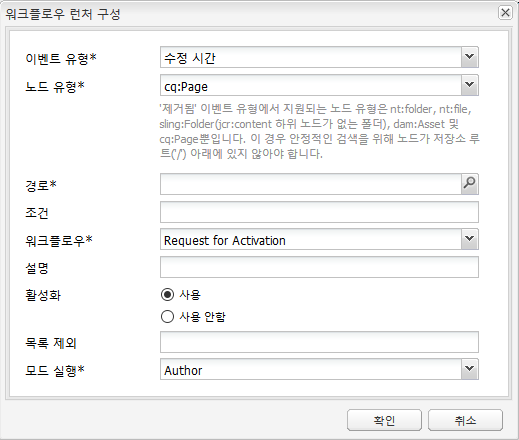

# 론치 홍보{#promoting-launches}

>[!CAUTION]
>
>AEM 6.4가 확장 지원이 종료되었으며 이 설명서는 더 이상 업데이트되지 않습니다. 자세한 내용은 [기술 지원 기간](https://helpx.adobe.com/kr/support/programs/eol-matrix.html). 지원되는 버전 찾기 [여기](https://experienceleague.adobe.com/docs/).

게시 전에 콘텐츠를 소스(프로덕션)로 다시 이동하려면 론치 페이지를 홍보해야 합니다. 론치 페이지가 홍보되면 해당 소스 페이지가 홍보된 페이지의 콘텐츠로 바뀝니다. 론치 페이지를 승격할 때 다음 옵션을 사용할 수 있습니다.

* 현재 페이지만 홍보할지 아니면 전체 론치를 홍보할지 여부.
* 현재 페이지의 하위 페이지를 홍보할지 여부.
* 전체 론치를 홍보할지 아니면 변경된 페이지만 홍보할지 여부.

## 론치 페이지 홍보 {#promoting-launch-pages}

페이지를 홍보하려면 홍보할 론치 페이지를 편집하는 동안 다음 단계를 수행하십시오.

1. 설정 **페이지** 사이드킥의 탭에서 **론치 홍보**.
1. 홍보할 페이지를 지정합니다.

   * (기본값) 현재 페이지만 홍보하려면 **Production 버전으로 페이지 변경 사항 홍보**.
   * 현재 페이지의 하위 페이지도 홍보하려면 **하위 페이지 포함**.
   * 론치의 모든 페이지를 홍보하려면 을(를) 선택합니다 **전체 론치를 프로덕션 버전으로 승격**.

1. 프로덕션 페이지를 워크플로우 패키지에 추가하려면 **워크플로우 패키지에 추가** 그런 다음 워크플로우 패키지를 선택합니다.
1. 클릭 **홍보**.

## AEM 워크플로를 사용하여 홍보된 페이지 처리 {#processing-promoted-pages-using-aem-workflow}

워크플로우 모델을 사용하여 판촉된 론치 페이지의 일괄 처리를 수행할 수 있습니다.

1. 워크플로우 패키지를 만듭니다.
1. 작성자가 Launch 페이지를 승격하면 워크플로우 패키지에 저장합니다.
1. 패키지를 페이로드로 사용하여 워크플로우 모델을 시작합니다.

페이지가 홍보될 때 워크플로우를 자동으로 시작하려면 [워크플로우 런처 구성](/help/sites-administering/workflows-starting.md#workflows-launchers) 패키지 노드의 경우

예를 들어 작성자가 론치 페이지를 승격하면 페이지 활성화 요청을 자동으로 생성할 수 있습니다. 패키지 노드가 수정될 때 Request Activation 워크플로우를 시작하도록 워크플로우 런처를 구성합니다.

