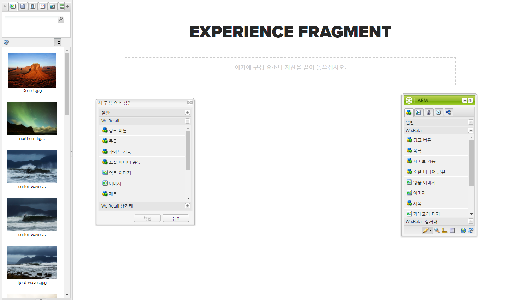
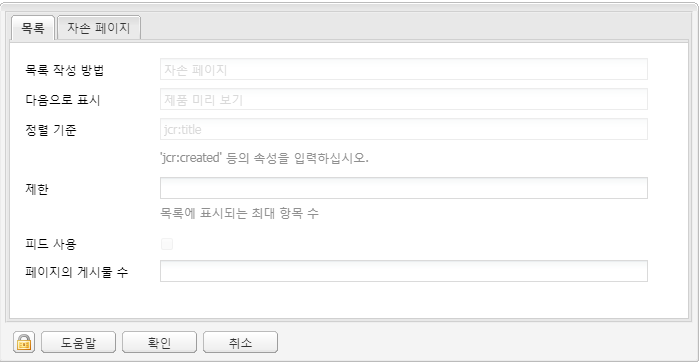
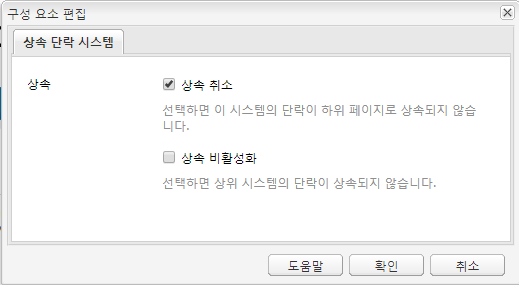
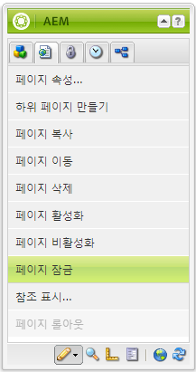

# 페이지 컨텐츠 편집{#editing-page-content}

페이지가 만들어지면(launch 또는 live copy의 일부 또는 신규) 컨텐츠를 편집하여 필요한 업데이트 작업을 수행할 수 있습니다.

컨텐츠는 페이지로 끌 수 있는 구성 요소(컨텐츠 유형에 맞는)를 사용하여 추가됩니다. 그런 다음 그 자리에서 편집하거나, 이동하거나 삭제할 수 있습니다.

>[!NOTE]
>
>구성 요소 추가, 편집 또는 삭제, 주석 추가, 잠금 해제 등 페이지 편집 작업을 하려면 계정에 [적절한 액세스 권한](/help/sites-administering/security.md) 및 [사용 권한](/help/sites-administering/security.md#permissions)이 있어야 합니다.
>
>문제가 발생하면 시스템 관리자에게 문의하십시오.

## 사이드 킥 {#sidekick}

사이드 킥은 페이지를 작성할 때의 주요 도구입니다. 페이지를 작성할 때에는 유동적으로 움직이므로 항상 볼 수 있습니다.

다음을 비롯한 여러 개의 탭과 아이콘을 사용할 수 있습니다.

* 구성 요소
* 페이지
* 정보
* 버전 관리
* 워크플로우
* 모드
* 스캐폴딩
* ClientContext
* 웹 사이트

여기에서는 다음을 비롯한 다양한 기능에 액세스할 수 있습니다.

* [구성 요소 선택](/help/sites-classic-ui-authoring/classic-page-author-env-tools.md#sidekick)
* [참조 표시](/help/sites-classic-ui-authoring/classic-page-author-env-tools.md#showing-references)
* [감사 로그 액세스](/help/sites-classic-ui-authoring/classic-page-author-env-tools.md#audit-log)
* [모드 전환](/help/sites-classic-ui-authoring/classic-page-author-env-tools.md#page-modes)
* 버전 [만들기](/help/sites-classic-ui-authoring/classic-page-author-work-with-versions.md#creating-a-new-version), [복원](/help/sites-classic-ui-authoring/classic-page-author-work-with-versions.md#restoring-a-page-version-from-sidekick) 및 [비교](/help/sites-classic-ui-authoring/classic-page-author-work-with-versions.md#comparing-with-a-previous-version)

*  페이지 [게시](/help/sites-classic-ui-authoring/classic-page-author-publish-pages.md#publishing-a-page), [게시 취소](/help/sites-classic-ui-authoring/classic-page-author-publish-pages.md#unpublishing-a-page)

* [페이지 속성 편집](/help/sites-classic-ui-authoring/classic-page-author-edit-page-properties.md)

* [scaffolding](/help/sites-authoring/scaffolding.md)

* [클라이언트 컨텍스트](/help/sites-administering/client-context.md)

## 구성 요소 삽입 {#inserting-a-component}

### 구성 요소 삽입 {#inserting-a-component-1}

페이지를 열었으면 이제 컨텐츠를 추가할 수 있습니다. 이 작업은 구성 요소(단락이라고도 함)를 추가하여 수행할 수 있습니다.

새 구성 요소 삽입

1. 몇 가지 방법으로 삽입할 단락의 유형을 선택할 수 있습니다.

   * **여기로 구성 요소나 자산을 드래그하십시오.**&#x200B;가 표시된 영역을 두 번 클릭하여 **새 구성 요소 삽입** 도구 모음을 엽니다. 구성 요소를 선택하고 **확인**&#x200B;을 클릭합니다.
   * 이동 도구 모음(사이드킥)에서 구성 요소를 드래그하여 새 단락을 삽입합니다.
   * 기존 단락을 마우스 오른쪽 단추로 클릭하고 **새로 만들기...**&#x200B;를 클릭하여 새 구성 요소 삽입 도구 모음을 엽니다. 구성 요소를 선택하고 **확인**&#x200B;을 클릭합니다.
   

1. 사이드 킥과 **새 구성 요소 삽입** 도구 모음에는 모두 사용 가능한 구성 요소(단락 유형)의 목록이 있습니다. 이 목록은 여러 부분으로 나뉘어 있으며(예: 일반, 열, 등) 필요에 따라 확장할 수 있습니다.

   선택 가능한 항목은 제작 환경에 따라 다를 수 있습니다. 구성 요소에 대한 모든 세부 정보는 [기본 구성 요소](/help/sites-classic-ui-authoring/classic-page-author-default-components.md)를 참조하십시오.

1. 페이지에 필요한 구성 요소를 삽입합니다. 그런 다음 단락을 두 번 클릭하면 단락을 구성하고 컨텐츠를 추가할 수 있는 창이 열립니다.

### 컨텐츠 파인더를 사용하여 구성 요소 삽입 {#inserting-a-component-using-the-content-finder}

[컨텐츠 파인더](/help/sites-classic-ui-authoring/classic-page-author-env-tools.md#the-content-finder)에서 자산을 끌어 페이지에 새 구성 요소를 추가할 수도 있습니다. 이렇게 하면 자산이 포함된 적절한 유형의 새 구성 요소가 자동으로 만들어집니다.

이것은 다음 자산 유형에 대해 유효합니다(일부는 페이지/단락 시스템에 따라 다릅니다.).

| 자산 유형 | 결과 구성 요소 유형 |
|---|---|
| 이미지 | 이미지 |
| 문서 | 다운로드 |
| 제품 | 제품 |
| 비디오 | Flash |

>[!NOTE]
>
>이 동작은 설치에 대해 구성할 수 있습니다. 자세한 내용은 [단락 시스템 구성 및 자산 드래그를 통한 구성 요소 인스턴스 생성](/help/sites-developing/developing-components.md#configuring-a-paragraph-system-so-that-dragging-an-asset-creates-a-component-instance)을 참조하십시오.

위의 자산 유형 중 하나를 끌어 구성 요소를 만들려면,

1. 페이지가 [**편집&#x200B;**모드](/help/sites-classic-ui-authoring/classic-page-author-env-tools.md#page-modes)인지 확인합니다.
1. [컨텐츠 파인더](/help/sites-classic-ui-authoring/classic-page-author-env-tools.md#the-content-finder)를 엽니다.
1. 필요한 자산을 필요한 위치로 끕니다. [구성 요소 자리 표시자](#componentplaceholder)는 구성 요소가 위치할 곳을 보여 줍니다.

   자산 유형에 적절한 구성 요소가 필요한 위치에 만들어지게 됩니다. 여기에 선택한 자산이 포함됩니다.

1. 필요할 경우 구성 요소를 [편집](#editmovecopypastedelete)합니다.

## 구성 요소(컨텐츠 및 속성) 편집 {#editing-a-component-content-and-properties}

기존 단락을 편집하려면 다음 중 하나를 수행합니다.

* 단락을 **두 번 클릭**&#x200B;하여 엽니다. 기존 컨텐츠로 단락을 만들 때 표시되는 창이 똑같이 표시됩니다. 필요한 사항을 변경하고 **확인**&#x200B;을 클릭합니다.

* 단락을 **마우스 오른쪽 단추로 클릭**&#x200B;하고 **편집**&#x200B;을 클릭합니다.

* 단락을 두 차례 **클릭**(느리게 두 번 클릭)하여 즉석 편집 모드로 전환합니다. 이제 대화 상자 창이 아닌 페이지의 텍스트를 직접 편집할 수 있습니다. 이 모드에서는 페이지 상단에 도구 모음이 표시됩니다. 변경 작업을 수행하면 변경 사항이 자동으로 저장됩니다.

## 구성 요소 이동 {#moving-a-component}

단락을 이동하는 방법은 다음과 같습니다.

>[!NOTE]
>
>[잘라내기 및 붙여넣기](#cut-copy-paste-a-component)를 사용하여 구성 요소를 이동할 수도 있습니다.

1. 이동시킬 단락을 선택합니다.

   

1. 단락을 새 위치에 드래그합니다. 단락을 이동할 수 있는 위치를 녹색 확인 표시로 나타냅니다. 단락을 원하는 위치에 놓습니다.
1. 단락이 이동됩니다.

   

## 구성 요소 삭제 {#deleting-a-component}

단락을 삭제하는 방법은 다음과 같습니다.

1. 단락을 선택하고 **마우스 오른쪽 단추로 클릭**&#x200B;합니다.

   

1. 메뉴에서 **삭제**&#x200B;를 선택합니다. 삭제는 취소할 수 없으므로 단락 삭제를 확인하는 메시지가 나타납니다.
1. **확인**&#x200B;을 클릭합니다.

>[!NOTE]
>
>[전역 편집 도구 모음을 보여주는 사용자 속성](/help/sites-classic-ui-authoring/author-env-user-props.md)을 설정한 경우 **복사**, **잘라내기**, **붙여넣기**, **삭제** 단추를 사용하여 단락에 대해 특정 작업을 수행할 수도 있습니다.\
>다양한 [키보드 단축키](/help/sites-classic-ui-authoring/classic-page-author-keyboard-shortcuts.md)도 사용할 수 있습니다.

## 구성 요소 잘라내기/복사/붙여넣기 {#cut-copy-paste-a-component}

[구성 요소를 삭제](#deleting-a-component)하면 컨텍스트 메뉴를 사용하여 구성 요소의 복사, 잘라내기 및/또는 붙여넣기를 수행할 수 있습니다.

>[!NOTE]
>
>[전역 편집 도구 모음을 보여주는 사용자 속성](/help/sites-classic-ui-authoring/author-env-user-props.md)을 설정한 경우 **복사**, **잘라내기**, **붙여넣기**, **삭제** 단추를 사용하여 단락에 대해 특정 작업을 수행할 수도 있습니다.
>
>다양한 [키보드 단축키](/help/sites-classic-ui-authoring/classic-page-author-keyboard-shortcuts.md)도 사용할 수 있습니다.

>[!NOTE]
>
>컨텐츠 잘라내기, 복사 및 붙여넣기는 동일한 페이지 내에서만 지원됩니다.

## 상속된 구성 요소 {#inherited-components}

상속된 구성 요소는 다음을 포함하여 다양한 시나리오의 제품일 수 있습니다.

* [다중 사이트 관리](/help/sites-administering/msm.md). [스캐폴딩](/help/sites-classic-ui-authoring/classic-feature-scaffolding.md#scaffolding-with-msm-inheritance)과 조합하여 사용됩니다.

* [Launch](/help/sites-classic-ui-authoring/classic-launches.md)(live copy을 기반으로 할 때).
* 특정 구성 요소 - 예: Geometrixx 내 상속된 단락 시스템.

상속을 취소(그런 다음 다시 활성화)할 수 있습니다. 구성 요소에 따라 다음 제품에서 사용할 수 있습니다.

1. **Live Copy**

   구성 요소가 live copy 또는 launch의 일부일 경우, 자물쇠 아이콘으로 표시됩니다. 자물쇠를 클릭하여 상속을 취소할 수 있습니다.

   * 구성 요소를 선택하면 자물쇠 아이콘이 표시됩니다. 예:
   

   * 이 자물쇠는 구성 요소들의 대화 상자에도 표시됩니다. 예:
   

1. **상속된 단락 시스템**

   구성 대화 상자. 예를 들어, Geometrixx 내 상속된 단락 시스템 사용.

   

## 주석 추가 {#adding-annotations}

[주석](/help/sites-classic-ui-authoring/classic-page-author-annotations.md)을 사용하면 다른 작성자가 컨텐츠에 대한 피드백을 제공할 수 있습니다. 검토 및 유효성 검사 목적으로 종종 사용됩니다.

## 페이지 미리 보기 {#previewing-pages}

페이지 미리 보기에 중요한 사이드 킥의 하단 경계에는 두 가지 아이콘이 있습니다.

* 연필 아이콘은 현재 컨텐츠를 추가, 수정, 이동 또는 삭제할 수 있는 편집 모드임을 보여 줍니다.

   

* 확대경 아이콘을 사용하면 페이지가 게시 환경에 표시될 모습을 보여주는 미리 보기 모드를 선택할 수 있습니다(때로 페이지 새로 고침도 필요함).

   

   미리 보기 모드에서는 사이드 킥이 축소되며, 아래쪽 화살표 아이콘을 클릭하면 편집 모드로 되돌아 갑니다.

   

## 찾기 및 바꾸기 {#find-replace}

동일한 구문을 대량으로 편집하는 경우 **[찾기 및 바꾸기](/help/sites-classic-ui-authoring/author-env-search.md#find-and-replace)**메뉴 옵션을 사용하여 웹 사이트 섹션 내에서 문자열을 반복하여 찾거나 바꿀 수 있습니다.

## 페이지 잠금 {#locking-a-page}

AEM에서는 다른 사람이 컨텐츠를 수정할 수 없도록 페이지를 잠글 수 있습니다. 이 기능은 하나의 특정 페이지에 여러 편집 작업을 수행하거나 잠시 동안 페이지를 동결해야 할 때 유용합니다.

>[!CAUTION]
>
>페이지 잠그기는 페이지 잠금을 해제할 수 있는 유일한 사람이 페이지를 잠근 사람(또는 관리자 권한이 있는 계정)이므로 신중히 사용해야 합니다.

페이지 잠그기

1. **웹 사이트** 탭에서 잠글 페이지를 선택합니다.
1. 페이지를 두 번 클릭하여 편집을 위해 엽니다.
1. 사이드킥의 **페이지** 탭에서 **페이지 잠금**&#x200B;을 선택합니다.

   

   다른 사용자에게 페이지가 잠겼다는 메시지가 나타납니다. 또한 **웹 사이트**&#x200B;콘솔의 오른쪽 창에서 페이지가 잠긴 것으로 표시되고 사용자가 페이지를 잠갔다는 것을 알려줍니다.

   

## 페이지 잠금 해제 {#unlocking-a-page}

페이지의 잠금을 해제하는 방법은 다음과 같습니다.

1. **웹 사이트** 탭에서 잠금을 해제할 페이지를 선택합니다.
1. 페이지를 두 번 클릭하여 엽니다.
1. 사이드 킥의 **페이지** 탭에서 **페이지 잠금 해제**&#x200B;를 선택합니다.

## 페이지 편집 실행 취소 및 재실행 {#undoing-and-redoing-page-edits}

페이지의 컨텐츠 프레임에 초점이 있을 때 다음 단축키를 사용하십시오.

* 실행 취소: Ctrl+Z(Windows) 또는 Cmd+Z(Mac)
* 재실행: Ctrl+Y(Windows) 또는 Cmd+Y(Mac)

하나 이상의 단락을 삭제, 추가 또는 재배치한 작업을 취소하거나 재실행하는 경우 영향을 받는 단락은 깜박(기본 행동)이며 강조됩니다.

>[!NOTE]
>
>페이지 편집 내용을 실행 취소하거나 재실행할 때 가능한 사항에 대한 모든 세부 사항은 [페이지 편집 실행 취소 및 재실행 - 이론](#undoing-and-redoing-page-edits-the-theory)을 참조하십시오.

## 페이지 편집 내용 실행 취소 및 재실행 - 이론 {#undoing-and-redoing-page-edits-the-theory}

>[!NOTE]
>
>시스템 관리자는 인스턴스에 대한 요구 사항에 따라 [실행 취소/재실행 기능의 다양한 측면을 구성](/help/sites-administering/config-undo.md)할 수 있습니다.

AEM에는 사용자가 수행한 작업 내역이 순서대로 저장됩니다. 따라서 여러 작업의 실행을 취소하면 수행한 순서대로 취소됩니다. 그런 다음 재실행을 사용하여 하나 이상의 작업을 다시 적용할 수 있습니다. 

컨텐츠 페이지의 요소가 선택되면, 실행 취소 및 재실행 명령이 선택된 항목(예: 텍스트 구성 요소)에 적용됩니다.

실행 취소 및 재실행 명령의 동작은 다른 소프트웨어 프로그램의 경우와 비슷합니다. 이러한 명령을 사용하여 웹 페이지의 컨텐츠를 편집하면서 최근 상태로 복원할 수 있습니다. 예를 들어 텍스트 단락을 페이지의 다른 위치로 이동한 후 실행 취소 명령을 사용하여 단락을 원래 위치로 되돌릴 수 있습니다. 이후에 단락을 다시 이동하려면 재실행 명령을 사용합니다.

>[!NOTE]
>
>다음을 작업을 수행할 수 있습니다.
>
>* 실행 취소를 사용한 후 페이지를 편집하지 않은 경우 작업을 재실행합니다.
>* 최대 20개의 편집 작업 실행을 취소합니다(기본 설정).
>* 실행 취소 및 재실행용 [키보드 단축키](/help/sites-classic-ui-authoring/classic-page-author-keyboard-shortcuts.md)를 사용할 수도 있습니다.
>

다음과 같은 유형의 페이지 변경을 취소하거나 재실행할 수 있습니다.

* 단락 추가, 편집, 삭제 및 이동
* 단락 내용 즉석 편집
* 페이지 내 항목 복사, 잘라내기 및 붙여넣기
* 페이지 간에 항목 복사, 잘라내기 및 붙여넣기
* 파일 및 이미지 추가, 삭제 및 변경
* 주석 및 스케치 추가, 삭제 및 변경
* 스캐폴드 변경
* 참조 추가 및 삭제
* 구성 요소 대화 상자에서 속성 값 변경

구성 요소 렌더링을 구성하는 양식 필드는 페이지를 작성하는 동안 값이 지정되지 않습니다. 따라서 실행 취소 및 재실행 명령으로는 해당 구성 요소 유형의 값에 수행한 변경 내용이 적용되지 않습니다. 예를 들어 드롭다운 목록에서 값을 선택한 작업에 대해서는 실행 취소를 할 수 없습니다.

>[!NOTE]
>
>파일 및 이미지 변경을 취소하거나 재실행하려면 특수 권한이 필요합니다. 또한 파일 및 이미지 변경의 실행 취소 내역은 최소 시간 동안 유지됩니다. 이 시간이 지나면 변경을 취소하지 못할 수 있습니다. 관리자는 필요한 권한을 제공하고 기본 시간인 10시간을 변경할 수 있습니다.

