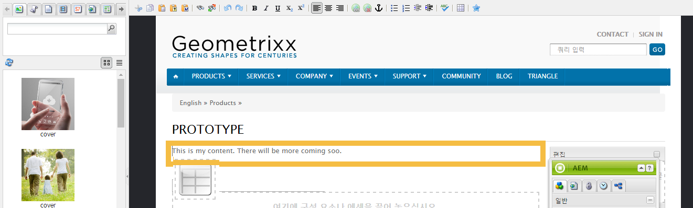
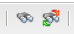
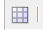
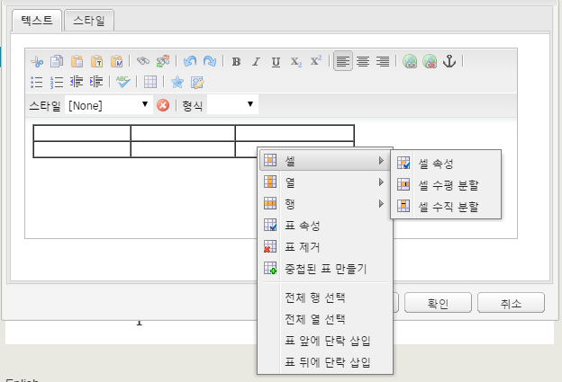

# 리치 텍스트 편집기{#rich-text-editor}

>[!CAUTION]
>
>AEM 6.4가 확장 지원이 종료되었으며 이 설명서는 더 이상 업데이트되지 않습니다. 자세한 내용은 [기술 지원 기간](https://helpx.adobe.com/kr/support/programs/eol-matrix.html). 지원되는 버전 찾기 [여기](https://experienceleague.adobe.com/docs/).

리치 텍스트 편집기는 텍스트 컨텐츠를 AEM에 입력하는 기본 빌딩 블록입니다. 이 편집기는 다음과 같은 다양한 구성 요소의 기초가 됩니다.

* 텍스트
* 텍스트 이미지
* 표

## 리치 텍스트 편집기 {#rich-text-editor-2}

WYSIWYG 편집 대화 상자는 광범위한 기능을 제공합니다.

>[!NOTE]
>
>사용 가능한 기능은 개별 프로젝트에 대해 구성할 수 있으므로 설치에 따라 다를 수 있습니다.

## 즉석 편집 {#in-place-editing}

대화 상자를 사용하는 리치 텍스트 편집 모드 이외에도 AEM에서 제공하는 즉석 편집 모드를 통해 페이지 레이아웃에 표시된 대로 텍스트를 직접 편집할 수도 있습니다.

단락을 두 번 클릭(느리게 두 번 클릭)하여 즉석 편집 모드로 전환합니다. 구성 요소 테두리가 주황색으로 표시됩니다.

대화 상자 창이 아닌 페이지에서 텍스트를 직접 편집할 수 있습니다. 변경 작업을 수행하면 변경 사항이 자동으로 저장됩니다.

>[!NOTE]
>
>컨텐츠 파인더가 열려 있으면 RTE 서식 옵션이 있는 도구 모음이 위와 같이 탭의 맨 위에 표시됩니다.
>
>컨텐츠 파인더가 열려 있지 않으면 도구 모음이 표시되지 않습니다.

현재 즉석 편집 모드는 **텍스트** 및 **제목** 구성 요소.

>[!NOTE]
>
>다음 **제목** 구성 요소는 줄바꿈 없는 짧은 텍스트를 포함하도록 디자인되었습니다. 즉석 편집 모드에서 제목을 편집할 때 줄바꿈을 삽입하면 새 줄이 열립니다 **텍스트** 구성 요소를 생성하지 않습니다.

## 리치 텍스트 편집기의 기능 {#features-of-the-rich-text-editor}

리치 텍스트 편집기에서는 다음과 같은 다양한 기능을 제공합니다 [구성에 따라 다릅니다](/help/sites-administering/rich-text-editor.md) 개별 구성 요소의 수입니다. 터치에 적합한 UI와 클래식 UI 모두에서 기능을 사용할 수 있습니다.

### 기본 문자 형식 {#basic-character-formats}

선택한 문자(강조 표시)에 서식을 적용할 수 있습니다. 일부 옵션에는 단축키도 있습니다.

* 굵게(Ctrl-B)
* 기울임체(Ctrl-I)
* 밑줄(Ctrl-U)
* 아래 첨자
* 위 첨자

모두 전환 동작이므로 다시 선택하면 형식이 제거됩니다.

### 사전 정의된 스타일 및 형식 {#predefined-styles-and-formats}

설치 환경에 사전 정의된 스타일과 형식이 포함될 수 있습니다. 이러한 기능은 **스타일** 및 **형식** 드롭다운 목록 및 선택한 텍스트에 적용할 수 있습니다.

스타일은 특정 문자열에 적용할 수 있습니다(스타일은 CSS와 관련됨).

반면에 형식은 전체 텍스트 단락에 적용되지만 HTML을 기반으로 합니다.

특정 형식은 변경할 수만 있습니다(기본값은 다음과 같습니다 **단락**).

스타일은 제거할 수 있습니다. 스타일이 적용된 텍스트 내에 커서를 놓고 제거 아이콘을 클릭합니다.

>[!CAUTION]
>
>스타일이 적용된 텍스트를 실제로 다시 선택하지 않거나 아이콘이 비활성화됩니다.

### 잘라내기, 복사, 붙여넣기 {#cut-copy-paste}

의 표준 함수 **잘라내기** 및 **복사** 사용할 수 있습니다. 몇 가지 맛 **붙여넣기** 형식이 다르도록 제공됩니다.

* 잘라내기(**Ctrl-X**)
* 복사(**Ctrl-C**)
* 붙여넣기

   기본 붙여넣기 메커니즘(**Ctrl-V**) 내의 아무 곳에나 삽입할 수 있습니다. 즉시 설치할 때 &quot;Word에서 붙여넣기&quot;로 구성됩니다.

* 텍스트로 붙여넣기

   스타일과 서식을 모두 제거하고 일반 텍스트만 붙여넣습니다.

* Word에서 붙여넣기

   이렇게 하면 컨텐츠를 HTML으로 붙여넣고 필요한 서식을 재구성합니다.

### 실행 취소, 다시 실행 {#undo-redo}

AEM은 현재 구성 요소의 마지막 50개 작업 기록을 시간 순서대로 유지합니다. 필요한 경우 이러한 작업을 순서에 따라 취소하고 재실행할 수 있습니다.

>[!CAUTION]
>
>기록은 현재 편집 세션에 대해서만 유지됩니다. 편집할 구성 요소를 열 때마다 다시 시작됩니다.

>[!NOTE]
>
>기본 작업 수는 50개입니다. 설치에 따라 다를 수 있습니다.

### 정렬 {#alignment}

텍스트를 왼쪽, 가운데 또는 오른쪽으로 정렬할 수 있습니다.

### 들여쓰기 {#indentation}

단락의 들여쓰기를 늘리거나 줄일 수 있습니다. 선택한 단락에 들여쓰기가 적용되고 새로 입력하는 텍스트에 현재 들여쓰기 수준이 적용됩니다.

### 목록 {#lists}

텍스트 안에 글머리 기호 목록과 번호 매기기 목록을 만들 수 있습니다. 목록 유형을 선택하고 입력을 시작하거나 변환할 텍스트를 강조 표시합니다. 두 경우 모두 라인 피드가 새 목록 항목을 시작합니다.

하나 이상의 목록 항목을 들여쓰면 중첩된 목록을 만들 수 있습니다.

목록 스타일을 변경하려면 목록 안에 커서를 놓고 다른 스타일을 선택하기만 하면 됩니다. 하위 목록의 스타일은 상위 목록과 다를 수 있습니다. 들여쓰기를 통해 하위 목록을 만든 후 적용할 수 있습니다.

### 링크 {#links}

웹 사이트 내 또는 외부 URL로 연결되는 링크는 필요한 텍스트를 강조 표시한 다음 **하이퍼링크** 아이콘:

대화 상자에서 대상 URL을 지정할 수 있습니다. 또한 새 창에서 열지 여부를 지정합니다.

다음과 같은 작업을 수행할 수 있습니다.

* 직접 URI 입력
* 사이트 맵을 사용하여 웹 사이트 내에서 페이지를 선택합니다
* URI를 입력한 다음 대상 앵커 추가 예 `www.TargetUri.org#AnchorName`
* 앵커만 입력(&quot;현재 페이지&quot; 참조). 예 `#anchor`
* content finder에서 페이지를 검색한 다음 페이지 아이콘을 하이퍼링크 대화 상자로 드래그하여 놓습니다

>[!NOTE]
>
>URI 앞에 설치 환경에 구성된 프로토콜을 추가할 수 있습니다. 표준 설치에서는 다음과 같습니다 `https://`, `ftp://`, 및 `mailto:`. 설치에 대해 구성되지 않은 프로토콜은 거부되며 오류로 표시됩니다.

링크를 끊으려면 링크 텍스트 안에 커서를 두고 **연결 해제** 아이콘:

### 앵커 {#anchors}

텍스트 안에 커서를 두거나 텍스트를 선택하여 어디든지 앵커를 만들 수 있습니다. 그런 다음 **앵커** 아이콘을 클릭하여 대화 상자를 엽니다.

앵커 이름을 입력한 다음 **확인** 저장

구성 요소를 편집하고 있으면 앵커가 표시되며, 이제 앵커를 링크 대상 내에서 사용할 수 있습니다.

### 찾기 및 바꾸기 {#find-and-replace}

AEM은 두 가지 모두를 제공합니다. **찾기** 그리고 **바꾸기** (찾기 및 바꾸기) 함수를 참조하십시오.

둘 다 **다음 찾기** 열기 구성 요소에서 지정된 텍스트를 검색하는 단추입니다. 대/소문자를 구분할지(위쪽/아래쪽) 여부를 지정할 수도 있습니다.

검색은 항상 텍스트 내의 현재 커서 위치부터 시작됩니다. 구성 요소의 끝에 도달하면 다음 검색 작업이 맨 위에서 시작됨을 알리는 메시지가 표시됩니다.

다음 **바꾸기** 옵션을 사용하면 다음 작업을 수행할 수 있습니다. **찾기**, 그런 다음 **바꾸기** 지정된 텍스트 또는 **모두 바꾸기** 현재 구성 요소의 인스턴스입니다.

### 이미지 {#images}

컨텐츠 파인더에서 이미지를 드래그하여 텍스트에 추가할 수 있습니다.

>[!NOTE]
>
>또한 AEM에서는 보다 자세한 이미지 구성을 위한 특수 구성 요소를 제공합니다. 예: **이미지** 및 **텍스트 이미지** 구성 요소를 사용할 수 있습니다.

### 맞춤법 검사 {#spelling-checker}

맞춤법 검사는 현재 구성 요소의 모든 텍스트를 검사합니다.

맞춤법이 잘못된 부분은 강조 표시됩니다.

>[!NOTE]
>
>맞춤법 검사는 하위 트리의 언어 속성을 사용하거나 URL에서 언어를 추출하여 웹 사이트의 언어로 작동합니다. 예: `en` 분기가 영어 및 `de` 독일어 분기입니다.

### 표 {#tables}

다음 두 가지 모두를 사용할 수 있습니다.

* 로서의 **표** 구성 요소

   

* 에서 **텍스트** 구성 요소

   

   >[!NOTE]
   >
   >RTE에서는 표를 사용할 수 있지만, **표** 구성 요소를 사용하여 표를 만들 수 있습니다.

두 가지 모두 **텍스트** 및 **표** 구성 요소 테이블 기능은 표 내에서 클릭한 컨텍스트 메뉴(일반적으로 마우스 오른쪽 단추)를 통해 사용할 수 있습니다. 예:

>[!NOTE]
>
>에서 **표** 구성 요소에는 다양한 표준 리치 텍스트 편집기 기능과 표 전용 기능의 하위 집합을 포함한 특수 도구 모음도 있습니다.

테이블별 함수는 다음과 같습니다.

<table> 
 <tbody> 
  <tr> 
   <td><a href="#table-properties">표 속성</a>  </td> 
  </tr> 
  <tr> 
   <td><a href="#cell-properties">셀 속성  </a></td> 
  </tr> 
  <tr> 
   <td><a href="#add-or-delete-rows">행 추가 또는 삭제  </a></td> 
  </tr> 
  <tr> 
   <td><a href="#add-or-delete-columns">열 추가 또는 삭제  </a></td> 
  </tr> 
  <tr> 
   <td><a href="#selecting-entire-rows-or-columns">전체 행 또는 열 선택  </a></td> 
  </tr> 
  <tr> 
   <td><a href="#merge-cells">셀 병합  </a></td> 
  </tr> 
  <tr> 
   <td><a href="#split-cells">셀 분할  </a></td> 
  </tr> 
  <tr> 
   <td><a href="#creating-nested-tables">중첩된 표</a></td> 
  </tr> 
  <tr> 
   <td><a href="#remove-table">표 제거</a> </td> 
  </tr> 
 </tbody> 
</table>

#### 표 속성 {#table-properties}

테이블의 기본 속성을 구성하기 전에 **확인** 저장

* **너비**

   표의 전체 폭입니다.

* **높이**

   표의 전체 높이입니다.

* **테두리**

   표 테두리의 크기입니다.

* **셀 패딩**

   셀 내용과 테두리 사이의 공백을 정의합니다.

* **셀 간격**

   셀 사이의 거리를 정의합니다.

>[!NOTE]
>
>**너비**, **높이** 및 특정 셀 속성은 다음 중 하나로 정의할 수 있습니다.
>
>* 픽셀
>* 백분율

>[!CAUTION]
>
>Adobe은 **너비** 테이블 위요

#### 셀 속성 {#cell-properties}

특정 셀 또는 셀 시리즈의 속성을 구성할 수 있습니다.

* **너비**
* **높이**
* **수평 정렬** - 왼쪽, 가운데 또는 오른쪽
* **수직 정렬** - 위쪽, 중간, 아래쪽 또는 기준선
* **셀 유형** - 데이터 또는 헤더
* **적용 대상:**
   * 단일 셀
   * 전체 행
   * 전체 열

#### 행 추가 또는 삭제 {#add-or-delete-rows}

행을 현재 행의 위 또는 아래에 추가할 수 있습니다.

현재 행을 삭제할 수도 있습니다.

#### 열 추가 또는 삭제 {#add-or-delete-columns}

현재 열의 왼쪽이나 오른쪽에 열을 추가할 수 있습니다.

현재 열을 삭제할 수도 있습니다.

#### 전체 행 또는 열 선택 {#selecting-entire-rows-or-columns}

현재 행 또는 열 전체를 선택합니다. 그런 다음 특정 작업(예: 병합)을 사용할 수 있습니다.

#### 셀 병합 {#merge-cells}

 

* 셀 그룹을 선택한 경우 하나로 병합할 수 있습니다.
* 셀을 하나만 선택한 경우 오른쪽이나 아래에 있는 셀에 병합할 수 있습니다.

#### 셀 분할 {#split-cells}

셀 하나를 선택하여 분할합니다.

* 셀을 가로로 분할하면 현재 열 내에서 현재 셀 오른쪽에 새 셀이 생성됩니다.
* 셀을 세로로 분할하면 현재 셀 아래에 새 셀이 생성되지만 현재 행 내에 새 셀이 생성됩니다.

#### 중첩된 표 만들기 {#creating-nested-tables}

중첩된 표를 만들면 현재 셀 내에 자체 포함된 새 테이블이 만들어집니다.

>[!NOTE]
>
>특정 추가 동작은 브라우저에 따라 다릅니다.
>
>* Windows IE: 여러 셀을 선택하려면 Ctrl 키를 누른 채로 마우스 기본 단추(일반적으로 왼쪽)를 클릭합니다.
>* Firefox: 마우스를 드래그하여 셀 범위를 선택합니다.
>

#### 표 제거 {#remove-table}

이렇게 하면 **텍스트** 구성 요소.

### 특수 문자 {#special-characters}

리치 텍스트 편집기에서 특수 문자를 사용할 수 있습니다. 설치 환경에 따라 달라질 수 있습니다.

마우스오버를 사용하여 확대된 문자 버전을 확인한 다음 클릭하여 텍스트의 현재 위치에 포함할 수 있습니다.

### 소스 편집 모드 {#source-editing-mode}

소스 편집 모드에서는 구성 요소의 기본 HTML을 보고 편집할 수 있습니다.

텍스트는 다음과 같습니다.

소스 모드에서는 다음과 같이 표시됩니다. 소스는 더 긴 경우가 많으므로 스크롤해야 합니다.

>[!CAUTION]
>
>소스 모드를 종료하면 AEM에서 특정 유효성 검사를 수행합니다. 예를 들어 텍스트가 블록에 올바르게 포함/중첩되어 있는지 확인합니다. 이로 인해 편집 내용이 변경될 수 있습니다.
