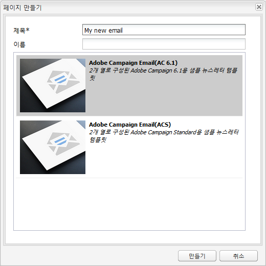
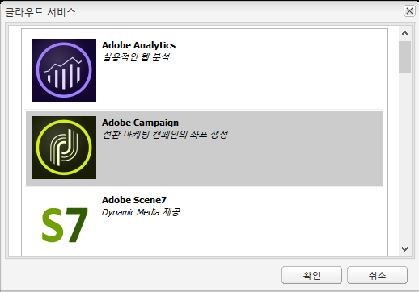
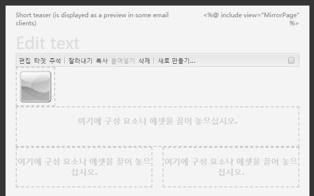
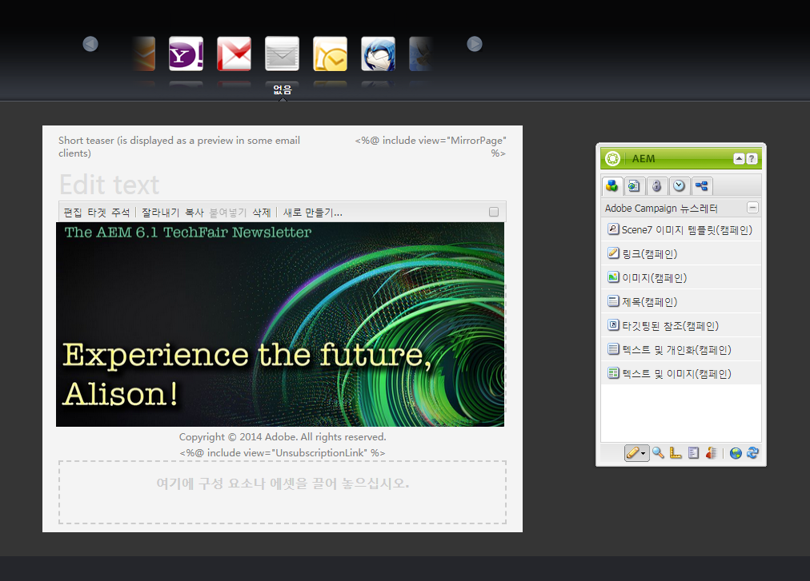
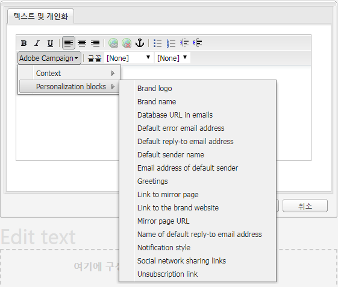
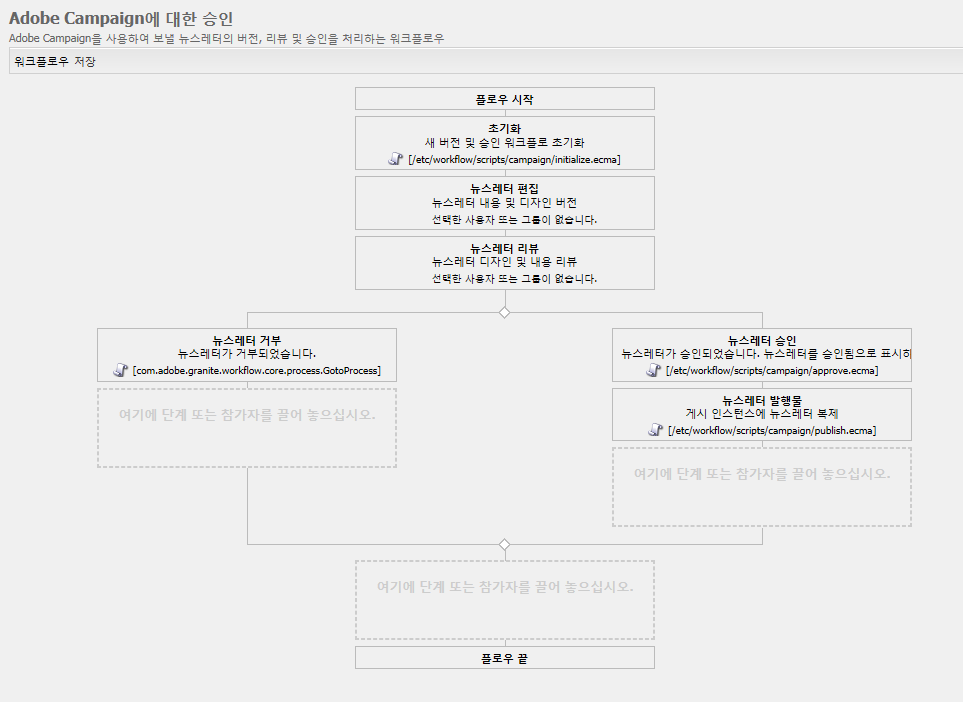

# Adobe Campaign 6.1 및 Adobe Campaign Standard 작업{#working-with-adobe-campaign-and-adobe-campaign-standard}

>[!CAUTION]
>
>AEM 6.4가 확장 지원이 종료되었으며 이 설명서는 더 이상 업데이트되지 않습니다. 자세한 내용은 [기술 지원 기간](https://helpx.adobe.com/kr/support/programs/eol-matrix.html). 지원되는 버전 찾기 [여기](https://experienceleague.adobe.com/docs/).

AEM에서 이메일 콘텐츠를 만들고 Adobe Campaign 이메일에서 처리할 수 있습니다. 이를 수행하려면 다음을 수행해야 합니다.

1. Adobe Campaign 관련 템플릿에서 AEM의 새 뉴스레터를 만듭니다.
1. 선택 [Adobe Campaign 서비스](#selectingtheadobecampaigncloudservice) 컨텐츠를 편집하기 전에 모든 기능에 액세스합니다.
1. 컨텐츠를 편집합니다.
1. 컨텐츠의 유효성을 검사합니다.

그런 다음 Adobe Campaign에서 콘텐츠를 게재와 동기화할 수 있습니다. 자세한 지침은 이 문서에 설명되어 있습니다.

>[!NOTE]
>
>이 기능을 사용하려면 먼저 와 통합하도록 AEM을 구성해야 합니다 [Adobe Campaign](/help/sites-administering/campaignonpremise.md) 또는 [Adobe Campaign Standard](/help/sites-administering/campaignstandard.md).

## Adobe Campaign을 통해 이메일 컨텐츠 보내기 {#sending-email-content-via-adobe-campaign}

AEM 및 Adobe Campaign을 구성한 후 AEM에서 직접 이메일 게재 콘텐츠를 만든 다음 Adobe Campaign에서 처리할 수 있습니다.

AEM에서 Adobe Campaign 컨텐츠를 만들 때 모든 기능에 액세스하려면 컨텐츠를 편집하기 전에 Adobe Campaign 서비스에 연결해야 합니다.

다음 두 가지 가능한 경우가 있습니다.

* Adobe Campaign의 게재와 컨텐츠를 동기화할 수 있습니다. 이렇게 하면 게재에서 AEM 콘텐츠를 사용할 수 있습니다.
* (Adobe Campaign 온프레미스 전용) 콘텐츠는 Adobe Campaign으로 직접 전송하여 자동으로 새 이메일 배달을 생성합니다. 이 모드에는 제한 사항이 있습니다.

자세한 지침은 이 문서에 설명되어 있습니다.

### 새 이메일 콘텐츠 만들기 {#creating-new-email-content}

>[!NOTE]
>
>전자 메일 템플릿을 추가할 때는 아래에 추가하십시오 **/content/campaigns** 사용할 수 있도록 합니다.

1. AEM에서 **웹 사이트** 폴더를 찾아 탐색기를 탐색하여 이메일 캠페인이 관리되는 위치를 찾습니다. 다음 예에서는 관련 노드가 다음과 같습니다 **웹 사이트** > **캠페인** > **Geometrixx Outdoors** > **이메일 캠페인**.

   >[!NOTE]
   >
   >[이메일 샘플은 Geometrixx에서만 사용할 수 있습니다](/help/sites-developing/we-retail.md#weretail). 패키지 공유에서 샘플 Geometrixx 콘텐츠를 다운로드하십시오.

   

1. 선택 **새로 만들기** > **새 페이지** 새 이메일 콘텐츠를 만들려면
1. Adobe Campaign과 관련된 사용 가능한 템플릿 중 하나를 선택한 다음 페이지의 일반 속성을 입력합니다. 기본적으로 다음 세 가지 템플릿을 사용할 수 있습니다.

   * **Adobe Campaign 이메일(AC 6.1)**: 미리 정의된 템플릿에 컨텐츠를 추가하여 전달을 위해 Adobe Campaign 6.1에 전송할 수 있습니다.
   * **Adobe Campaign Email (ACS)**: 컨텐츠를 배달할 Adobe Campaign Standard에 보내기 전에 미리 정의된 템플릿에 추가할 수 있습니다.

   

1. 클릭 **만들기** 이메일 또는 뉴스레터를 만들려면 다음을 수행하십시오.

### Adobe Campaign 클라우드 서비스 및 템플릿 선택 {#selecting-the-adobe-campaign-cloud-service-and-template}

Adobe Campaign과 통합하려면 페이지에 Adobe Campaign 클라우드 서비스를 추가해야 합니다. 이렇게 하면 개인화 및 기타 Adobe Campaign 정보에 액세스할 수 있습니다.

또한 Adobe Campaign 템플릿을 선택하고 제목을 변경하고 HTML에서 이메일을 보지 않는 사용자를 위해 일반 텍스트 컨텐츠를 추가해야 할 수도 있습니다.

1. 을(를) 선택합니다 **페이지** 사이드 킥에서 탭을 선택하고 을 선택합니다 **페이지 속성.**
1. 에서 **클라우드 서비스** 팝업 창에서 **서비스 추가** Adobe Campaign 서비스를 추가하려면 를 클릭하고 **확인**.

   

1. 드롭다운 목록에서 Adobe Campaign 인스턴스와 일치하는 구성을 선택한 다음 를 클릭합니다 **확인**.

   >[!NOTE]
   >
   >탭/클릭해야 합니다. **확인** 또는 **적용** 클라우드 서비스를 추가한 후. 이렇게 하면 **Adobe Campaign** 제대로 작동하려면 탭을 클릭하십시오.

1. 기본 이메일 게재 템플릿 이외의 특정 이메일 게재 템플릿(Adobe Campaign의)을 적용하려면 **메일** 템플릿, 선택 **페이지 속성** 다시 한 번 에서 **Adobe Campaign** 탭에서 관련 Adobe Campaign 인스턴스에 이메일 게재 템플릿의 내부 이름을 입력합니다.

   Adobe Campaign Standard에서 템플릿은 다음과 같습니다 **AEM 콘텐츠으로 게재**. Adobe Campaign 6.1에서 템플릿은 다음과 같습니다 **AEM 콘텐츠를 사용한 이메일 게재**.

   템플릿을 선택하면 AEM에서 자동으로 **Adobe Campaign 뉴스레터** 구성 요소.

### 전자 메일 콘텐츠 편집 {#editing-email-content}

클래식 사용자 인터페이스나 터치에 적합한 사용자 인터페이스에서 이메일 콘텐츠를 편집할 수 있습니다.

1. 전자 메일의 제목과 텍스트 버전을 선택하여 입력합니다 **페이지 속성** > **이메일** 도구 상자에서 참조할 수 있습니다.

   

1. 사이드 킥에서 사용할 수 있는 요소에서 원하는 요소를 추가하여 이메일 컨텐츠를 편집합니다. 이렇게 하려면 끌어서 놓습니다. 그런 다음 편집할 요소를 두 번 클릭합니다.

   예를 들어 개인화 필드가 포함된 텍스트를 추가할 수 있습니다.

   

   자세한 내용은 [Adobe Campaign 구성 요소](/help/sites-classic-ui-authoring/classic-personalization-ac-components.md) Adobe Campaign 뉴스레터/이메일 캠페인에 사용할 수 있는 구성 요소에 대한 설명입니다.

   

### 개인화 삽입 {#inserting-personalization}

컨텐츠를 편집할 때 다음을 삽입할 수 있습니다.

* Adobe Campaign 컨텍스트 필드. 이러한 필드는 텍스트 내에 삽입할 수 있는 필드로, 수신자 데이터(예: 이름, 성 또는 대상 차원의 데이터)에 따라 조정됩니다.
* Adobe Campaign 개인화 블록. 브랜드 로고 또는 미러 페이지에 대한 링크와 같이, 수신자의 데이터와 관련이 없는 사전 정의된 컨텐츠 블록입니다.

자세한 내용은 [Adobe Campaign 구성 요소](/help/sites-classic-ui-authoring/classic-personalization-ac-components.md) 캠페인 구성 요소에 대한 전체 설명입니다.

>[!NOTE]
>
>* Adobe Campaign의 필드만 **프로필** 타겟팅 차원이 고려됩니다.
>* 등록 정보를 볼 때 **Sites** Adobe Campaign 컨텍스트 필드에 액세스할 수 없습니다. 편집하는 동안 이메일에서 직접 액세스할 수 있습니다.
>

1. 새 항목 삽입 **뉴스레터** > **텍스트 및 개인화(캠페인)** 구성 요소.
1. 구성 요소를 두 번 클릭하여 엽니다. 다음 **편집** 창에는 개인화 요소를 삽입할 수 있는 기능이 있습니다.

   >[!NOTE]
   >
   >사용 가능한 컨텍스트 필드는 **프로필** Adobe Campaign의 타겟팅 차원.
   >
   >자세한 내용은 [Adobe Campaign 이메일에 AEM 페이지 연결](/help/sites-classic-ui-authoring/classic-personalization-ac-campaign.md#linkinganaempagetoanadobecampaignemail).

   

1. 선택 **Client Context** 사이드 킥에서 모습 프로필의 데이터를 사용하여 개인화 필드를 테스트합니다.

   

1. 창이 나타나고 원하는 모습을 선택할 수 있습니다. 개인화 필드는 선택한 프로필의 데이터로 자동 교체됩니다.

   

### 뉴스레터 미리 보기 {#previewing-a-newsletter}

뉴스레터의 모양을 미리 보고 개인화를 미리 볼 수 있습니다.

1. 미리 보려는 뉴스레터를 열고 미리 보기(확대경)를 클릭하여 사이드 킥을 축소합니다.
1. 이메일 클라이언트 아이콘 중 하나를 클릭하여 각 이메일 클라이언트에서 표시되는 뉴스레터를 확인합니다.

   

1. 사이드킥을 확장하여 편집을 다시 시작합니다.

### AEM에서 컨텐츠 승인 {#approving-content-in-aem}

컨텐츠가 완료되면 승인 프로세스를 시작할 수 있습니다. 로 이동합니다. **워크플로우** 도구 상자의 탭을 선택하고 **Adobe Campaign 승인** 워크플로우.

이 기본 워크플로우에는 두 가지 단계가 있습니다. 개정 후 승인 또는 개정 후 거부 하지만 이 워크플로우를 확장하고 보다 복잡한 프로세스에 맞게 조정할 수 있습니다.

Adobe Campaign에 대한 컨텐츠를 승인하려면 을(를) 선택하여 워크플로우를 적용합니다 **워크플로우** 사이드 킥에서 **Adobe Campaign 승인** 을(를) 클릭합니다. **워크플로우 시작**. 단계를 거쳐 컨텐츠를 승인합니다. 을 선택하여 컨텐츠를 거부할 수도 있습니다 **거부** 대신 **승인** 마지막 워크플로우 단계에 있는 을 참조하십시오.

컨텐츠가 승인되면 Adobe Campaign에 승인된 것으로 표시됩니다. 그런 다음 이메일을 보낼 수 있습니다.

Adobe Campaign Standard에서:

Adobe Campaign 6.1에서:

>[!NOTE]
>
>승인되지 않은 콘텐츠는 Adobe Campaign에서 게재와 동기화할 수 있지만 게재를 실행할 수 없습니다. 승인된 컨텐츠만 캠페인 게재를 통해 보낼 수 있습니다.

## AEM과 Adobe Campaign Standard 및 Adobe Campaign 6.1 연결 {#linking-aem-with-adobe-campaign-standard-and-adobe-campaign}

>[!NOTE]
>
>자세한 내용은 [AEM과 Adobe Campaign Standard 및 Adobe Campaign 6.1 연결](/help/sites-authoring/campaign.md#linking-aem-with-adobe-campaign-standard-and-adobe-campaign-classic) 아래에 [Adobe Campaign 6.1 및 Adobe Campaign Standard 작업](/help/sites-authoring/campaign.md) 자세한 내용은 표준 작성 설명서 를 참조하십시오.
