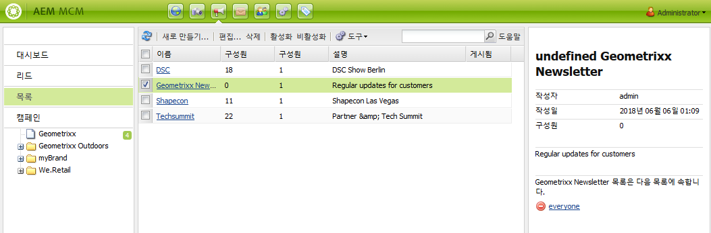
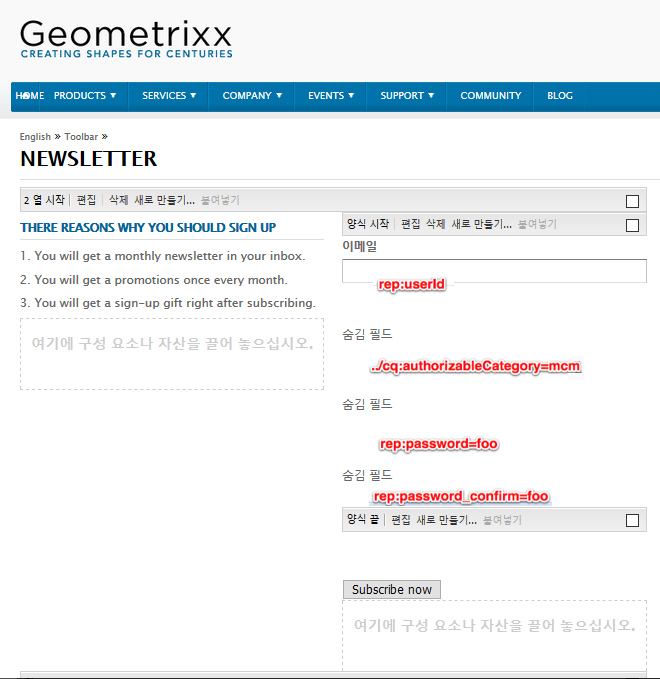
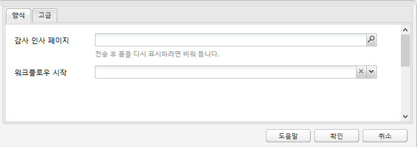
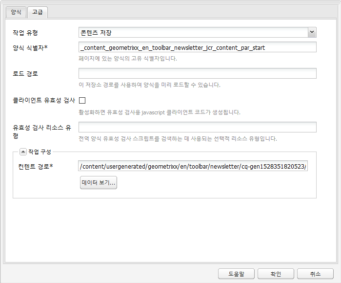
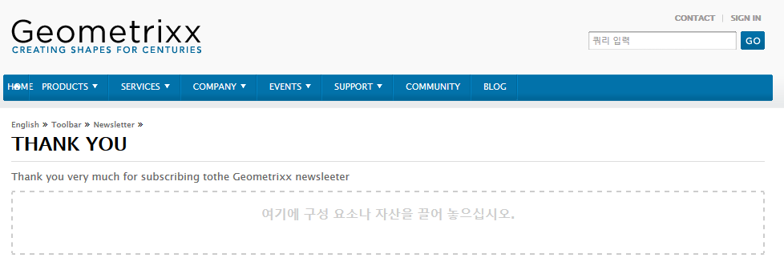
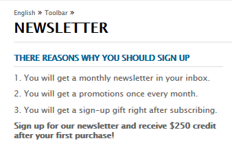
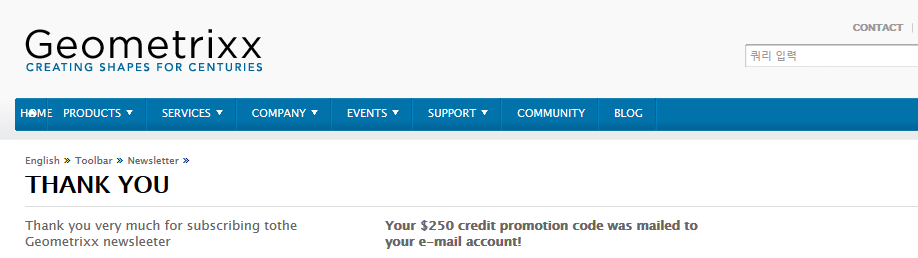

# 효과적인 뉴스레터 랜딩 페이지 만들기{#creating-an-effective-newsletter-landing-page}

>[!CAUTION]
>
>AEM 6.4가 확장 지원이 종료되었으며 이 설명서는 더 이상 업데이트되지 않습니다. 자세한 내용은 [기술 지원 기간](https://helpx.adobe.com/kr/support/programs/eol-matrix.html). 지원되는 버전 찾기 [여기](https://experienceleague.adobe.com/docs/).

효과적인 뉴스레터 랜딩 페이지는 뉴스레터(또는 기타 이메일 마케팅 캠페인)에 최대한 많은 사람을 등록할 수 있도록 해줍니다. 뉴스레터 등록 정보에서 수집한 정보를 사용하여 리드를 얻을 수 있습니다.

효과적인 뉴스레터 랜딩 페이지를 만들려면 다음을 수행해야 합니다.

1. 사람들이 뉴스레터에 가입할 수 있도록 뉴스레터 목록을 만듭니다.
1. 등록 양식을 만듭니다. 이를 수행할 때 뉴스레터에 등록하는 사람을 리드 목록에 자동으로 추가하는 워크플로우 단계를 추가합니다.
1. 등록한 사용자에게 감사를 표하고 프로모션을 제공할 수 있는 확인 페이지를 만듭니다.
1. 티저를 추가합니다.

>[!NOTE]
>
>Adobe은 이 기능(리드 및 목록 관리)을 추가로 개선할 계획이 없습니다.\
>추천은 활용 [Adobe Campaign과 AEM 통합](/help/sites-administering/campaign.md).

## 뉴스레터에 대한 목록 만들기 {#creating-a-list-for-the-newsletter}

예를 들어 목록을 만듭니다. **Geometrixx 뉴스레터** mcm에서 사람들이 가입해야 하는 뉴스레터에 대해 설명합니다. 목록 만들기에 대해서는 [목록 만들기](/help/sites-classic-ui-authoring/classic-personalization-campaigns.md#creatingnewlists).

다음은 목록의 예입니다.

## 등록 양식 만들기 {#create-a-sign-up-form}

사용자가 태그에 가입할 수 있는 뉴스레터 등록 양식을 만듭니다. 샘플 Geometrixx 웹 사이트에서는 양식을 만들 수 있는 Geometrixx 도구 모음에 있는 뉴스레터 페이지를 제공합니다.

고유한 뉴스레터 양식을 만들려면 [Forms 설명서](/help/sites-authoring/default-components.md#form). 뉴스레터는 태그 라이브러리의 태그를 사용합니다. 태그를 더 추가하려면 [태그 관리](/help/sites-authoring/tags.md#tagadministration).

다음 예제의 숨김 필드는 최소한의 정보(전자 메일)를 제공합니다. 또한 나중에 필드를 더 추가할 수 있지만, 이 경우 전환율에 영향을 줍니다.

다음 예제는 http://localhost:4502/cf#/content/geometrixx/en/toolbar/newsletter.html에서 만든 양식입니다.

1. 양식을 만듭니다.

   

1. 클릭 **편집** 양식 구성 요소에서 감사 페이지로 이동할 양식을 구성합니다(참조). [감사 인사 페이지 만들기](#creating-a-thank-you-page)).

   

1. 양식 작업(양식을 제출할 때 발생하는 작업)을 설정하고 그룹을 구성하여 등록한 사용자를 이전에 만든 목록(예: geometrixx-newsletter)에 지정합니다.

   

## 감사 인사 페이지 만들기 {#creating-a-thank-you-page}

사용자가 **지금 구독**&#x200B;을 눌러 감사 인사 페이지를 자동으로 엽니다. Geometrixx 뉴스레터 페이지에 감사 인사 페이지를 만듭니다. 뉴스레터 양식을 만든 후 양식 구성 요소를 편집하고 감사 인사 페이지에 경로를 추가합니다.

요청을 제출하면 사용자가 **감사합니다** 페이지가 게시되어 이메일이 발송됩니다. 이 감사 인사 페이지는 /content/geometrixx/en/toolbar/newsletter/thank_you에서 만들어졌습니다.

## Teaser 추가 {#adding-teasers}

추가 [티저](/help/sites-classic-ui-authoring/classic-personalization-campaigns.md#teasers) 타깃팅할 대상을 지정합니다. 예를 들어 감사 인사 페이지 및 뉴스레터 등록 페이지에 티저를 추가할 수 있습니다.

효과적인 뉴스레터 랜딩 페이지를 만들기 위해 티저를 추가하는 방법은 다음과 같습니다.

1. 등록 선물에 대한 티저 단락을 만듭니다. 선택 **첫 번째** 전략과 함께 제공되는 텍스트를 통해 어떤 선물을 받게 되는지 알려 줍니다.

   

1. 감사 인사 페이지에 티저 단락을 만듭니다. 선택 **첫 번째** 는 전략과 함께 선물이 배송되었음을 나타내는 텍스트를 포함합니다.

   

1. 두 개의 Teaser를 사용하여 캠페인을 만듭니다. 하나에는 비즈니스 태그를 달고 하나에는 태그를 달지 않습니다.

## 구독자에게 컨텐츠 푸시 {#pushing-content-to-subscribers}

MCM의 뉴스레터 기능을 통해 페이지에 변경 사항을 푸시합니다. 그런 다음 업데이트된 컨텐츠를 구독자에게 푸시합니다.

자세한 내용은 [뉴스레터 보내기](/help/sites-classic-ui-authoring/classic-personalization-campaigns.md#newsletters).
