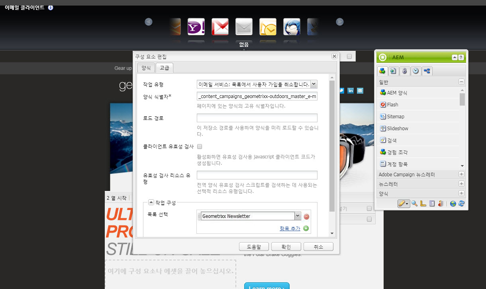

# 구독 관리{#managing-subscriptions}

>[!CAUTION]
>
>AEM 6.4가 확장 지원이 종료되었으며 이 설명서는 더 이상 업데이트되지 않습니다. 자세한 내용은 [기술 지원 기간](https://helpx.adobe.com/kr/support/programs/eol-matrix.html). 지원되는 버전 찾기 [여기](https://experienceleague.adobe.com/docs/).

>[!NOTE]
>
>Adobe은 이 기능(리드 및 목록 관리)을 추가로 개선할 계획이 없습니다.\
>추천은 활용 [Adobe Campaign과 AEM 통합](/help/sites-administering/campaign.md).

사용자에게 을 구독하라는 메시지가 표시될 수 있습니다 **이메일 서비스 공급자** 메일링 목록은 **양식** AEM 웹 페이지에서 사용되는 구성 요소입니다. 이메일 서비스 메일링 목록 가입용 등록 양식을 사용하여 AEM 페이지를 준비하려면, 잠재적인 가입자가 방문할 AEM 페이지에 해당 서비스 구성을 적용해야 합니다.

## 페이지에 이메일 서비스 구성 적용 {#applying-email-service-configuration-to-a-page}

AEM 페이지를 구성하려면:

1. 로 이동합니다 **웹 사이트** 탭.
1. 서비스에 대해 구성해야 하는 페이지를 선택합니다. 페이지를 마우스 오른쪽 단추로 클릭하고 를 선택합니다. **속성**.

1. 선택 **Cloud Services** 그런 다음 **서비스 추가**. 사용 가능한 구성 목록에서 구성을 선택합니다.

   

1. **확인**&#x200B;을 클릭합니다.

## 목록 가입/가입 해지를 위해 AEM 페이지에 등록 양식 만들기 {#creating-a-sign-up-form-on-an-aem-page-for-subscribing-unsubscribing-to-lists}

등록 양식을 만들고 이메일 서비스 공급자의 메일링 목록 가입용으로 구성하려면 다음을 수행하십시오.

1. 사용자가 방문할 AEM 페이지를 엽니다.
1. 이메일 서비스 공급자의 구성을 페이지에 적용합니다.

1. 추가 **양식** 구성 요소를 사이드킥에서 드래그하여 페이지에 추가합니다. 구성 요소를 사용할 수 없는 경우 디자인 모드로 전환한 후 **양식** 그룹에 속해 있어야 합니다.
1. 클릭 **편집** 에서 **양식 시작** 막대형 및 **고급** 탭.
1. 에서 **양식** 드롭다운 메뉴에서 **이메일 서비스: 가입자 만들기** 및 를 목록에 추가합니다.
1. 대화 상자 하단에서 **작업 구성** 드롭다운: 하나 이상의 구독 목록을 선택할 수 있습니다.
1. 에서 **목록 선택**&#x200B;을 선택합니다. 사용자가 가입할 목록을 선택합니다. 더하기 단추(**항목 추가**).

   

   >[!NOTE]
   >
   >대화 상자는 전자 메일 서비스 공급자에 따라 다를 수 있습니다.

1. 에서 **양식** 탭에서 사용자가 양식을 제출한 후 이동할 감사 인사 페이지를 선택합니다(비워 두면 제출 시 양식이 다시 표시됩니다.). **확인**&#x200B;을 클릭합니다. An **이메일 ID** 구성 요소가 양식에 표시됩니다. 이 양식을 사용하면 사용자가 메일링 목록에서 가입하거나 가입을 해지하기 위해 이메일 주소를 제출할 수 있습니다.
1. 추가 **제출** 단추 구성 요소 **양식** 사이드킥의 섹션.

   양식이 준비되었습니다. 위의 단계에서 구성한 페이지를 와 함께 게시합니다. **감사합니다** 페이지를 게시 인스턴스에 추가합니다. 페이지를 방문하는 잠재적인 가입자는 누구나 양식을 작성하고 구성에 제공된 목록에 가입할 수 있습니다.

   >[!NOTE]
   >
   >양식 가입 기능이 제대로 작동하려면, [작성자의 암호화 키를 내보내고 게시 인스턴스로 가져와야 합니다.](#exporting-keys-from-author-and-importing-on-publish).

## 작성자에서 키 내보내기 및 게시에서 가져오기 {#exporting-keys-from-author-and-importing-on-publish}

게시 인스턴스의 등록 양식을 통해 이메일 서비스 가입 및 가입 해지가 작동하려면 다음 단계를 수행해야 합니다.

1. 작성자 인스턴스에서 패키지 관리자로 이동합니다.
1. 새 패키지를 만듭니다. 필터를 로 설정 `/etc/key`.
1. 패키지를 빌드하고 다운로드합니다.
1. 게시 인스턴스의 패키지 관리자로 이동하고 이 패키지를 업로드합니다.
1. Publish osgi 콘솔로 이동한 후 번들을 다시 시작합니다 **Adobe Granite Crypto 지원**.

## 목록에서 사용자 가입 해지 {#unsubscribing-users-from-lists}

목록에서 사용자를 가입 해지하려면

1. 리드 가입 해지를 위한 등록 양식이 있는 AEM 페이지의 페이지 속성을 엽니다.
1. 페이지에 서비스 구성을 적용합니다.
1. 페이지에서 등록 양식을 만듭니다.
1. 구성 요소를 구성하는 동안 작업을 선택합니다 **이메일 서비스**: **목록에서 사용자 가입을 취소합니다.**
1. 드롭다운 메뉴에서 가입 해지 시 사용자가 제거될 목록을 선택합니다.

   

1. 작성자에서 게시로 키를 내보냅니다.

## 이메일 서비스에 대한 자동 응답자 이메일 구성 {#configuring-auto-responder-emails-for-email-service}

가입자에 대한 자동 응답자 이메일을 구성하려면:

1. 리드에 대한 자동 응답기를 구성할 등록 양식이 있는 AEM 페이지의 페이지 속성을 엽니다.
1. ExactTarget 구성을 페이지에 적용합니다.

1. 추가 **양식** 구성 요소를 사이드킥에서 드래그하여 페이지에 추가합니다. 구성 요소를 사용할 수 없는 경우 디자인 모드로 전환한 후 **양식** 그룹에 속해 있어야 합니다.
1. 클릭 **편집** 에서 **양식 시작** 막대형 및 **고급** 탭.
1. 에서 **양식** 드롭다운 메뉴에서 **이메일 서비스: 자동 응답자 이메일을 보냅니다.**
1. **이메일 선택** (자동 응답자 이메일로 전송되는 메일입니다.)

1. **분류 선택** (이메일을 전송하는 데 사용)
1. 을(를) 선택합니다 **감사합니다** 페이지 (사용자가 양식을 제출하면 이동되는 페이지)입니다.

   에서 **양식** 탭에서 사용자가 양식을 제출한 후 이동할 감사 인사 페이지를 선택합니다. 비워 두면 제출 시 양식이 다시 표시됩니다. **확인**&#x200B;을 클릭합니다.

1. 작성자에서 게시로 키를 내보냅니다.
1. 추가 **제출** 단추 구성 요소 **양식** 사이드킥의 섹션.

   등록 양식을 사용할 준비가 되었습니다. 위의 단계에서 구성한 페이지를 와 함께 게시합니다. **감사합니다** 페이지를 게시 인스턴스에 추가합니다. 페이지를 방문하는 모든 잠재적 가입자는 양식을 작성하고, 양식 제출 시 방문자는 양식에 입력된 이메일 ID로 자동 응답자 이메일을 받게 됩니다.

   >[!NOTE]
   >
   >등록 양식 가입 기능이 제대로 작동하도록 하려면, [작성자의 암호화 키를 내보내고 게시 인스턴스로 가져와야 합니다.](#exporting-keys-from-author-and-importing-on-publish).

   
