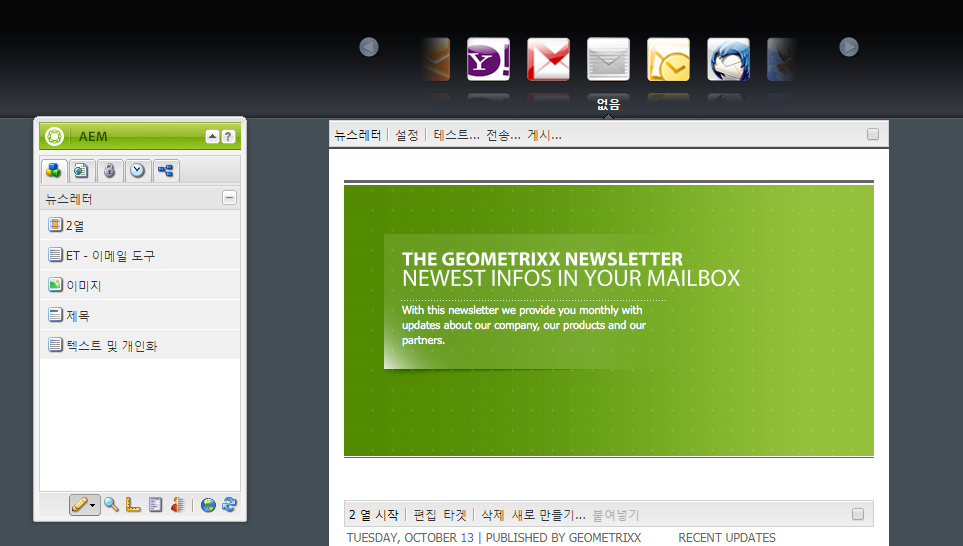
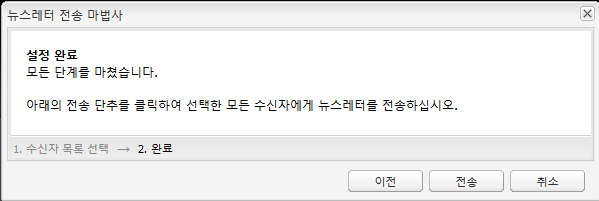

# 이메일 마케팅{#e-mail-marketing}

>[!CAUTION]
>
>AEM 6.4가 확장 지원이 종료되었으며 이 설명서는 더 이상 업데이트되지 않습니다. 자세한 내용은 [기술 지원 기간](https://helpx.adobe.com/kr/support/programs/eol-matrix.html). 지원되는 버전 찾기 [여기](https://experienceleague.adobe.com/docs/).

>[!NOTE]
>
>Adobe은 AEM SMTP 서비스에서 보낸 열기/바운스된 전자 메일의 추가 개선을 계획하지 않습니다.\
>추천은 다음과 같습니다 [Adobe Campaign과 해당 AEM 통합 활용](/help/sites-administering/campaign.md).

이메일 마케팅(예: 뉴스레터)은 리드에 컨텐츠를 푸시하는 데 사용할 수 있으므로 모든 마케팅 캠페인에서 중요한 부분입니다. AEM에서는 기존 AEM 컨텐츠으로 뉴스레터를 만들거나 뉴스레터에 사용할 새 컨텐츠를 추가할 수 있습니다.

작성된 Newsletter를 특정 사용자 그룹에 즉시 보내거나 워크플로우를 사용하여 예약된 시간에 보낼 수 있습니다. 또한 사용자는 원하는 형식으로 뉴스레터에 가입할 수 있습니다.

또한 AEM에서 주제 관리, 뉴스레터 보관, 뉴스레터 통계 보기 등 뉴스레터 기능을 관리할 수 있습니다.

>[!NOTE]
>
>Geometrixx에서 뉴스레터 템플릿은 자동으로 이메일 편집기를 엽니다. 전자 메일을 보낼 다른 템플릿(예: 초대)에서 전자 메일 편집기를 사용할 수 있습니다. 이메일 편집기는 페이지가 **mcm/components/newsletter/page**.

이 문서에서는 AEM에서 뉴스레터를 작성하는 기본 사항을 설명합니다. 이메일 마케팅 사용 방법에 대한 자세한 내용은 다음 문서를 참조하십시오.

* [효과적인 뉴스레터 랜딩 페이지 만들기](/help/sites-classic-ui-authoring/classic-personalization-campaigns-email-landingpage.md)
* [구독 관리](/help/sites-classic-ui-authoring/classic-personalization-campaigns-email-subscriptions.md)
* [이메일 서비스 공급자에 이메일 게시](/help/sites-classic-ui-authoring/classic-personalization-campaigns-email-newsletters.md)
* [바운스된 이메일 추적](/help/sites-classic-ui-authoring/classic-personalization-campaigns-email-tracking-bounces.md)

>[!NOTE]
>
>이메일 공급자를 업데이트하거나, 플라이트 테스트를 수행하거나, 뉴스레터를 전송하는 경우, 뉴스레터가 게시 인스턴스에 먼저 게시되지 않거나, 게시 인스턴스를 사용할 수 없는 경우 이 작업이 실패합니다. 뉴스레터를 게시하고 게시 인스턴스가 작동되어 실행 중인지 확인하십시오.

## 뉴스레터 경험 만들기 {#creating-a-newsletter-experience}

>[!NOTE]
>
>osgi 구성을 통해 이메일 알림을 구성해야 합니다. 자세한 내용은 [전자 메일 알림을 구성하는 중입니다.](/help/sites-administering/notification.md)

1. 왼쪽 창에서 새 캠페인을 선택하거나 오른쪽 창에서 캠페인을 두 번 클릭합니다.

1. 다음 아이콘을 사용하여 목록 보기를 선택합니다.

   

1. 클릭 **새로 만들기...**

   을(를) 지정할 수 있습니다 **제목**, **이름** 만들 경험 유형; 이 경우 Newsletter입니다.

   

1. **만들기**&#x200B;를 클릭합니다.

1. 새 대화 상자가 즉시 열립니다. 여기에서 뉴스레터의 속성을 입력할 수 있습니다.

   다음 **기본 수신자 목록** 뉴스레터의 터치포인트를 구성하므로 필수 필드입니다(참조). [목록 작업](/help/sites-classic-ui-authoring/classic-personalization-campaigns.md#workingwithlists) 목록 추가 정보).

   

   * **보낸 사람 이름**

      뉴스레터 발송자로 표시되는 이름입니다.

   * **보낸 주소**

      뉴스레터 발송자로 표시되는 메일 주소입니다.

   * **제목**

      뉴스레터의 제목입니다.

   * **회신 대상**

      발송된 뉴스레터에 대해 회신 가능한 메일 주소입니다.

   * **설명**

      뉴스레터에 대한 설명입니다.

   * **시간**

      Newsletter를 보낼 시간입니다.

   * **기본 수신자 목록**

      뉴스레터를 수신할 기본 목록입니다.
   이러한 기능은 **속성...** 대화 상자.

1. 클릭 **확인** 저장

## 뉴스레터에 컨텐츠 추가 {#adding-content-to-newsletters}

모든 AEM 구성 요소에서처럼 다이내믹 컨텐츠를 포함한 컨텐츠를 뉴스레터에 추가할 수 있습니다. Geometrixx에서 뉴스레터 템플릿에는 뉴스레터에 컨텐츠를 추가 및 수정하는 데 사용할 수 있는 특정 구성 요소가 있습니다.

1. MCM에서 **캠페인** 탭하고 컨텐츠를 추가하거나 편집할 뉴스레터를 두 번 클릭합니다. 뉴스레터가 열립니다.

1. 구성 요소가 표시되지 않으면 디자인 보기로 이동하여 필요한 구성 요소(예: 뉴스레터 구성 요소)를 활성화한 후에 편집을 시작합니다.
1. 새 텍스트, 이미지 또는 기타 구성 요소를 적절하게 입력합니다. Geometrixx 예에서는 4개의 구성 요소를 사용할 수 있습니다. 텍스트, 이미지, 제목 및 2열. Newsletter는 설정 방법에 따라 구성 요소가 더 많거나 적을 수 있습니다.

   >[!NOTE]
   >
   >변수를 사용하여 뉴스레터를 개인화합니다. Geometrixx 뉴스레터에서 변수는 텍스트 구성 요소에서 사용할 수 있습니다. 변수 값은 사용자 프로필의 정보에서 상속됩니다.

   

1. 변수를 삽입하려면 목록에서 변수를 선택하고 을(를) 클릭합니다 **삽입**. 프로필에서 변수를 채웁니다.

## Newsletter 개인화 {#personalizing-newsletters}

뉴스레터의 텍스트 구성 요소에 사전 정의된 변수를 Geometrixx에 삽입하여 뉴스레터를 개인화합니다. 변수 값은 사용자 프로필의 정보에서 상속됩니다.

클라이언트 컨텍스트를 사용하고 프로필을 로드하여 뉴스레터의 개인화 결과를 시뮬레이션할 수도 있습니다.

뉴스레터를 개인화하고 결과를 시뮬레이션하는 방법은 다음과 같습니다.

1. MCM에서 설정을 사용자 지정할 뉴스레터를 엽니다.

1. 개인화할 텍스트 구성 요소를 엽니다.

1. 변수를 표시할 위치에 커서를 놓고 드롭다운 목록에서 변수를 선택한 다음 를 클릭합니다 **삽입**. 필요한 만큼 변수를 처리하고 를 클릭합니다. **확인**.

   

1. 전송 시 변수가 표시되는 방식을 시뮬레이션하려면 Ctrl+Alt+C를 눌러 클라이언트 컨텍스트를 열고 을 선택합니다 **로드**. 목록에서 프로필을 로드할 사용자를 선택하고 **확인**.

   로드한 프로필의 정보가 변수에 채워집니다.

   

## 다른 이메일 클라이언트에서 뉴스레터 테스트 {#testing-newsletters-in-different-e-mail-clients}

>[!NOTE]
>
>Newsletter를 발송하기 전에 OSGi 구성에서 Day CQ Link Externalizer 를 선택합니다. `http://localhost:4502/system/console/configMgr`.
>
>기본적으로 매개 변수의 값은 입니다 `localhost:4502` 실행 중인 인스턴스에 대한 포트가 변경된 경우 및 작업을 완료할 수 없습니다.

널리 사용되는 여러 이메일 클라이언트에서 뉴스레터가 리드에게 어떻게 표시되는지 시험해 봅니다. 기본적으로 뉴스레터는 이메일 클라이언트를 선택하지 않은 상태로 열립니다.

현재 다음 이메일 클라이언트에서 뉴스레터를 볼 수 있습니다.

* 야후 메일
* Gmail
* Hotmail
* Thunderbird
* Microsoft Outlook 2007
* Apple 메일

클라이언트 간을 전환하려면 해당 아이콘을 클릭하여 해당 이메일 클라이언트에서 뉴스레터를 확인합니다.

1. MCM에서 설정을 사용자 지정할 뉴스레터를 엽니다.

1. 상단 막대에서 이메일 클라이언트를 클릭하여 해당 클라이언트에서 뉴스레터가 어떻게 표시되는지 확인합니다.

   

1. 확인할 다른 이메일 클라이언트에 대해 이 단계를 반복합니다.

   

## 뉴스레터 설정 사용자 지정 {#customizing-newsletter-settings}

승인된 사용자만 뉴스레터를 보낼 수 있지만 다음을 사용자 지정해야 합니다.

* 제목 줄이며, 사용자가 이메일을 열고 Newsletter가 스팸으로 표시되지 않도록 합니다.
* 보낸 사람 주소(예: noreply@geometrixx.com)을 사용하여 사용자가 지정된 주소에서 이메일을 수신하도록 합니다.

뉴스레터 설정을 사용자 지정하는 방법은 다음과 같습니다.

1. MCM에서 설정을 사용자 지정할 뉴스레터를 엽니다.

   

1. 뉴스레터 상단에서 을 클릭합니다. **설정**.

   

   1. 을(를) 입력합니다. **From** 이메일 주소
   1. 수정 **제목** 필요한 경우 e-메일 중에서 선택합니다.
   1. 선택 **기본 수신자 목록** 드롭다운 목록에서 을 선택합니다.
   1. **확인**&#x200B;을 클릭합니다.

   뉴스레터를 테스트하거나 보내면 지정된 이메일 주소와 제목으로 수신자에게 이메일이 발송됩니다.

## 뉴스레터 플라이트 테스트 {#flight-testing-newsletters}

플라이트 테스트는 필수가 아니지만, 뉴스레터를 발송하기 전에 원하는 방식으로 표시되는지 테스트해 볼 수 있습니다.

플라이트 테스트에서는 다음을 수행할 수 있습니다.

* 에서 뉴스레터를 확인합니다. [모든 의도된 클라이언트](#testing-newsletters-in-different-e-mail-clients).
* 메일 서버가 올바르게 설정되었는지 확인합니다.
* 이메일에 스팸으로 플래그가 지정되는지 확인합니다. 수신자 목록에 자신을 포함해야 합니다.

>[!NOTE]
>
>이메일 공급자를 업데이트하거나, 플라이트 테스트를 수행하거나, 뉴스레터를 전송하는 경우, 뉴스레터가 게시 인스턴스에 먼저 게시되지 않거나, 게시 인스턴스를 사용할 수 없는 경우 이 작업이 실패합니다. 뉴스레터를 게시하고 게시 인스턴스가 작동되어 실행 중인지 확인하십시오.

Newsletter 플라이트 테스트 방법은 다음과 같습니다.

1. MCM에서 테스트하고 전송할 뉴스레터를 엽니다.

1. 뉴스레터 상단에서 을 클릭합니다. **테스트** 테스트한 후 전송해야 합니다.

   

1. Newsletter를 보낼 테스트 메일 주소를 입력하고 **보내기**. 프로필을 변경하려면 Client Context에서 다른 프로필을 로드합니다. 이렇게 하려면 Ctrl+Alt+C를 누르고 로드를 선택하고 프로필을 로드합니다.

## 뉴스레터 보내기 {#sending-newsletters}

뉴스레터 또는 목록에서 뉴스레터를 보낼 수 있습니다. 두 절차 모두 설명되어 있습니다.

>[!NOTE]
>
>Newsletter를 발송하기 전에 OSGi 구성에서 Day CQ Link Externalizer 를 선택합니다. `http://localhost:4502/system/console/configMgr`.
>
>기본적으로 매개 변수의 값은 입니다 `localhost:4502` 실행 중인 인스턴스에 대한 포트가 변경된 경우 및 작업을 완료할 수 없습니다.

>[!NOTE]
>
>이메일 공급자를 업데이트하거나, 플라이트 테스트를 수행하거나, 뉴스레터를 전송하는 경우, 뉴스레터가 게시 인스턴스에 먼저 게시되지 않거나, 게시 인스턴스를 사용할 수 없는 경우 이 작업이 실패합니다. 뉴스레터를 게시하고 게시 인스턴스가 작동되어 실행 중인지 확인하십시오.

### 캠페인에서 뉴스레터 보내기 {#sending-newsletters-from-a-campaign}

캠페인 내에서 뉴스레터를 발송하는 방법은 다음과 같습니다.

1. MCM에서 발송할 뉴스레터를 엽니다.

   >[!NOTE]
   >
   >뉴스레터를 발송하기 전에 뉴스레터의 제목 및 보낸 사람 이메일 주소를 [설정 사용자 지정](#customizing-newsletter-settings).
   >
   >[플라이트 테스트](#flight-testing-newsletters) 뉴스레터를 발송하기 전에 발송하는 것이 좋습니다.

1. 뉴스레터 상단에서 을 클릭합니다. **보내기**. 뉴스레터 마법사가 열립니다.

1. 수신자 목록에서 뉴스레터를 수신할 목록을 선택하고 을(를) 클릭합니다 **다음**.

   

1. 설정 완료가 확인되었습니다. 클릭 **보내기** 실제로 뉴스레터를 발송합니다.

   

   >[!NOTE]
   >
   >뉴스레터가 수신되었는지 확인할 수 있도록 수신자에 자신을 포함하십시오.

### 목록에서 뉴스레터 보내기 {#sending-newsletters-from-a-list}

목록에서 뉴스레터를 발송하려면 다음을 수행하십시오.

1. MCM에서 **목록** 왼쪽 창에 있습니다.

   >[!NOTE]
   >
   >뉴스레터를 발송하기 전에 뉴스레터의 제목 및 보낸 사람 이메일 주소를 [설정 사용자 지정](#customizing-newsletter-settings). 목록에서 Newsletter를 보낼 때는 테스트할 수 없습니다. 다음을 수행할 수 있습니다. [플라이트 테스트](#flight-testing-newsletters) 뉴스레터에서 보내면 됩니다.

1. 뉴스레터를 발송할 리드 목록 옆의 확인란을 선택합니다.

1. 에서 **도구** 메뉴, 선택 **뉴스레터 전송**. 다음 **뉴스레터 전송** 창이 열립니다.

   

1. 에서 **뉴스레터** 필드에서 발송할 뉴스레터를 선택하고 **다음**.

   

1. 설정 완료가 확인되었습니다. 클릭 **보내기** 선택한 뉴스레터를 지정된 리드 목록에 발송합니다.

   

   뉴스레터가 선택한 수신자에게 전송됩니다.

## 뉴스레터 가입 {#subscribing-to-a-newsletter}

이 섹션에서는 뉴스레터에 가입하는 방법을 설명합니다.

### 뉴스레터 가입 {#subscribing-to-a-newsletter-1}

뉴스레터에 가입하려면(예를 들어 Geometrixx 웹 사이트 사용):

1. 클릭 **웹 사이트** Geometrixx으로 이동합니다 **도구 모음** 열어요

   

1. Geometrixx 뉴스레터에서 **등록** 필드에 전자 메일 주소를 입력하고 **등록**. 이제 뉴스레터에 가입되었습니다.
