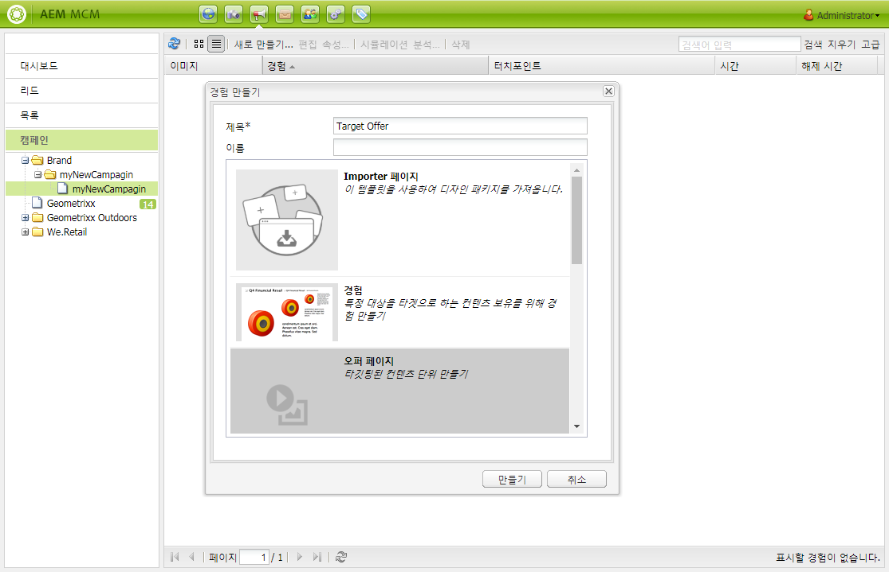

# 오퍼 Target{#target-offers}

>[!CAUTION]
>
>AEM 6.4가 확장 지원이 종료되었으며 이 설명서는 더 이상 업데이트되지 않습니다. 자세한 내용은 [기술 지원 기간](https://helpx.adobe.com/kr/support/programs/eol-matrix.html). 지원되는 버전 찾기 [여기](https://experienceleague.adobe.com/docs/).

## Test&amp;Target 오퍼 경험 만들기 {#creating-a-test-target-offer-experience}

1. 왼쪽 창에서 새 캠페인을 선택하거나 오른쪽 창에서 캠페인을 두 번 클릭합니다.
1. 아이콘을 사용하여 목록 보기를 선택합니다.

   

1. 클릭 **새로 만들기..**
1. 을(를) 지정할 수 있습니다 **제목**, **이름** 만들 경험 유형; 이 경우 Test&amp;Target 오퍼.

   

1. **만들기**&#x200B;를 클릭합니다.

   >[!NOTE]
   >
   >테스트 및 Target 경험은 현재 MCM에 나열되어 있지 않습니다. 액세스 권한은 **웹 사이트** 콘솔, 캠페인 아래에 있습니다.

## Adobe Target과 통합 {#integrating-with-adobe-target}

자세한 내용은 [Adobe과 통합](/help/sites-administering/target.md) [Target](/help/sites-administering/target.md) 자세한 내용
