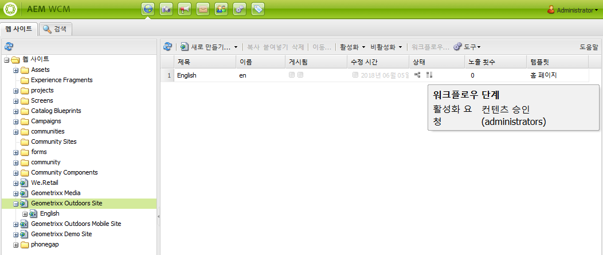
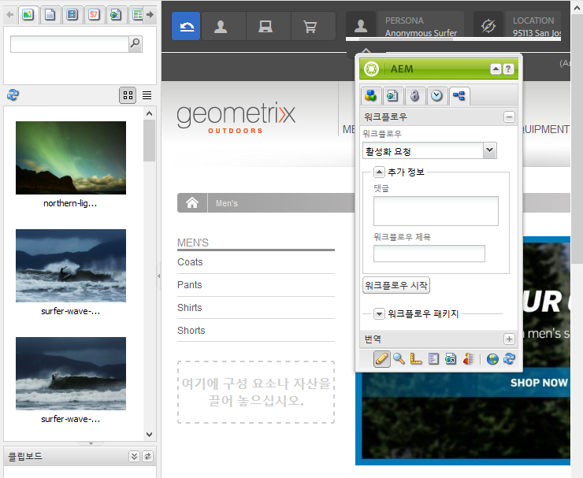

# 페이지에 워크플로 적용{#applying-workflows-to-pages}

>[!CAUTION]
>
>AEM 6.4가 확장 지원이 종료되었으며 이 설명서는 더 이상 업데이트되지 않습니다. 자세한 내용은 [기술 지원 기간](https://helpx.adobe.com/kr/support/programs/eol-matrix.html). 지원되는 버전 찾기 [여기](https://experienceleague.adobe.com/docs/).

워크플로를 적용할 때에는 다음 정보를 지정합니다.

* The workflow to apply.

   You can apply any workflow (that you have access to, as assigned by your AEM administrator).
* 원할 경우:

   * 워크플로우를 시작한 이유에 대한 정보를 제공하는 주석입니다.
   * 사용자의 받은 편지함에서 워크플로우 인스턴스를 식별하는 데 도움이 되는 제목입니다.

>[!NOTE]
>
>AEM 관리자는 [몇 가지 다른 방법](/help/sites-administering/workflows-starting.md).

## 워크플로우 적용 {#applying-workflows}

워크플로우는 웹 사이트 콘솔에서, 또는 페이지 편집 시에는 사이드 킥에서 시작할 수 있습니다.

다음 **상태** 열 **웹 사이트** 콘솔은 워크플로우가 페이지에 적용되었는지 여부를 나타냅니다.

### 웹 사이트 콘솔에서 워크플로우 시작 {#starting-a-workflow-from-the-websites-console}

1. 웹 사이트 콘솔을 엽니다. ([http://localhost:4502/siteadmin](http://localhost:4502/siteadmin))
1. 웹 사이트 트리에서 워크플로우를 적용할 페이지의 상위를 선택합니다.
1. 페이지 목록에서 페이지를 선택한 다음 워크플로우를 클릭합니다.
1. 워크플로우 시작 대화 상자에서 적용할 워크플로우를 선택합니다. 원할 경우 주석과 제목을 입력합니다. 그런 다음 시작을 클릭합니다.

### 사이드 킥을 사용하여 워크플로우 시작 {#starting-a-workflow-using-sidekick}

1. 웹 사이트 콘솔을 엽니다.
1. 필요한 페이지를 엽니다.
1. 사이드 킥에서 워크플로우 탭을 선택합니다.
1. 를 확장합니다. **워크플로우** 대화 상자에서 다음을 선택할 수 있습니다 **워크플로우** 및 선택적으로 입력합니다 **워크플로우 제목** 및 **댓글**.

   

1. 클릭 **워크플로우 시작** 구성한 속성과 현재 페이지를 페이로드로 사용하여 새 워크플로우 인스턴스를 시작하려면 다음을 수행하십시오. 이제 워크플로우가 실행 중입니다.
