# 페이지에 Dynamic Media Classic 기능 추가{#adding-scene-features-to-your-page}

[Adobe Dynamic Media ](https://help.adobe.com/ko_KR/scene7/using/WS26AB0D9A-F51C-464e-88C8-580A5A82F810.html) Classic은 리치 미디어 에셋을 관리, 향상, 게시 및 웹, 모바일, 이메일 및 인터넷에 연결된 디스플레이와 인쇄물로 전달하는 호스팅된 솔루션입니다.

다양한 뷰어에서 Dynamic Media Classic에 게시된 AEM 자산을 볼 수 있습니다.

* 확대/축소
* 플라이아웃
* 비디오
* 이미지 템플릿
* 이미지

AEM에서 Dynamic Media Classic으로 디지털 자산을 직접 게시할 수 있으며, Dynamic Media Classic에서 AEM으로 디지털 자산을 게시할 수 있습니다.

이 섹션에서는 AEM에서 Dynamic Media Classic으로 디지털 자산을 게시하거나 그 반대로 게시하는 방법에 대해 설명합니다. 뷰어도 자세히 설명되어 있습니다. Dynamic Media Classic용 AEM 구성에 대한 자세한 내용은 [Dynamic Media Classic과 AEM](/help/sites-administering/scene7.md) 통합을 참조하십시오.

[이미지 맵 추가](/help/assets/image-maps.md)도 참조하십시오.

AEM에서 비디오 구성 요소를 사용하는 방법에 대한 자세한 내용은 다음을 참조하십시오.

* [비디오](/help/sites-classic-ui-authoring/manage-assets-classic-s7-video.md)

>[!NOTE]
>
>Dynamic Media Classic 에셋이 제대로 표시되지 않으면 동적 미디어가 [disabled](/help/assets/config-dynamic.md#disabling-dynamic-media)인지 확인한 후 페이지를 새로 고칩니다.

## 자산 {#manually-publishing-to-scene-from-assets}에서 Dynamic Media Classic에 수동으로 게시

클래식 UI의 자산 콘솔에서 또는 자산에서 직접 Dynamic Media Classic에 디지털 자산을 게시할 수 있습니다.

>[!NOTE]
>
>AEM은 비동기적으로 Dynamic Media Classic에 게시합니다. **[!UICONTROL 게시]**&#x200B;를 클릭하면 자산이 Dynamic Media Classic에 게시되는 데 몇 초가 걸릴 수 있습니다.

### 자산 콘솔에서 게시 {#publishing-from-the-assets-console}

자산이 Dynamic Media Classic 대상 폴더에 있는 경우 자산 콘솔에서 Dynamic Media Classic에 게시하려면:

1. AEM 클래식 UI에서 **[!UICONTROL 디지털 자산]**&#x200B;을 클릭하여 디지털 자산 관리자에 액세스합니다.

1. Dynamic Media Classic에 게시할 대상 폴더 내에서 에셋(또는 에셋) 또는 폴더를 선택하고 마우스 오른쪽 단추를 클릭하고 **[!UICONTROL Dynamic Media Classic에 게시]**&#x200B;를 선택합니다. 또는 **[!UICONTROL 도구]** 메뉴에서 **[!UICONTROL Dynamic Media Classic에 게시]**&#x200B;를 선택할 수 있습니다.

   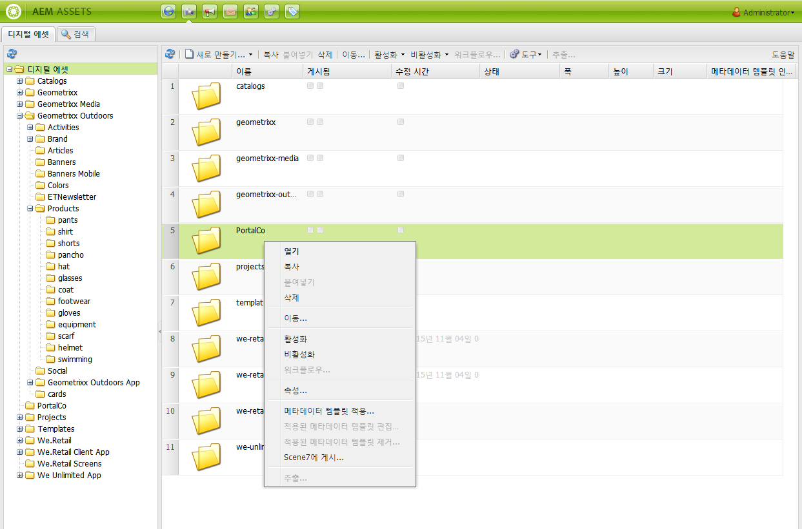

1. Dynamic Media Classic으로 이동하여 에셋을 사용할 수 있는지 확인합니다.

   >[!NOTE]
   >
   >자산이 Dynamic Media Classic 동기화 폴더에 없는 경우 두 메뉴 모두에 **[!UICONTROL Dynamic Media Classic에 게시]**&#x200B;가 표시되지만 비활성화됩니다.

### 자산에서 게시 {#publishing-from-an-asset}

자산이 동기화된 Dynamic Media Classic 폴더 내에 있는 한 자산을 수동으로 게시할 수 있습니다.

>[!NOTE]
>
>자산이 Dynamic Media Classic 동기화 폴더에 없는 경우 **[!UICONTROL Dynamic Media Classic에 게시]**&#x200B;에 대한 링크를 사용할 수 없습니다.

**디지털 자산에서 직접 Dynamic Media Classic에 게시하려면 다음을 수행하십시오**.

1. AEM에서 **[!UICONTROL 디지털 자산]**&#x200B;을 클릭하여 디지털 자산 관리자에 액세스합니다.

1. 자산을 두 번 클릭하여 엽니다.

1. 자산 세부 사항 창에서 **[!UICONTROL Dynamic Media Classic에 게시]**&#x200B;를 선택합니다.

   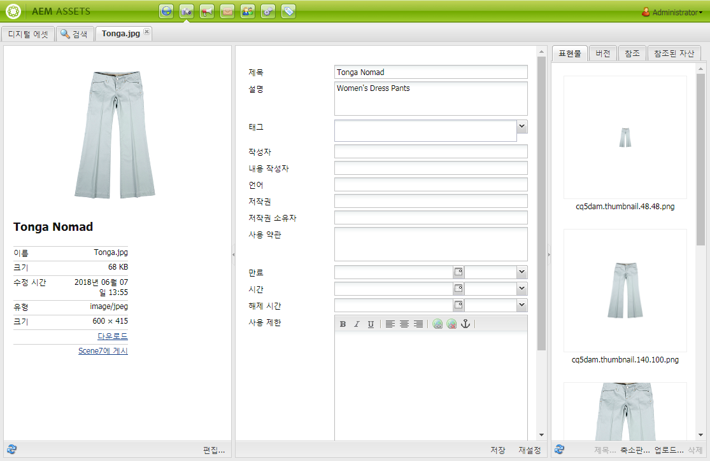

1. 링크가 **[!UICONTROL 게시 중...]**&#x200B;으로 바뀐 다음, **[!UICONTROL 게시됨]**&#x200B;으로 바뀝니다. Dynamic Media Classic으로 이동하여 에셋을 사용할 수 있는지 확인합니다.

   >[!NOTE]
   >
   >자산이 Dynamic Media Classic에 제대로 게시되지 않으면 링크가 **[!UICONTROL 게시 실패]**&#x200B;로 변경됩니다. 자산이 Dynamic Media Classic에 이미 게시된 경우 링크는 **[!UICONTROL Dynamic Media Classic에 다시 게시]**&#x200B;로 표시됩니다. 다시 게시를 사용하면 AEM에서 자산을 변경하고 다시 게시할 수 있습니다.

### CQ 대상 폴더 {#publishing-assets-from-outside-the-cq-target-folder} 외부에서 자산 게시

Adobe에서는 Dynamic Media Classic 대상 폴더 내의 자산에서만 Dynamic Media Classic에 자산을 게시하는 것이 좋습니다. 그러나 대상 폴더 외부의 폴더에서 에셋을 업로드해야 하는 경우에도 Dynamic Media Classic의 *애드혹* 폴더에 업로드하면 됩니다.

이렇게 하려면 자산이 표시되는 페이지에 대한 클라우드 구성을 구성합니다. 그런 다음 Dynamic Media Classic 구성 요소를 페이지에 추가하고 자산을 구성 요소에 끌어다 놓습니다. 페이지 속성이 해당 페이지에 대해 설정되면, 선택한 경우 Dynamic Media Classic에 업로드를 트리거하는 **[!UICONTROL Dynamic Media Classic에 게시]** 링크가 나타납니다.

>[!NOTE]
>
>임시 폴더에 있는 자산은 Dynamic Media Classic 컨텐츠 브라우저에 나타나지 않습니다.

**CQ 대상 폴더 외부에 있는 자산을 게시하려면**:

1. 클래식 UI의 AEM에서 **[!UICONTROL 웹 사이트]**&#x200B;를 클릭하고 아직 Dynamic Media Classic에 게시되지 않은 디지털 자산을 추가할 웹 페이지로 이동합니다. (일반 페이지 상속 규칙이 적용됩니다.)

1. 사이드 킥에서 **[!UICONTROL 페이지]** 아이콘을 클릭한 다음 **[!UICONTROL 페이지 속성]**&#x200B;을 클릭합니다.

1. **[!UICONTROL Cloud Services] > [!UICONTROL 서비스 추가] > [!UICONTROL Dynamic Media Classic (Scene7)]**&#x200B;을 클릭합니다.
1. Adobe Dynamic Media Classic 드롭다운 목록에서 원하는 구성을 선택한 다음 **[!UICONTROL 확인]**&#x200B;을 클릭합니다.

   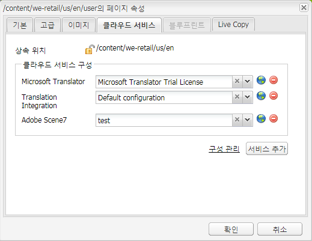

1. 웹 페이지에서 Dynamic Media Classic(Scene7) 구성 요소를 페이지의 원하는 위치에 추가합니다.
1. 컨텐츠 파인더에서 디지털 자산을 구성 요소로 끌어옵니다. **[!UICONTROL Dynamic Media Classic 게시 상태 확인]**&#x200B;에 대한 링크가 표시됩니다.

   >[!NOTE]
   >
   >디지털 자산이 CQ 대상 폴더에 있는 경우 **[!UICONTROL Dynamic Media Classic 게시 상태 확인]**&#x200B;에 대한 링크가 표시되지 않습니다. 자산은 단순히 구성 요소에 배치됩니다.

   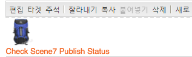

1. **[!UICONTROL Dynamic Media Classic 게시 상태 확인]**&#x200B;을 클릭합니다. 에셋이 게시되지 않은 경우 AEM은 해당 에셋을 Dynamic Media Classic에 게시합니다. 업로드 후 자산은 임시 폴더에 있습니다. 기본적으로 임시 폴더는 `name_of_the_company/CQ5_adhoc`에 있습니다. [필요한 경우 구성](#configuringtheadhocfolder)할 수 있습니다.

   >[!NOTE]
   >
   >자산이 Dynamic Media Classic 동기화 폴더에 없고 현재 페이지에 연결된 Dynamic Media Classic 클라우드 구성이 없는 경우 업로드가 실패합니다.

## Dynamic Media Classic(Scene7) 구성 요소 {#scene-components}

다음 Dynamic Media Classic 구성 요소를 AEM에서 사용할 수 있습니다.

* 확대/축소
* 플라이아웃(확대/축소)
* 이미지 템플릿
* 이미지
* 비디오

>[!NOTE]
>
>이러한 구성 요소는 기본적으로 사용할 수 없으며 사용하기 전에 **[!UICONTROL 디자인]** 모드에서 선택해야 합니다.

**[!UICONTROL 디자인]** 모드에서 사용할 수 있게 되면 다른 AEM 구성 요소처럼 페이지에 구성 요소를 추가할 수 있습니다. Dynamic Media Classic에 아직 게시되지 않은 자산은 동기화된 폴더 또는 페이지에 있거나 Dynamic Media Classic 클라우드 구성이 있는 경우 Dynamic Media Classic에 게시됩니다.

### Flash 뷰어 종료 알림 {#flash-viewers-end-of-life-notice}

2017년 1월 31일부터 Adobe Dynamic Media Classic은 공식적으로 Flash 뷰어 플랫폼에 대한 지원을 중단했습니다.

이 중요한 변경 사항에 대한 자세한 내용은 [Flash 뷰어 사용 종료 FAQ](https://docs.adobe.com/content/docs/kr/aem/6-1/administer/integration/marketing-cloud/scene7/flash-eol.html)를 참조하십시오.

### 페이지 {#adding-a-scene-component-to-a-page}에 Dynamic Media Classic 구성 요소 추가

Dynamic Media Classic 구성 요소를 페이지에 추가하는 것은 페이지에 구성 요소를 추가하는 것과 같습니다. Dynamic Media Classic 구성 요소는 다음 섹션에 자세히 설명되어 있습니다.

**클래식 UI의 페이지에 Dynamic Media Classic 구성 요소/뷰어를 추가하려면 다음을 수행하십시오**.

1. AEM에서 Dynamic Media Classic 구성 요소를 추가할 페이지를 엽니다.

1. 사용할 수 있는 Dynamic Media Classic 구성 요소가 없는 경우 사이드 킥의 눈금자를 클릭하여 **[!UICONTROL 디자인]** 모드를 시작하고 **[!UICONTROL 편집]** parsys를 클릭한 다음, 모든 **[!UICONTROL Dynamic Media Classic]** 구성 요소를 선택하여 사용할 수 있도록 하십시오.

1. 사이드 킥에서 연필을 클릭하여 **[!UICONTROL 편집]** 모드로 돌아갑니다.

1. 사이드 킥의 **[!UICONTROL Dynamic Media Classic]** 그룹의 구성 요소를 원하는 위치의 페이지로 드래그합니다.

1. **[!UICONTROL 편집]**&#x200B;을 클릭하여 구성 요소를 엽니다.

1. 필요에 따라 구성 요소를 편집하고 **[!UICONTROL 확인]**&#x200B;을 클릭하여 변경 내용을 저장합니다.

### 응답형 웹 사이트에 대화형 보기 환경 추가 {#adding-interactive-viewing-experiences-to-a-responsive-website}

자산이 응답형으로 디자인되어 자산이 표시되는 위치에 따라 조정됩니다. 반응형 디자인을 사용하면 동일한 에셋이 여러 장치에 효과적으로 표시됩니다.

**클래식 UI에서 응답형 사이트에 대화형 보기 환경을 추가하려면**:

1. AEM에 로그인하고 [구성된 Adobe Dynamic Media Classic Cloud Services](/help/sites-administering/scene7.md#configuring-scene-integration)이(가) 있고 Dynamic Media Classic 구성 요소를 사용할 수 있는지 확인합니다.

   >[!NOTE]
   >
   >Dynamic Media Classic WCM 구성 요소를 사용할 수 없는 경우 **[!UICONTROL 디자인] 모드를 통해 사용하도록 설정해야 합니다.

1. Dynamic Media Classic 구성 요소가 활성화된 웹 사이트에서 **[!UICONTROL 이미지]** 뷰어를 페이지로 드래그합니다.
1. 구성 요소를 편집하고 **[!UICONTROL Dynamic Media 클래식 설정]** 탭에서 중단점을 조정합니다.

   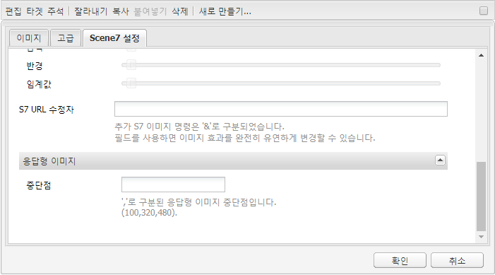

1. 뷰어가 그에 따라 크기가 조정되는지와 모든 상호 작용이 데스크톱, 태블릿 및 모바일에 최적화되어 있는지 확인합니다.

### 모든 Dynamic Media Classic 구성 요소 {#settings-common-to-all-scene-components}에 공통되는 설정

구성 옵션은 다르지만 모든 Dynamic Media Classic 구성 요소에는 다음과 같은 공통점이 있습니다.

* **[!UICONTROL 파일 참조]** - 참조할 파일을 찾아 봅니다. 파일 참조는 자산 URL을 보여주며 URL 명령 및 매개 변수를 포함하는 전체 Dynamic Media Classic URL일 필요는 없습니다. 이 필드에 Dynamic Media Classic URL 명령 및 매개 변수는 추가할 수 없습니다. 구성 요소의 해당 기능을 통해 추가해야 합니다.
* **[!UICONTROL 너비]** - 너비를 설정할 수 있습니다.
* **[!UICONTROL 높이]** - 높이를 설정할 수 있습니다.

예를 들어, **[!UICONTROL 확대/축소]** 구성 요소를 열 때 Dynamic Media Classic 구성 요소를 두 번 클릭하여 이러한 구성 옵션을 설정합니다.

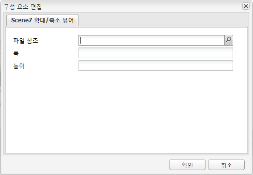

### 확대/축소 {#zoom}

HTML5 확대/축소 구성 요소가 더 큰 이미지를 표시하려면 + 단추를 누릅니다.

자산의 맨 아래에는 확대/축소 도구가 있습니다. 확대하려면 **[!UICONTROL +]**&#x200B;을 클릭하십시오. 축소하려면 **[!UICONTROL -]**&#x200B;를 클릭하십시오. **[!UICONTROL x]** 또는 확대/축소 재설정 화살표를 클릭하면 이미지가 가져온 원래 크기로 돌아갑니다. 전체 화면으로 만들려면 대각선 화살표를 클릭합니다. **[!UICONTROL 편집]**&#x200B;을 클릭하여 구성 요소를 구성합니다. 이 구성 요소를 사용하면 모든 Dynamic Media Classic 구성 요소](#settings-common-to-all-scene-components)에 공통되는 [설정을 구성할 수 있습니다.

### 플라이아웃 {#flyout}

HTML5 플라이아웃 구성 요소에서 자산은 분할 화면으로 표시됩니다. 왼쪽에는 지정된 크기의 자산이 표시되고, 오른쪽에는 확대/축소 부분이 표시됩니다. **[!UICONTROL 편집]**&#x200B;을 클릭하여 구성 요소를 구성합니다. 이 구성 요소를 사용하면 모든 Dynamic Media Classic 구성 요소](/help/sites-administering/scene7.md#settingscommontoalldynamicmediaclassiccomponents)에 공통되는 [설정을 구성할 수 있습니다.

>[!NOTE]
>
>플라이아웃 구성 요소가 사용자 지정 크기를 사용하는 경우 해당 사용자 지정 크기가 사용되고 구성 요소의 응답형 설정이 비활성화됩니다.
>
>플라이아웃 구성 요소가 기본 크기를 사용하는 경우, [!UICONTROL 디자인] 보기에 설정된 대로 기본 크기가 사용되며, 구성 요소는 구성 요소의 응답형 설정이 활성화되면 페이지 레이아웃 크기를 수용하도록 확장됩니다. 그러나 구성 요소의 응답형 설정에는 제한이 있습니다. 응답형 설정이 있는 플라이아웃 구성 요소를 사용하는 경우 전체 페이지 늘리기를 함께 사용하면 안 됩니다. 그러지 않으면, 플라이아웃이 확장되어 페이지의 오른쪽 테두리를 넘어갈 수 있습니다.

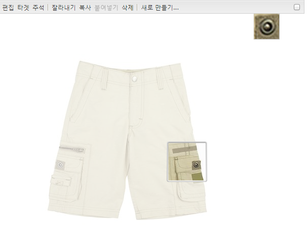

### 이미지 {#image}

Dynamic Media Classic 이미지 구성 요소를 사용하면 Dynamic Media Classic 수정자, 이미지 또는 뷰어 사전 설정 및 선명하게 하기 등과 같은 Dynamic Media Classic 기능을 이미지에 추가할 수 있습니다. Dynamic Media Classic 이미지 구성 요소는 특수 Dynamic Media Classic 기능이 있는 AEM의 다른 이미지 구성 요소와 유사합니다. 이 예에서 이미지에는 Dynamic Media Classic URL 수정자인 `&op_invert=1`이 적용되었습니다.

**[!UICONTROL 제목, 대체 텍스트]**  - 고급   탭에서 이미지에 제목을 추가하고 그래픽을 해제한 사용자를 위한 대체 텍스트를 추가합니다.

**[!UICONTROL URL, 열기]**  - 링크를 열 자산을 설정할 수 있습니다. **[!UICONTROL URL]** 및 **[!UICONTROL 여는 위치]**&#x200B;를 설정하여 같은 창에서 열지 또는 새 창에서 열지를 지정합니다.

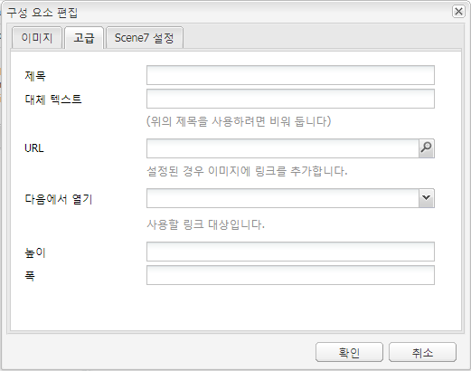

**[!UICONTROL 뷰어 사전]**  설정 - 드롭다운 메뉴에서 기존 뷰어 사전 설정을 선택합니다. 보려는 뷰어 사전 설정이 표시되지 않을 경우 표시되도록 설정해야 할 수 있습니다. [뷰어 사전 설정 관리](/help/assets/managing-viewer-presets.md)를 참조하십시오. 이미지 사전 설정을 사용 중일 때는 뷰어 사전 설정을 선택할 수 없고 그 반대의 경우도 마찬가지입니다.

**[!UICONTROL Dynamic Media Classic 구성]**  - Scene7 Publishing System에서 활성 이미지 사전 설정을 가져오는 데 사용할 Dynamic Media Classic 구성을 선택합니다.

**[!UICONTROL 이미지 사전]**  설정 - 드롭다운 메뉴에서 기존 이미지 사전 설정을 선택합니다. 보려는 이미지 사전 설정이 표시되지 않을 경우 표시되도록 설정해야 할 수 있습니다. [이미지 사전 설정 관리](/help/assets/managing-image-presets.md)를 참조하십시오. 이미지 사전 설정을 사용 중일 때는 뷰어 사전 설정을 선택할 수 없고 그 반대의 경우도 마찬가지입니다.

**[!UICONTROL 출력 형식]**  - 이미지의 출력 형식(예: jpeg)을 선택합니다. 선택한 출력 형식에 따라 추가 구성 옵션이 있을 수 있습니다. [이미지 사전 설정 관리](/help/assets/managing-image-presets.md)를 참조하십시오.

**[!UICONTROL 선명하게 하기]**  - 이미지를 선명하게 할 방법을 선택합니다. 선명하게 하기는 [*Adobe Dynamic Media Classic 이미지 품질 및 선명하게 하기 우수 사례*](/help/assets/assets/s7_sharpening_images.pdf)&#x200B;에 자세히 설명되어 있습니다.

**[!UICONTROL URL 수정자]**  - 추가 Dynamic Media Classic 이미지 명령을 제공하여 이미지 효과를 변경할 수 있습니다. 이러한 내용은 [이미지 사전 설정 관리](/help/assets/managing-image-presets.md) 및 [명령 참조](https://docs.adobe.com/content/help/ko-KR/dynamic-media-developer-resources/image-serving-api/image-serving-api/http-protocol-reference/command-reference/c-command-reference.html)에 설명되어 있습니다.

**[!UICONTROL 중단점]**  - 웹 사이트가 응답형인 경우 중단점을 조정할 수 있습니다. 중단점은 쉼표 `,`로 구분해야 합니다.

### 이미지 템플릿 {#image-template}

[Dynamic Media Classic 이미지 ](https://help.adobe.com/ko_KR/scene7/using/WS60B68844-9054-4099-BF69-3DC998A04D3C.html) 템플릿은 Dynamic Media Classic으로 가져온 계층화된 Photoshop 컨텐츠으로, 컨텐츠와 속성이 가변성을 위해 매개 변수화되었습니다. **[!UICONTROL 이미지 템플릿]** 구성 요소를 사용하여 이미지를 가져오고 AEM에서 텍스트를 동적으로 변경할 수 있습니다. 또한 클라이언트 컨텍스트의 값을 사용하도록 **[!UICONTROL 이미지 템플릿]** 구성 요소를 구성할 수 있으므로 각 사용자는 개인화된 방식으로 이미지를 경험하게 됩니다.

**[!UICONTROL 편집]**&#x200B;을 클릭하여 구성 요소를 구성합니다. 이 섹션에 설명된 다른 설정은 물론 모든 Dynamic Media Classic 구성 요소](/help/sites-administering/scene7.md#settingscommontoalldynamicmediaclassicscomponents)에 공통되는 [설정을 구성할 수 있습니다.

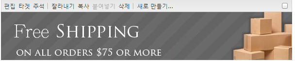

**[!UICONTROL 파일 참조, 폭, 높이]**  - 모든 Dynamic Media Classic 구성 요소에 공통인 설정을 참조하십시오.

>[!NOTE]
>
>Dynamic Media Classic URL 명령 및 매개 변수는 파일 참조 URL에 직접 추가할 수 없습니다. **[!UICONTROL 매개 변수]** 패널의 구성 요소 UI에서만 정의할 수 있습니다.

**[!UICONTROL 제목, 대체]** 텍스트 [!UICONTROL Dynamic Media Classic 이미지 템플릿] 의 경우 이미지에 제목을 추가하고 그래픽을 해제한 사용자를 위한 대체 텍스트를 추가합니다.

**[!UICONTROL URL, 여는 위치]** 링크를 열 자산을 설정할 수 있습니다. **[!UICONTROL URL]**&#x200B;을 설정하고 **[!UICONTROL 여는 위치]**&#x200B;에 같은 창에서 열지 또는 새 창에서 열지를 지정합니다.

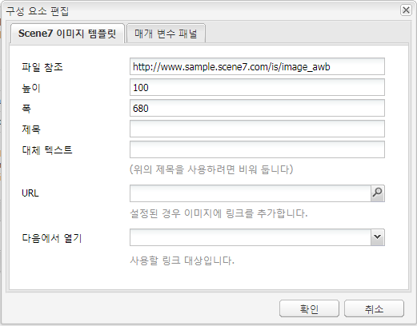

**[!UICONTROL 매개 변수 패널]** 이미지를 가져올 때 매개 변수는 이미지의 정보로 미리 채워집니다. 동적으로 변경할 수 있는 컨텐츠가 없는 경우 이 창은 비어 있습니다.

#### 동적으로 텍스트 변경 {#changing-text-dynamically}

텍스트를 동적으로 변경하려면 필드에 새 텍스트를 입력하고 **[!UICONTROL 확인]**&#x200B;을 클릭하십시오. 이 예에서 **[!UICONTROL 가격]**&#x200B;은 현재 $50이며 배송비는 99센트입니다.

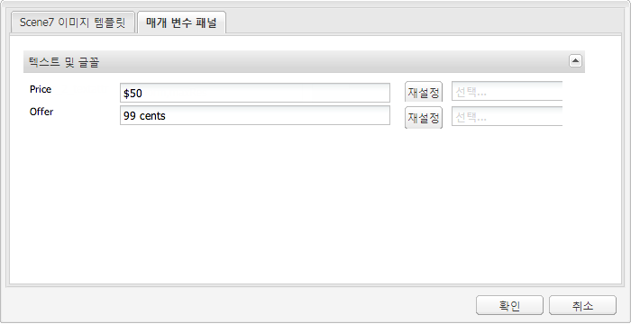

이미지의 텍스트가 변경됩니다. 필드 옆에 있는 **[!UICONTROL 재설정]**&#x200B;을 클릭하여 텍스트를 원래 값으로 재설정할 수 있습니다.

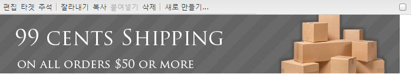

#### 클라이언트 컨텍스트 값을 반영하도록 텍스트 변경 {#changing-text-to-reflect-the-value-of-a-client-context-value}

필드를 클라이언트 컨텍스트 값에 연결하려면 **[!UICONTROL 선택]**&#x200B;을 클릭하여 클라이언트 컨텍스트 메뉴를 열고 클라이언트 컨텍스트를 선택한 후 **[!UICONTROL 확인]**&#x200B;을 클릭합니다. 이 예제에서 이름은 프로필의 형식이 지정된 이름과 연결되어 변경됩니다.

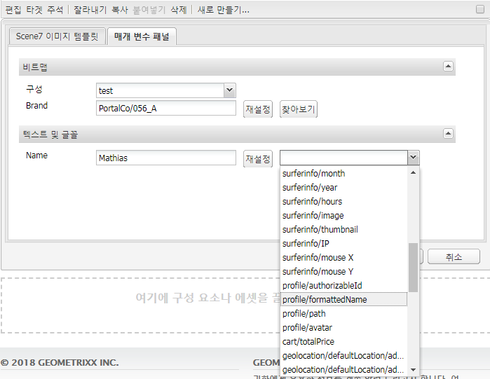

텍스트는 현재 로그인한 사용자의 이름을 반영합니다. 필드 옆에 있는 **[!UICONTROL 재설정]**&#x200B;을 클릭하여 텍스트를 원래 값으로 재설정할 수 있습니다.

#### Dynamic Media Classic 이미지 템플릿을 링크 {#making-the-scene-image-template-a-link}로 만들기

**Dynamic Media Classic 이미지 템플릿을 링크로 만들려면 다음을 수행하십시오**.

1. Dynamic Media Classic 이미지 템플릿 구성 요소가 있는 페이지에서 **[!UICONTROL 편집]**&#x200B;을 클릭합니다.
1. **[!UICONTROL URL]** 필드에 이미지를 클릭할 때 사용자가 이동되는 URL을 입력합니다. **[!UICONTROL 여는 위치]** 필드에서 대상을 새 창 또는 동일한 창 중 어떤 창에서 열지를 선택합니다.

   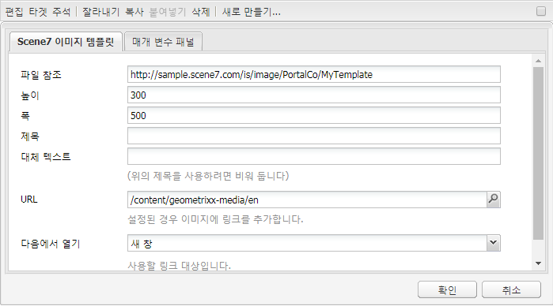

1. **[!UICONTROL 확인]**&#x200B;을 클릭합니다.

### 비디오 구성 요소 {#video-component}

Dynamic Media Classic **[!UICONTROL Video]** 구성 요소(사이드 킥의 Dynamic Media Classic 섹션에서 사용 가능)는 장치 및 대역폭 검색을 사용하여 각 화면에 올바른 비디오를 제공합니다. 이 구성 요소는 HTML5 비디오 플레이어로, 채널 간에 사용할 수 있는 단일 뷰어입니다.

응용 비디오 세트, 단일 MP4 비디오 또는 단일 F4V 비디오에 사용할 수 있습니다.

비디오가 Dynamic Media Classic 통합에 사용되는 방법에 대한 자세한 내용은 [비디오](/help/sites-classic-ui-authoring/manage-assets-classic-s7-video.md)를 참조하십시오. 또한 [Dynamic Media Classic 비디오&#x200B;**구성 요소가 기본** video **구성 요소](/help/sites-classic-ui-authoring/manage-assets-classic-s7-video.md)와 어떻게 비교되는지 확인하십시오.**

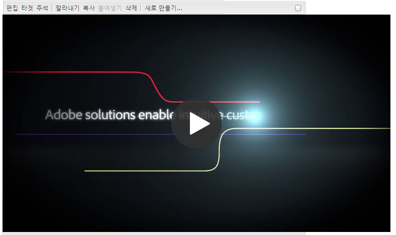

### 비디오 구성 요소의 알려진 제한 사항 {#known-limitations-for-the-video-component}

Adobe DAM 및 WCM은 마스터 비디오가 업로드되었는지를 표시합니다. 다음과 같은 프록시 자산은 표시되지 않습니다.

* Dynamic Media Classic 인코딩 표현물
* Dynamic Media Classic 응용 비디오 세트

Dynamic Media Classic 비디오 구성 요소와 함께 응용 비디오 세트를 사용하는 경우 비디오 크기에 맞게 구성 요소의 크기를 조정해야 합니다.

## Dynamic Media Classic 컨텐츠 브라우저 {#scene-content-browser}

Dynamic Media Classic 컨텐츠 브라우저를 사용하면 AEM에서 바로 Dynamic Media Classic의 컨텐츠를 볼 수 있습니다. 컨텐츠 브라우저에 액세스하려면 컨텐츠 파인더에서 터치에 적합한 사용자 인터페이스에서 **[!UICONTROL Dynamic Media Classic]** 또는 클래식 사용자 인터페이스에서 **[!UICONTROL S7]** 아이콘을 선택합니다. 기능은 두 사용자 인터페이스에서 동일합니다.

다중 구성이 있는 경우, 기본적으로 AEM은 [기본 구성](/help/sites-administering/scene7.md#configuring-a-default-configuration)을 표시합니다. 드롭다운 메뉴의 Dynamic Media Classic 컨텐츠 브라우저에서 직접 다른 구성을 선택할 수 있습니다.

>[!NOTE]
>
>* 임시 폴더에 있는 자산은 Dynamic Media Classic 컨텐츠 브라우저에 나타나지 않습니다.
>* [보안 미리 보기가 활성화되면 Dynamic Media Classic에 게시된 자산과 게시되지 않은 자산이 모두 Dynamic Media Classic 콘텐츠 브라우저에 표시됩니다.](/help/sites-administering/scene7.md#configuring-the-state-published-unpublished-of-assets-pushed-to-scene)
>* 컨텐츠 브라우저에 **[!UICONTROL Dynamic Media Classic]** 또는 **[!UICONTROL S7]** 아이콘이 옵션으로 표시되지 않으면 [AEM](/help/sites-administering/scene7.md)에서 작동하도록 Dynamic Media Classic을 구성해야 합니다.

   >
   >
* 비디오의 경우 Dynamic Media Classic 컨텐츠 브라우저는 다음을 지원합니다.
   >
   >
* 응용 비디오 세트: 여러 화면 간에 원활하게 재생되는 데 필요한 모든 비디오 표현물의 컨테이너
>* 단일 MP4 비디오
>* 단일 F4V 동영상

### 클래식 UI에서 컨텐츠 찾아보기 {#browsing-content-in-the-classic-ui}

**[!UICONTROL S7]** 탭을 클릭하여 Dynamic Media Classic에서 컨텐츠를 찾습니다.

구성을 선택하여 액세스하는 구성을 변경할 수 있습니다. 폴더는 선택한 구성에 따라 달라집니다.

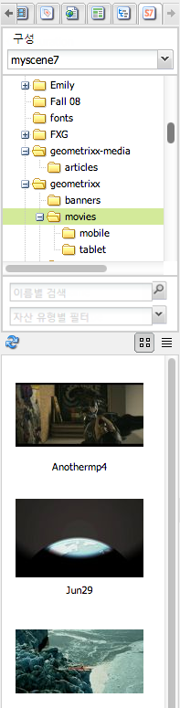

자산용 컨텐츠 파인더와 마찬가지로, 자산 및 필터 결과를 검색할 수 있습니다. 그러나 자산 파인더와 달리 **[!UICONTROL S7]** 탭에서 키워드를 입력할 때 파일 이름은 파일 이름의 키워드를 *포함하지* 않고 입력한 문자열로 *시작*&#x200B;합니다.

기본적으로 자산은 파일 이름으로 표시됩니다. 자산 유형별로 결과를 필터링할 수도 있습니다.

>[!NOTE]
>
>비디오의 경우 WCM의 Dynamic Media Classic 컨텐츠 브라우저는 다음을 지원합니다.
>
>* 응용 비디오 세트: 여러 화면 간에 원활하게 재생되는 데 필요한 모든 비디오 표현물의 컨테이너
>* 단일 MP4 비디오
>* 단일 F4V 동영상

>

### 컨텐츠 브라우저 {#searching-for-scene-assets-with-the-content-browser}에서 Dynamic Media Classic 에셋 검색

Dynamic Media Classic 에셋 검색은 검색 시 AEM으로 직접 가져오는 대신 Dynamic Media Classic 시스템의 에셋에 대한 원격 보기를 실제로 보게 된다는 점을 제외하고 AEM 에셋 검색과 유사합니다.

클래식 UI 또는 터치에 적합한 UI를 사용하여 자산을 보고 검색할 수 있습니다. 인터페이스에 따라, 검색 방식이 약간 다릅니다.

UI에서 검색할 때 다음 기준(터치에 적합한 UI에서 여기에 표시됨)에 따라 필터링할 수 있습니다.

**[!UICONTROL 키워드]**  입력 - 이름별로 자산을 검색할 수 있습니다. 키워드를 검색할 때 파일 이름의 시작 문자를 입력합니다. 예를 들어, &quot;swimming&quot;이라는 단어를 입력하면 해당 문자가 해당 순서로 시작되는 모든 자산 파일 이름이 검색됩니다. 자산을 찾으려면 용어를 입력한 후 Enter 키를 클릭해야 합니다.

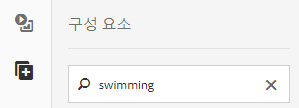

**[!UICONTROL 폴더/경로]**  - 나타나는 폴더의 이름은 선택한 구성을 기반으로 합니다. 폴더 아이콘을 클릭하고 하위 폴더를 선택한 후 확인 표시를 클릭하여 하위 레벨로 드릴다운할 수 있습니다.

키워드를 입력하고 폴더를 선택하는 경우, AEM은 해당 폴더 및 하위 폴더를 검색합니다. 그러나 검색 시 키워드를 입력하지 않을 경우 폴더를 선택하면 해당 폴더의 자산만 표시되고 하위 폴더는 포함되지 않습니다.

기본적으로 AEM은 선택한 폴더 및 모든 하위 폴더를 검색합니다.

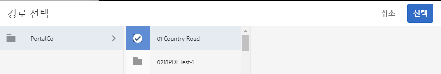

**[!UICONTROL 에셋 유형]** Dynamic Media Classic을 선택하여 Dynamic Media Classic 내용을 찾아봅니다. 이 옵션은 Dynamic Media Classic을 이미 구성한 경우에만 사용할 수 있습니다.

**[!UICONTROL 구성]** Cloud Services에 둘 이상의 Dynamic Media Classic 구성이 정의되어 있으면  [!UICONTROL 여기에서 선택할 수] 있습니다. 결과적으로 폴더는 선택한 구성에 따라 변경됩니다.

**[!UICONTROL 자산]** 유형Dynamic Media Classic 브라우저에서 다음 중 하나를 포함하도록 결과를 필터링할 수 있습니다.이미지, 템플릿, 비디오 및 응용 비디오 세트. 자산 유형을 선택하지 않으면 기본적으로 AEM은 모든 자산 유형을 검색합니다.

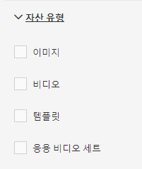

>[!NOTE]
>
>* 비디오를 검색할 때 단일 표현물을 검색합니다. 결과는 원본 변환(&amp;ast;.mp4만 해당) 및 인코딩된 변환을 반환합니다.
>* 응용 비디오 세트를 검색할 때 폴더 및 모든 하위 폴더가 검색되지만, 검색에 키워드를 추가한 경우에만 해당됩니다. 키워드를 추가하지 않은 경우 AEM이 하위 폴더를 검색하지 않습니다.

>

**[!UICONTROL 게시]** 상태게시 상태를 기반으로 자산을 필터링할 수 있습니다. [!UICONTROL 게시 ] 취소됨 . [!UICONTROL 게시 상태]를 선택하지 않으면 AEM은 기본적으로 모든 게시 상태를 검색합니다.

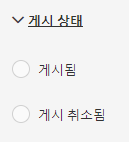

