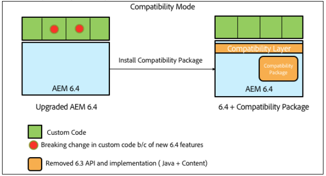

# AEM 6.4{#backward-compatibility-in-aem}의 이전 버전과의 호환성

## 개요 {#overview}

>[!NOTE]
>
>호환성 패키지의 범위에 속하지 않는 컨텐츠 및 구성 변경 사항 목록에 대해서는 [AEM 6.4](/help/sites-deploying/repository-restructuring.md)저장소 구조 조정을 참조하십시오.

AEM 6.4에서는 모든 기능이 이전 버전과의 호환성을 고려하여 개발되었습니다.

대부분의 경우 AEM 6.3을 실행하는 고객은 업그레이드를 수행할 때 코드 또는 사용자 지정을 변경할 필요가 없습니다. AEM 6.1 및 6.2 고객의 경우 6.3으로 업그레이드하는 동안 발생할 수 있는 추가 변경 사항은 없습니다.

기능을 이전 버전과 호환하지 못하는 경우, 6.3용 호환성 패키지를 설치하여 번들 및 컨텐츠에 대한 이전 버전과의 호환성을 달성할 수 있습니다(다운로드 위치에 대한 자세한 내용은 아래 설정 방법 참조). 이 호환성 패키지는 AEM 6.3과 호환되는 응용 프로그램의 호환성을 복원합니다.

호환성 패키지를 사용하면 AEM을 호환성 모드에서 실행하고 새로운 AEM 기능에 대한 사용자 지정 개발을 연기할 수 있습니다.

>[!NOTE]
>
>호환성 패키지는 AEM 6.4 호환성에 필요한 개발을 유예하는 임시 솔루션일 뿐이며 업그레이드 직후 개발을 통해 호환성 문제를 해결할 수 없는 경우에만 마지막 옵션으로 권장됩니다. 6.4 기반의 사용자 지정 개발 및 전체 6.4 기능을 사용하려면 기본 모드로 전환하고 호환성 패키지를 제거하는 것이 좋습니다.

호환성 패키지에는 다음 두 가지 모드가 있습니다.**라우팅 사용** 및 **라우팅 사용 안 함**.

이렇게 하면 AEM 6.4를 다음 세 가지 모드로 실행할 수 있습니다.

**기본 모드:**

네이티브 모드는 AEM 6.4의 모든 새로운 기능을 사용하려는 고객으로서, 새로운 모든 기능을 사용하여 사용자 지정을 작동하도록 하기 위한 일부 개발을 준비하고 있는 고객을 위한 것입니다.

즉, 업그레이드 후 즉시 애플리케이션에서 조정해야 할 수도 있습니다.

**호환성 모드:라우팅 사용 시 설치된 호환성 패키지**

호환성 모드는 이전 버전과 호환되지 않는 인터페이스 사용자 지정 사항이 있는 고객을 위한 것입니다. 이렇게 하면 AEM이 호환성 모드에서 실행되고 일부 사용자 지정 코드와 호환되지 않는 새 AEM 기능에 필요한 사용자 지정 개발을 연기할 수 있습니다.

**이전 모드:라우팅이 비활성화되어 설치된 호환성 패키지**

레거시 모드는 호환성 패키지에서 이동된 AEM의 레거시 또는 사용되지 않는 코드를 기반으로 사용자 지정 인터페이스를 사용하는 고객을 위한 것입니다.

## 설정 방법 {#how-to-set-up}

AEM 6.3 호환성 패키지는 패키지 관리자를 사용하여 패키지로 설치할 수 있습니다. 소프트웨어 배포](https://experience.adobe.com/#/downloads/content/software-distribution/en/aem.html?package=/content/software-distribution/en/details.html/content/dam/aem/public/adobe/packages/cq640/compatpack/aem-compat-cq64-to-cq63) 사이트에서 [AEM 6.3 호환성 패키지를 다운로드할 수 있습니다.

호환성 패키지가 설치되면 아래 표시된 대로 OSGI 구성의 스위치를 사용하여 라우팅을 활성화하거나 비활성화할 수 있습니다.

호환성 패키지를 설치하고 설정하면 선택한 호환성 모드를 기반으로 기능이 사용됩니다.
