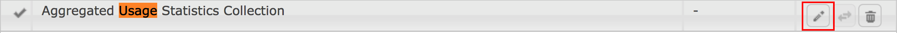

# 집계된 사용 통계 수집 선택{#opting-into-aggregated-usage-statistics-collection}

## 소개 {#introduction}

AEM과 상호 작용하는 방법에 대한 Adobe 통계를 보내 Adobe Marketing Cloud을 개선할 수 있습니다. 이 정보에는 회사의 사이트 방문자에 대한 데이터가 포함되지 않으며 사용자 경험을 Adobe으로 제공, 지원 및 향상시키는 데에만 사용됩니다.

터치 UI 또는 웹 콘솔을 사용하여 사용 통계 수집을 선택할 수 있습니다.

>[!NOTE]
>
>다양한 데이터 보호 및 개인 정보 보호 규정이 있습니다. 여기에는 GDPR 및 CPA와 같은 정보가 포함됩니다. AEM Sites은 고객의 데이터 보호 및 개인 정보 보호 규정 준수 의무를 지원할 준비가 되었습니다. 이 페이지에서는 고객에게 집계된 사용 통계 수집을 옵트인(또는 옵트아웃)하는 절차를 안내합니다.
>
>자세한 내용은 [Adobe 개인 정보 보호 센터를 참조하십시오](https://www.adobe.com/privacy.html).

>[!NOTE]
>
>또한 [웹 콘솔을](/help/sites-deploying/opt-in-aggregated-usage-statistics.md#opt-in-by-using-the-web-console) 사용하거나 AEM 옵트인 화면에서 옵트인 옵션을 선택하지 않으면 언제든지 옵트아웃할 수 있습니다.

## 터치 UI를 사용하여 옵트인 {#opt-in-by-using-the-touch-ui}

AEM을 처음 시작할 때 다음과 같이 Touch UI를 사용하여 옵트인을 할 수 있습니다.

1. AEM Navigation 화면에서 **받은 편지함** (벨) 아이콘을 클릭합니다.

   

1. 드롭다운 목록에서 &quot;집계된 사용 통계 수집&#x200B;**활성화&quot;를 클릭합니다**.

   

1. 옵트인 화면에서 &quot;집계된 사용 통계 수집&#x200B;**허용&quot;을 선택합니다**.

   

1. &quot;**완료**&quot;를 클릭합니다.

## 웹 콘솔을 사용하여 옵트인 {#opt-in-by-using-the-web-console}

다음과 같이 웹 콘솔을 사용하여 옵트인(또는 옵트아웃)할 수 있습니다.

1. AEM 탐색 화면에서 **도구** , 작업 순으로 **클릭합니다**.

   

1. 작업 창에서 **웹 콘솔을 클릭합니다**.

   

1. &quot;**집계된 사용 통계 수집&quot;을**&#x200B;검색합니다.
1. Click the **Edit** icon.

   

1. 활성화 **확인란을** 선택합니다. 또는 사용 통계 수집을 옵트아웃하려는 경우 확인란을 선택 취소할 수 있습니다.

   

1. **저장**&#x200B;을 클릭합니다.

