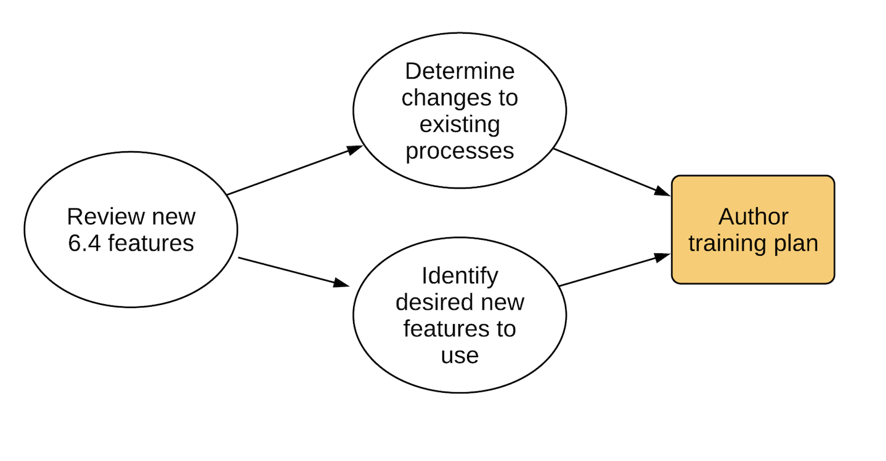
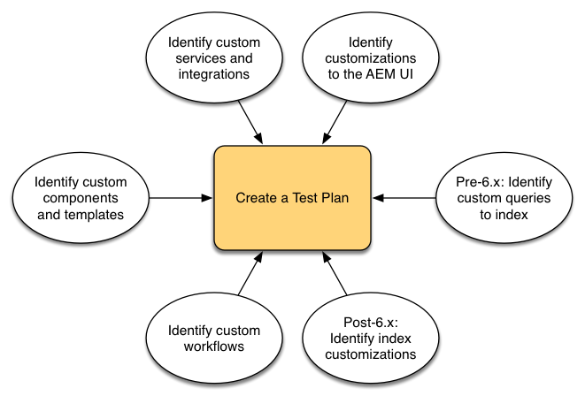
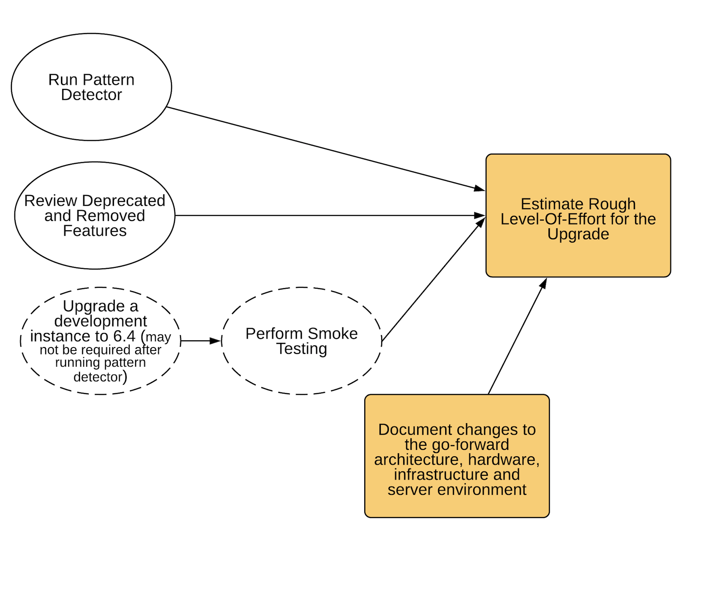

# 업그레이드 계획{#planning-your-upgrade}

## AEM 프로젝트 개요 {#aem-project-overview}

AEM은 수백만 명의 사용자에게 제공할 수 있는 영향을 많이 받는 배포에 종종 사용됩니다. 대부분의 경우 인스턴스에 배포되는 사용자 정의 애플리케이션이 있으므로 복잡성이 가중됩니다. 이러한 배포를 업그레이드하기 위한 모든 작업은 수동으로 처리해야 합니다.

이 가이드는 업그레이드를 계획할 때 명확한 목표, 단계 및 결과물을 설정하는 데 도움이 됩니다. 전반적인 프로젝트 실행 및 지침에 중점을 둡니다. 실제 업그레이드 단계에 대한 개요를 제공하면서도 적합한 기술 리소스를 참조합니다. 이 정보는 문서에서 참조되는 사용 가능한 기술 리소스와 함께 사용해야 합니다.

AEM 업그레이드 프로세스는 각 단계에 대해 정의된 주요 결과물을 사용하여 계획, 분석 및 실행 단계를 신중하게 처리해야 합니다.

AEM 버전 6.0 및 최대 6.4로 직접 업그레이드할 수 있습니다. 5.6.x 이하를 실행하는 고객은 먼저 6.0(SP3)으로 업그레이드해야 합니다. 또한 6.3 이후 세그먼트 노드 저장소에 새로운 OAK Segment Tar 형식이 사용되고 6.0, 6.1 및 6.2에도 이러한 새로운 형식으로 저장소 마이그레이션이 필수입니다.

>[!CAUTION]
>
>AEM 6.2에서 6.3으로 업그레이드하는 경우 버전(**6.2-SP1-CFP1 - -6.2SP1-CFP12.1**)이나 **6.2SP1-CFP15**)에서 업그레이드해야 합니다. 그렇지 않은 경우 **6.2SP1-CFP13/6.2SP1CFP14**&#x200B;에서 AEM 6.3으로 업그레이드하는 경우 적어도 버전 **6.3.2.2**&#x200B;으로 업그레이드해야 합니다. 그렇지 않으면 업그레이드 후 AEM Sites이 실패합니다.

## 업그레이드 범위 및 요구 사항 {#upgrade-scope-requirements}

아래에는 일반적인 AEM 업그레이드 프로젝트의 영향을 받는 영역 목록이 있습니다.

<table> 
 <tbody>
  <tr>
   <td><strong>구성 요소</strong></td> 
   <td><strong>영향</strong></td> 
   <td><strong>설명</strong></td> 
  </tr>
  <tr>
   <td>운영 체제</td> 
   <td>불확실하지만 미묘한 효과</td> 
   <td>AEM 업그레이드 시 운영 체제를 업그레이드해야 할 때이며 이 경우 몇 가지 영향이 있을 수 있습니다.</td> 
  </tr>
  <tr>
   <td>Java 런타임</td> 
   <td>중간 영향</td> 
   <td>AEM 6.3에는 JRE 1.7.x(64비트) 이상이 필요합니다. JRE 1.8은 현재 Oracle에서 지원하는 유일한 버전입니다.</td> 
  </tr>
  <tr>
   <td>하드웨어</td> 
   <td>중간 영향</td> 
   <td>온라인 개정 정리를 수행하려면 저장소 크기의 25% 및 사용 가능한 heap space 과 같은 사용 가능한   디스크 공간이 있어야 합니다. 완전히  실행되도록 하드웨어를 로 업그레이드해야 온라인 개정 정리 리소스가 충분한지 확인할 수 있습니다. 또한 AEM 6 이전 버전에서 업그레이드하는 경우 추가 스토리지 요구 사항이 있을 수 있습니다. </td> 
  </tr>
  <tr>
   <td>컨텐츠 저장소(CRX 또는 Oak)</td> 
   <td>높은 영향</td> 
   <td>버전 6.1부터 AEM은 CRX2를 지원하지 않으므로 이전 버전에서 업그레이드하는 경우  Oak(CRX3)로 마이그레이션해야 합니다. AEM 6.3에는 이(가) 마이그레이션이 필요한 새 세그먼트 노드 저장소를 구현했습니다.   crx2oak 도구는 이 용도로 사용됩니다.</td> 
  </tr>
  <tr>
   <td>AEM 구성 요소/컨텐츠</td> 
   <td>중간 영향</td> 
   <td><code>/libs</code> 및 <code>/apps</code>은 업그레이드를 통해 쉽게 처리되지만, 일반적으로 <code>/etc</code>에는 사용자 지정을 수동으로 다시 적용해야 합니다.</td> 
  </tr>
  <tr>
   <td>AEM 서비스</td> 
   <td>낮은 영향</td> 
   <td>대부분의 AEM 핵심 서비스는 업그레이드를 테스트합니다. 이것은 낮은 영향의 시대입니다.</td> 
  </tr>
  <tr>
   <td>사용자 지정 응용 프로그램 서비스</td> 
   <td>낮은 충격에서 높은 영향</td> 
   <td>인덱스가 Oak에서 자동으로 생성되지 않으므로 응용 프로그램 및 사용자 지정에 따라 JVM, 운영 체제 버전 및 일부 색인 관련  변경 사항에 대한   종속성이 있을 수 있습니다.</td> 
  </tr>
  <tr>
   <td>사용자 지정 애플리케이션 컨텐츠</td> 
   <td>낮은 충격에서 높은 영향</td> 
   <td>업그레이드를 통해 처리되지 않는 컨텐츠는 업그레이드가 수행되기 전에  에 백업한 다음 저장소로 다시 이동할 수 있습니다.  대부분의 콘텐츠는 마이그레이션 도구를 통해 처리할 수 있습니다.</td> 
  </tr>
 </tbody>
</table>

지원되는 운영 체제, Java 런타임, httpd 및 Dispatcher 버전을 실행 중인지 확인하는 것이 중요합니다. 자세한 내용은 [AEM 6.4 기술 요구 사항 페이지](/help/sites-deploying/technical-requirements.md)를 참조하십시오. 이러한 구성 요소를 업그레이드하려면 프로젝트 계획에서 고려해야 하며 AEM을 업그레이드하기 전에 수행해야 합니다.

## 프로젝트 단계 {#project-phases}

많은 작업이 AEM 업그레이드를 계획 및 실행하는 데 도움이 됩니다. 이 프로세스에 들어가는 다양한 노력을 명확히 하기 위해 계획 및 실행 연습을 별도의 단계로 분류했습니다. 아래 섹션에서는 각 단계가 프로젝트의 향후 단계에서 종종 활용되는 결과물을 생성합니다.

### 작성자 교육 계획 {#planning-for-author-training}

새로운 릴리스를 통해 UI 및 사용자 워크플로우에 대한 잠재적인 변경 사항이 도입될 수 있습니다. 또한 새 릴리스에서는 비즈니스에 도움이 될 수 있는 새로운 기능을 도입했습니다. 도입된 기능 변경 사항을 검토하고 사용자를 효과적으로 활용할 수 있도록 교육 계획을 구성하는 것이 좋습니다.

AEM 6.4의 새로운 기능은 adobe.com](/help/release-notes/release-notes.md)의 AEM 섹션에 있습니다. [ 조직에서 일반적으로 사용되는 UI 또는 제품 기능에 대한 변경 사항을 반드시 확인하십시오. 새로운 기능을 살펴보면서 조직에 유용한 모든 사항을 주목하십시오. AEM 6.4의 변경 사항을 살펴본 후 작성자를 위한 교육 계획을 개발하십시오. 여기에는 [Adobe 디지털 학습 서비스](https://www.adobe.com/training.html)를 통해 제공되는 Helpx 기능 비디오나 공식 교육 등과 같이 자유롭게 사용할 수 있는 리소스가 활용될 수 있습니다.

### 테스트 계획 만들기 {#creating-a-test-plan}

각 고객의 AEM 구현은 고유하며 비즈니스 요구 사항을 충족하도록 사용자 정의되었습니다. 따라서 시스템에 수행된 모든 사용자 지정을 테스트 계획에 포함할 수 있도록 결정하는 것이 중요합니다. 이 테스트 계획은 업그레이드된 인스턴스에서 수행하는 QA 프로세스를 진행합니다.

모든 애플리케이션과 사용자 지정 코드가 원하는 대로 계속 실행되도록 하려면 정확한 프로덕션 환경을 복제하고 업그레이드 후 테스트해야 합니다. 모든 사용자 지정을 등록하고 성능, 로드 및 보안 테스트를 실행해야 합니다. 테스트 계획을 구성할 때는 일상적인 작업에서 활용하는 기본 제공 UI 및 워크플로우뿐만 아니라 시스템에 수행된 모든 사용자 지정 사항도 고려해야 합니다. 여기에는 사용자 지정 OSGI 서비스 및 서블릿, Adobe Marketing Cloud에 대한 통합, AEM 커넥터를 통한 타사 통합, 사용자 지정 타사 통합, 사용자 지정 구성 요소 및 템플릿, AEM의 사용자 지정 UI 오버레이, 사용자 지정 워크플로우가 포함될 수 있습니다. AEM 6 이전 버전에서 마이그레이션하는 고객의 경우 모든 사용자 지정 쿼리를 인덱싱해야 할 수 있으므로 분석해야 합니다. 이미 AEM 6.x 버전을 사용 중인 고객의 경우 업그레이드 후에도 해당 인덱스가 효과적으로 계속 작동하도록 하려면 이러한 쿼리를 테스트해야 합니다.

### 필요한 아키텍처 및 인프라 변경 사항 확인 {#determining-architectural-and-infrastructure-changes-needed}

업그레이드할 때 운영 체제 또는 JVM과 같은 기술 스택의 다른 구성 요소를 업그레이드해야 할 수도 있습니다. 또한 저장소 구성의 변경으로 인해 추가 하드웨어가 필요할 수 있습니다. 일반적으로 6.x 이전 인스턴스에서 마이그레이션하는 고객에게만 제공되지만 고려해야 합니다. 마지막으로, 모니터링, 유지 관리, 백업 및 재해 복구 프로세스 등 운영 방식에 변경이 필요할 수 있습니다.

AEM 6.4에 대한 기술 요구 사항을 검토하고 현재 하드웨어와 소프트웨어가 충분한지 확인합니다. 운영 프로세스의 잠재적 변경 사항에 대해서는 다음 문서를 참조하십시오.

**모니터링 및 유지 관리:**

[작업 대시보드](/help/sites-administering/operations-dashboard.md)

[Assets 모니터링 우수 사례](/help/assets/assets-monitoring-best-practices.md)

[JMX 콘솔을 사용하여 서버 리소스 모니터링](/help/sites-administering/jmx-console.md)

[개정 정리](/help/sites-deploying/revision-cleanup.md)

**백업/복원 및 재해 복구:**

[백업 및 복원](/help/sites-administering/backup-and-restore.md)

[성능 및 확장성](/help/sites-deploying/performance.md)

[TarMK Cold Standby를 사용하여 AEM을 실행하는 방법](/help/sites-deploying/tarmk-cold-standby.md)

#### 컨텐츠 구조 조정 고려 사항 {#content-restructuring-considerations}

AEM 6.4에는 업그레이드 작업을 보다 원활하게 수행하는 데 도움이 되는 저장소 구조 변경 사항이 도입되었습니다. 변경 사항에는 Adobe 또는 고객이 컨텐츠를 소유하는지 여부에 따라 /etc 폴더의 컨텐츠를 /libs, /apps 및 /content를 포함하는 폴더로 이동하여 릴리스 중 컨텐츠를 덮어쓸 가능성을 제한합니다. 저장소 구조 변경은 업그레이드를 계획하는 동안 [AEM 6.4의 저장소 구조 조정](/help/sites-deploying/repository-restructuring.md)에서 세부 사항을 검토하는 것이 좋지만, 6.4 업그레이드 시 코드 변경이 필요하지 않도록 하는 방식으로 수행되었습니다.

### 업그레이드 복잡성 평가 {#assessing-upgrade-complexity}

고객이 AEM 환경에 적용하는 사용자 지정의 양과 특성에 대한 다양한 다양성 때문에 업그레이드에서 예상해야 하는 전반적인 작업 수준을 파악하려면 먼저 시간을 할애해야 합니다.

업그레이드의 복잡도를 평가하는 데 사용할 수 있는 두 가지 방법이 있습니다. 예비 단계에서는 AEM 6.1, 6.2 및 6.3 인스턴스에서 실행할 수 있는 새로 도입된 패턴 탐지기를 사용할 수 있습니다. 패턴 탐지기는 보고된 패턴을 사용하여 예상되는 업그레이드의 전체 복잡성을 평가하는 가장 쉬운 방법입니다. 패턴 탐지기 보고서에는 사용자 지정 코드 베이스에서 사용 중인 사용할 수 없는 API를 식별하는 패턴이 포함되어 있습니다(6.3에서 업그레이드 전 호환성 검사를 사용하여 수행됨).

초기 평가 후 보다 포괄적인 다음 단계는 테스트 인스턴스에서 업그레이드를 수행하고 몇 가지 기본적인 연기 테스트를 수행하는 것입니다. Adobe에서 일부 도 제공합니다. 또한 [사용되지 않거나 제거된 기능](/help/release-notes/deprecated-removed-features.md) 목록은 업그레이드하려는 버전뿐만 아니라 소스와 타겟 버전 간의 모든 버전에 대해서도 검토해야 합니다. 예를 들어 AEM 6.2에서 6.4로 업그레이드하는 경우 AEM 6.4용 기능 외에도 AEM 6.3에서 더 이상 사용되지 않고 제거된 기능을 검토해야 합니다.

6.4에 도입된 패턴 탐지기는 대부분의 경우 업그레이드 중에 예상되는 내용을 상당히 정확하게 추정해야 합니다. 그러나 호환되지 않는 변경 사항이 있는 복잡한 사용자 지정 및 배포의 경우 [즉석 업그레이드 수행](/help/sites-deploying/in-place-upgrade.md)의 지침에 따라 개발 인스턴스를 AEM 6.4로 업그레이드할 수 있습니다. 완료되면 이 환경에서 높은 수준의 연기 테스트를 수행합니다. 이 연습의 목적은 테스트 사례 인벤토리를 철저하게 완료하고 결함 대한 공식 인벤토리를 작성하는 것이 아니라 6.4 호환성을 위해 코드를 업그레이드하는 데 필요한 작업량의 대략적인 추정치를 제공하는 것입니다. [패턴 감지](/help/sites-deploying/pattern-detector.md) 및 이전 섹션에서 결정된 아키텍처 변경 사항과 결합하면 업그레이드를 계획하기 위해 프로젝트 관리 팀에 대략적인 견적을 제공할 수 있습니다.

### 업그레이드 및 롤백 Runbook {#building-the-upgrade-and-rollback-runbook} 작성

Adobe이 AEM 인스턴스 업그레이드 프로세스를 문서화했지만, 각 고객의 네트워크 레이아웃, 배포 아키텍처 및 사용자 지정에는 이 접근 방식을 세밀하게 조정하고 조정해야 합니다. 따라서 Dell에서 제공한 모든 설명서를 검토하고 이 설명서를 사용하여 사용자 환경에서 진행될 특정 업그레이드 및 롤백 절차에 대해 대략적으로 설명하는 프로젝트 특정 Runbook을 알리는 것이 좋습니다. CRX2에서 업그레이드하는 경우 CRX2에서 Oak로 이동할 때 컨텐츠 마이그레이션이 걸리는 시간을 평가해야 합니다. 대형 리포지토리의 경우 많은 양이 될 수 있습니다.

[업그레이드 프로시저](/help/sites-deploying/upgrade-procedure.md)에 업그레이드 및 롤백 절차와 [즉석 업그레이드 수행](/help/sites-deploying/in-place-upgrade.md)에서 업그레이드를 적용하는 단계별 지침을 제공했습니다. 이러한 지침은 업그레이드 중에 실행할 적절한 전환 및 롤백 절차를 결정하려면 시스템 아키텍처, 사용자 지정 및 다운타임 허용 여부와 함께 검토 및 고려되어야 합니다. 사용자 지정된 Runbook을 작성할 때 아키텍처 또는 서버 크기에 대한 변경 사항이 포함되어야 합니다. 이 값이 첫 번째 초안으로 처리되어야 한다는 점에 유의해야 합니다. 팀이 QA 및 개발 주기를 완료하고 스테이징 환경으로 업그레이드를 배포하면, 몇 가지 추가 단계가 필요할 수 있습니다. 가장 좋은 방법은 이 문서에 충분한 정보를 포함시켜 작업 직원에게 전달하면 해당 작업 직원이 내에 포함된 정보에서 업그레이드를 완전히 완료할 수 있다는 것입니다.

### 프로젝트 계획 개발 {#developing-a-project-plan}

이전 연습의 결과를 사용하여 테스트 또는 개발 노력, 교육 및 실제 업그레이드 실행에 대한 예상 일정을 다루는 프로젝트 계획을 구축할 수 있습니다.

포괄적인 프로젝트 계획에는 다음이 포함되어야 합니다.

* 개발 및 테스트 계획 확정

* 개발 및 QA 환경 업그레이드

* AEM 6.4용 사용자 지정 코드 기본 업데이트

* QA 테스트 및 수정 주기

* 스테이징 환경 업그레이드

* 통합, 성능 및 로드 테스트

* 환경 인증

* 라이브로 이동

### 개발 및 QA {#performing-development-and-qa} 수행

[Upgrading Code 및 Customizations](/help/sites-deploying/upgrading-code-and-customizations.md)가 AEM 6.4와 호환되도록 하는 절차를 제공했습니다. 이 반복 프로세스가 실행되면 필요에 따라 Runbook을 변경해야 합니다. 또한 업그레이드 후 즉시 개발을 하지 않고도 대부분의 경우 사용자 지정 항목이 이전 버전과 호환되는 방법에 대한 자세한 내용은 AEM 6.4](/help/sites-deploying/backward-compatibility.md)의 이전 호환성 을 참조하십시오.[

개발 및 테스트 프로세스는 일반적으로 반복적인 프로세스입니다. 사용자 지정 사항으로 인해 업그레이드 중에 변경된 사항이 제품 전체 섹션을 사용할 수 없게 될 수 있습니다. 개발자가 문제의 근본 원인을 해결하고 테스트 팀이 이러한 기능을 테스트할 수 있는 권한이 있으면 추가 문제를 발견할 가능성이 있습니다. 업그레이드 프로세스를 조정해야 하는 문제가 발견되면 사용자 지정 업그레이드 Runbook에 해당 문제를 추가해야 합니다. 여러 차례의 테스트 및 수정 반복 후에 코드 베이스의 유효성을 완전히 확인하고 스테이징 환경에 배포할 준비가 되어 있어야 합니다.

### 최종 테스트 {#final-testing}

조직의 QA 팀에서 코드 베이스를 인증한 후 최종 테스트 단계를 권장합니다. 이 테스트 과정에서는 스테이징 환경에서 Runbook을 검증한 후 사용자 수락, 성능 및 보안 테스트가 실행됩니다.

이 단계는 프로덕션 환경에서 Runbook의 단계를 확인할 수 있는 유일한 시간이므로 매우 중요합니다. 환경이 업그레이드되면 일반 사용자가 일상적인 활동에서 시스템을 사용할 때 로그인하여 수행하는 활동을 진행할 수 있도록 하는 것이 중요합니다. 사용자가 이전에 고려되지 않은 시스템 일부를 활용하는 것은 일반적입니다. Go-Live 전에 이러한 영역에서 문제를 해결하고 수정하면 비용이 많이 드는 운영 중단을 방지할 수 있습니다. AEM의 새 버전에는 기본 플랫폼에 대한 중요한 변경 사항이 포함되어 있으므로 처음 실행하는 것처럼 시스템에서 성능, 로드 및 보안 테스트를 수행하는 것이 중요합니다.

### 업그레이드 수행{#performing-the-upgrade}

모든 이해 당사자로부터 최종 로그오프가 수신되면 정의된 Runbook 절차를 실행할 차례입니다. [업그레이드 프로시저](/help/sites-deploying/upgrade-procedure.md)에 업그레이드 및 롤백 단계와 [즉석 업그레이드](/help/sites-deploying/in-place-upgrade.md)를 참조 지점으로 수행하는 의 설치 단계를 제공했습니다.

환경 유효성 검사에 대한 업그레이드 지침에 몇 가지 단계를 제공했습니다. 이러한 기능에는 업그레이드 로그 스캔 및 모든 OSGi 번들이 제대로 시작되었는지 확인하는 것과 같은 기본 검사가 포함되지만 비즈니스 프로세스를 기반으로 테스트 사례를 직접 확인하는 것이 좋습니다. 또한 AEM Online 개정 정리 일정 및 관련 루틴을 확인하여 회사의 조용한 시간 동안 발생할 수 있는지 확인하는 것이 좋습니다. 이러한 루틴은 AEM의 장기적인 성능에 필수적이다.
