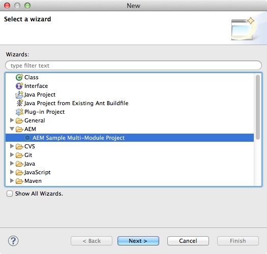
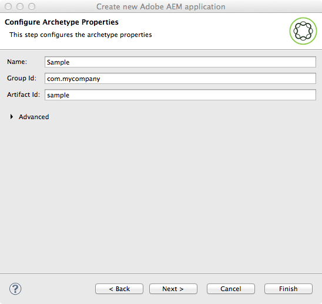

# Eclipse용 AEM 개발자 도구{#aem-developer-tools-for-eclipse}


## 개요 {#overview}

Eclipse용 AEM 개발자 도구는 Apache 라이센스 2에 릴리스된 Apache Sling](https://sling.apache.org/documentation/development/ide-tooling.html)용 Eclipse 플러그인을 기반으로 하는 Eclipse 플러그인입니다.[

AEM 개발을 쉽게 하는 몇 가지 기능을 제공합니다.

* Eclipse Server Connector를 통해 AEM 인스턴스와의 원활한 통합.
* 컨텐츠 및 OSGI 번들을 모두 동기화할 수 있습니다.
* 코드 핫 스왑 기능을 사용하여 디버깅 지원.
* 특정 프로젝트 만들기 마법사를 통해 AEM 프로젝트의 간단한 부트스트랩입니다.
* 손쉽게 JCR 속성 편집.

## 요구 사항 {#requirements}

AEM 개발자 도구를 사용하려면 먼저 다음을 수행해야 합니다.

* Java EE 개발자용 [Eclipse IDE](https://eclipse.org/downloads/packages/eclipse-ide-java-ee-developers/lunar)를 다운로드하여 설치합니다. AEM 개발자 도구는 현재 Eclipse Kepler 이상을 지원합니다

* AEM 버전 5.6.1 이상에서 사용할 수 있습니다
* [Eclipse FAQ](https://wiki.eclipse.org/FAQ_How_do_I_increase_the_heap_size_available_to_Eclipse%3F)에 설명된 대로 `eclipse.ini` 구성 파일을 편집하여 1GB 이상의 힙메모리가 있는지 확인하도록 eclipse 설치를 구성합니다.

>[!NOTE]
>
>macOS에서 **Eclipse.app**&#x200B;을 마우스 오른쪽 단추로 클릭한 다음 **패키지 내용 표시**&#x200B;를 선택하여 `eclipse.ini`**.**

## Eclipse용 AEM 개발자 도구를 설치하는 방법 {#how-to-install-the-aem-developer-tools-for-eclipse}

위의 [요구 사항](#requirements)을 충족하면 다음과 같이 플러그인을 설치할 수 있습니다.

1. [**AEM** 개발자 도구 웹 사이트](https://eclipse.adobe.com/aem/dev-tools/)를 탐색합니다.

1. **설치 링크**&#x200B;를 복사합니다.

   또는 설치 링크를 사용하는 대신 아카이브를 다운로드할 수 있습니다. 이렇게 하면 오프라인 설치가 허용되지만 이 방법으로 자동 업데이트 알림이 누락됩니다.

1. Eclipse에서 **도움말** 메뉴를 엽니다.
1. **새 소프트웨어 설치**&#x200B;를 클릭합니다.
1. **추가...를 클릭합니다.**.
1. **이름**&#x200B;에 AEM 개발자 도구를 입력합니다.
1. **Location**&#x200B;에서 설치 URL을 복사합니다.
1. **확인**&#x200B;을 클릭합니다.
1. **AEM** 및 **Sling** 플러그인을 모두 확인합니다.
1. **다음**&#x200B;을 클릭합니다.
1. **다음**&#x200B;을 클릭합니다.
1. 라인 계약에 동의하고 **완료**&#x200B;를 클릭합니다.
1. Eclipse를 다시 시작하려면 **예**&#x200B;를 클릭하십시오.

## 기존 프로젝트를 가져오는 방법 {#how-to-import-existing-projects}

>[!NOTE]
>
>AEM](https://stackoverflow.com/questions/29699726/how-to-work-with-a-bundle-in-eclipse-when-it-was-downloaded-from-aem/29705407#29705407)에서 다운로드할 때 Eclipse에서 번들을 사용하여 작업하는 방법 을 참조하십시오.[

## AEM 관점 {#the-aem-perspective}

Eclipse용 AEM 개발 도구는 AEM 프로젝트 및 인스턴스를 완벽하게 제어할 수 있는 관점을 제공합니다.


## 샘플 다중 모듈 프로젝트 {#sample-multi-module-project}

AEM Developer Tools for Eclipse에는 여러 AEM 기능에 대한 모범 사례 안내서로서 Eclipse에서 프로젝트 설정을 빠르게 확인할 수 있도록 지원하는 샘플 다중 모듈 프로젝트가 포함되어 있습니다. [Project Archetype에 대해 자세히 알아보십시오](https://github.com/Adobe-Marketing-Cloud/aem-project-archetype).

다음 단계에 따라 샘플 프로젝트를 만듭니다.

1. **파일** > **새** > **프로젝트** 메뉴에서 **AEM** 섹션으로 이동하여 **AEM 샘플 다중 모듈 프로젝트**&#x200B;를 선택합니다.

   

1. **다음**&#x200B;을 클릭합니다.

   >[!NOTE]
   >
   >m2eclipse가 원형 카탈로그를 스캔해야 하므로 이 단계는 시간이 걸릴 수 있습니다.

   

1. **com.adobe.granite.archetypes 를 선택합니다.sample-project-archetype :(가장 높은 숫자)** 메뉴에서 **다음**&#x200B;을 클릭합니다.

   

1. 샘플 프로젝트에 대한 **이름**, **그룹 id** 및 **아티팩트 id**&#x200B;를 입력합니다. 고급 속성을 설정하도록 선택할 수도 있습니다.

   

1. 그런 다음 Eclipse가 연결할 AEM 서버를 구성해야 합니다.

   디버거 기능을 사용하려면 디버그 모드에서 AEM을 시작해야 합니다. 이 작업은 명령줄에 다음을 추가하여 수행할 수 있습니다.

   ```
       -nofork -agentlib:jdwp=transport=dt_socket,server=y,suspend=n,address=10123
   ```

   

1. **완료**&#x200B;를 클릭합니다. 프로젝트 구조가 만들어집니다.

   >[!NOTE]
   >
   >새로 설치할 때(구체적으로maven 종속성이 다운로드되지 않은 경우) 오류가 발생하여 프로젝트를 만들 수 있습니다. 이 경우 [잘못된 프로젝트 정의 해결](#resolving-invalid-project-definition)에 설명된 절차를 따르십시오.

## 문제 해결 {#troubleshooting}

### 잘못된 프로젝트 정의 확인 중 {#resolving-invalid-project-definition}

잘못된 종속성 및 프로젝트 정의를 해결하려면 다음과 같이 진행합니다.

1. 생성된 프로젝트를 모두 선택합니다.
1. 마우스 오른쪽 단추를 클릭합니다. **Maven** 메뉴에서 **프로젝트 업데이트**&#x200B;를 선택합니다.
1. **Force Updates of Snapshot/Releases**&#x200B;을 선택합니다.
1. **확인**&#x200B;을 클릭합니다. Eclipse는 필요한 종속성을 다운로드하려고 합니다.

### JSP 파일 {#enabling-tag-library-autocompletion-in-jsp-files}에서 태그 라이브러리 자동 완성 사용

올바른 종속성이 프로젝트에 추가되면 태그 라이브러리 자동 완성 기능이 즉시 작동합니다. 필요한 tld 및 TagExtraInfo 파일을 포함하지 않는 AEM Uber Jar를 사용할 때 알려진 한 문제가 있습니다.

이 문제를 해결하려면 org.apache.sling.scripting.jsp.taglib 아티팩트가 AEM Uber Jar 앞에 있는 클래스 경로에 있는지 확인합니다. Maven 프로젝트의 경우 Uber Jar 앞에 pom.xml에 다음 종속성을 배치합니다.

```xml
<dependency>
  <groupId>org.apache.sling</groupId>
  <artifactId>org.apache.sling.scripting.jsp.taglib</artifactId>
  <scope>provided</scope>
</dependency>
```

AEM 배포에 적절한 버전을 추가해야 합니다.

## 추가 정보 {#more-information}

Eclipse 웹 사이트용 공식 Apache Sling IDE 도구는 다음과 같이 유용한 정보를 제공합니다.

* Eclipse용 [**Apache Sling IDE 도구** 사용 안내서](https://sling.apache.org/documentation/development/ide-tooling.html)에서는 이 설명서에서 AEM 개발 도구에서 지원하는 전체 개념, 서버 통합 및 배포 기능을 안내합니다.
* [문제 해결 섹션](https://sling.apache.org/documentation/development/ide-tooling.html#troubleshooting).
* [알려진 문제 목록](https://sling.apache.org/documentation/development/ide-tooling.html#known-issues).

다음 공식 [Eclipse](https://eclipse.org/) 설명서는 환경을 설정하는 데 도움이 될 수 있습니다.

* [Eclipse 시작하기](https://eclipse.org/users/)
* [Eclipse Luna 도움말 시스템](https://help.eclipse.org/luna/index.jsp)
* [Maven 통합(m2eclipse)](https://www.eclipse.org/m2e/)
