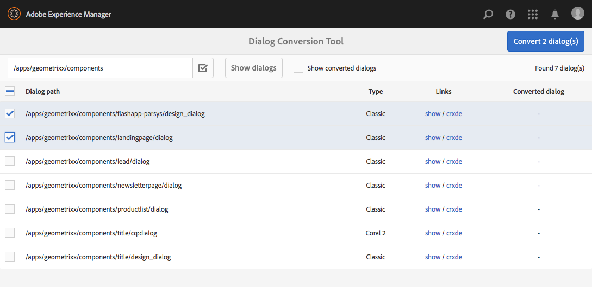
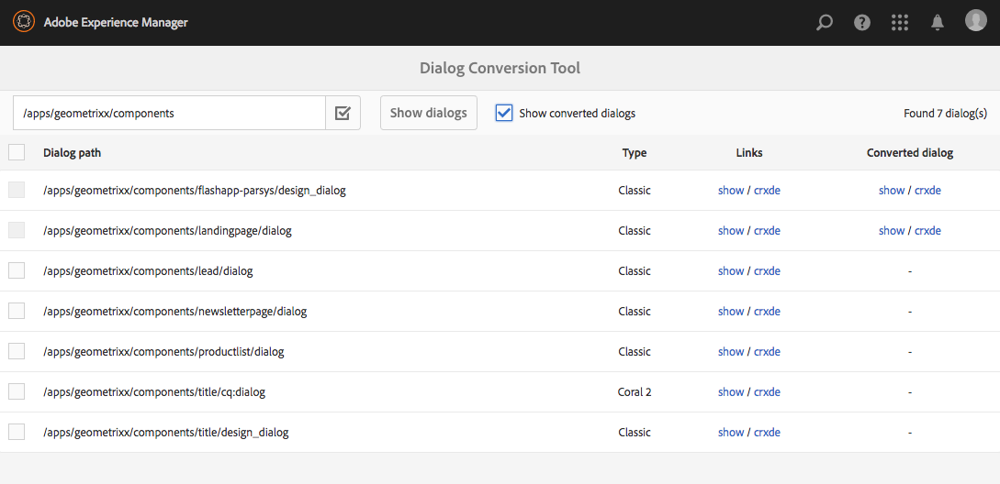

# 대화 상자 변환 도구{#dialog-conversion-tool}

대화 상자 변환 도구는 클래식 UI(ExtJS 기반)에 대해 정의된 대화 상자만 있거나 [granite UI] 및 [Coral 2]에 기반하여 정의된 기존 구성 요소를 확장하기 위해 제공됩니다. 이 도구는 원래 대화 상자를 사용하여 [화강암 UI] 및 [Coral 3]을 기반으로 표준 UI용으로 디자인된 복제 대화 상자를 만듭니다.

이 툴의 목표는 최대한 업그레이드를 자동화하고 효율성을 높이며 오류를 줄이는 것입니다. 그러나 이 도구는 모든 시나리오를 포괄할 수는 없으므로 프로세스를 완전히 자동화하지 못하고 사용자는 전환된 대화 상자를 검토하고 추가 조정을 해야 합니다. 이 도구는 전환 프로세스를 시작하는 데 도움이 되지만 전환을 완전히 제어하지는 않습니다.

이 도구는 표준, [granite UI] 및 [Coral 3] 기반 UI를 사용하여 새 대화 상자를 만들지만 변환할 수 없는 것은 건너뜁니다. 따라서 특정 구성 요소와 일치하는 규칙이 없을 경우 결과 대화 상자에 있는 그대로 복사된 원래 대화 상자의 노드가 포함될 수 있습니다. 또한 변환된 구성 요소에는 변환하기 위한 적절한 규칙이 없으므로 변환되지 않은 속성이 있을 수 있습니다.

>[!CAUTION]
>
>전환 규칙이 완벽하지 않으며 최상의 노력으로 작동하므로 이 도구는 모든 시나리오를 포괄할 수 없습니다. 가장 자주 사용하는 요소와 속성을 변환하지만 사용자 지정 또는 고도로 전문화된 대화 상자를 처리할 때는 변환이 불완전합니다. **변환된 대화 상자에서는 추가 조정이 필요할 수 있으며 모든 전환을 검토해야 합니다.**

>[!NOTE]
>
>클래식 UI가 더 이상 개발되거나 향상되지 않으므로 Adobe은 최신 기술을 활용하기 위해 고객이 기본 [granite UI] 사용자 인터페이스로 업그레이드할 것을 권장합니다.
>
>일반적으로 최신 플랫폼으로 마이그레이션하는 것이 좋지만 Coral 2에서 Coral 3으로 마이그레이션하는 것은 중요하지 않습니다. 하지만 새로운 프로젝트는 Coral 3을 기반으로 시작해야 합니다.

## 대화 상자 전환 도구 다운로드 및 설치 {#download-and-install-the-dialog-conversion-tool}

대화 상자 전환 도구는 오픈 소스로 사용되었으며 GitHub를 통해 액세스할 수 있습니다.

GITHUB에 대한 코드

GitHub에서 이 페이지의 코드를 찾을 수 있습니다

* [GitHub에서 aem-dialog-conversion 프로젝트 열기](https://github.com/Adobe-Marketing-Cloud/aem-dialog-conversion)
* 프로젝트를 ZIP 파일 [로 다운로드](https://github.com/Adobe-Marketing-Cloud/aem-dialog-conversion/archive/master.zip)

>[!NOTE]
>
>AEM은 대화 변환 도구와 함께 제공되지 않습니다. 사용하려면 다운로드하여 설치해야 합니다.

다음 단계에 따라 대화 상자 변환 도구를 설치합니다.

1. 대화 상자 전환 [도구 GitHub 프로젝트에서 패키지를 다운로드합니다](https://github.com/Adobe-Marketing-Cloud/aem-dialog-conversion/releases).
1. 인스턴스에 패키지를 설치합니다. 패키지 관리에 대한 자세한 내용은 패키지 [를 사용한 작업 방법을 참조하십시오](/help/sites-administering/package-manager.md).

## 대화 상자 변환 {#converting-a-dialog}

이 도구는 컨텐츠 트리의 원래 대화 상자와 동일한 위치에서 해당 [화강암 UI]/[Coral 3] 대화 상자를 만들어 대화 상자를 변환합니다. [화강암 UI]/[Coral 2] 대화 상자의 경우, 이 대화 상자는 무시되지 않도록 백업 위치( `.coral2` 대화 상자 노드 이름에 접미사가 추가됩니다)에 복사됩니다. 이 도구는 디자인 대화 상자뿐만 아니라 대화 상자도 변환할 수 있습니다.

하나 이상의 대화 상자를 변환하려면 다음 단계를 따르십시오.

1. 전역 탐색 **->** 도구 **-> 작업** 에서 액세스할 수 있는 대화 상자 전환 **콘솔** ****&#x200B;을 엽니다.

   `https://<hostname>:<port>/libs/cq/dialogconversion/content/console.html`

   

1. 필요한 경로를 입력합니다(예: `/apps/geometrixx/components`). 같은 단일 대화 상자에 직접 경로를 입력할 수도 있습니다 `/apps/geometrixx/components/lead`.

   

1. 대화 **상자** 표시를 선택하여 해당 위치 아래에 있는 모든 대화 상자를 표시합니다.

   

   이 표에는 입력한 경로 아래에 있는 기존의 모든 대화 상자가 나열됩니다. 각 대화 상자의 유형은 나열됩니다. 유형에는 다음이 포함됩니다.

   * **클래식:** 노드 이름 `cq:Dialog` 또는 노드 이름이 있는 유형 `dialog` 노드 `design_dialog`
   * **산호 2:** 하위 컨텐츠 노드에서 [MOCK] `cq:dialog` `cq:design_dialog` or that has a Granite UI / Coral 2 resource type at the child content node

   각 행은 대화 상자를 볼 수 있는 링크와 해당 노드 구조를 볼 수 있는 CRXDE Lite에 대한 링크를 포함합니다.

   >[!NOTE]
   >
   >클래식 UI나 Coral 2에 대한 대화 상자가 전혀 없는 구성 요소(즉, [화강암 UI/Coral 3]로 디자인된 구성 요소는 나열되지 않습니다.

1. 변환에 사용할 대화 상자를 하나 이상 선택하고 **X 변환 대화 상자를 클릭하거나 탭하여** 변환 프로세스를 시작합니다.

   

1. 선택한 대화 상자가 변환 결과와 함께 나열됩니다. 변환이 성공하면 행에 변환된 대화 상자를 보거나 CRXDE Lite에서 여는 링크가 포함됩니다.

   뒤로를 **클릭하거나** 탭하여 대화 상자 전환 도구로 돌아갑니다.

   

1. 대화 상자 전환 도구에서 변환된 대화 상자가 더 이상 목록에 표시되지 않습니다. 그러나 이미 변환된 대화 상자 수를 포함하여 총 대화 상자 수가 여전히 나열되며, 즉 테이블의 행 수가 발견된 행 수와 반드시 일치하지 않습니다.

   

1. 변환된 대화 상자 **표시 옵션을** 선택하면 이미 변환된 지정된 경로에 있는 대화 상자가 표시됩니다.

   

   대화 상자가 이미 변환되어 있으면 변환된 대화 상자에도 링크가 제공됩니다. 이미 사용 가능한 동위 [화강암 UI]/[Coral 3] 대화 상자가 있는 경우 대화 상자가 변환된 것으로 간주됩니다.

## 대화 상자 다시 작성 규칙 {#dialog-rewrite-rules}

대화 상자 변환 도구는 **그래프 재작성**&#x200B;개념을 기반으로 하며 재작성 규칙을 적용하여 제목 그래프를 변형하는 것입니다. 다시 작성 규칙은 패턴 및 대체 그래프를 연결하는 것입니다. 이 규칙은 제목 그래프에서 특정 하위 그래프 발생을 일치시키고 그 뒤에 이를 대체합니다. 그래프 재작성에 [대한 자세한 내용은 https://en.wikipedia.org/wiki/Graph_rewriting을](https://en.wikipedia.org/wiki/Graph_rewriting) 참조하십시오.

대화 상자 변환 도구는 이 접근 방식을 사용하여 주어진 레거시 대화 상자 트리(클래식 또는 [화강암 UI/Coral 2)를 [화강암 UI]/[Coral 3] 상대 영역에 다시 씁니다. 이 기능은 전환이 매우 유연하고 복잡한 구성 요소도 고려할 수 있다는 장점이 있습니다. 일치는 실제 하위 트리에서 수행되며 단일 노드나 속성만 계산되지 않기 때문입니다.

### 알고리즘 {#algorithm}

다시 작성 알고리즘은 다시 작성할 트리 및 다시 작성 규칙 세트를 매개 변수로 사용합니다. 이 클래스는 트리를 순서대로 순회하고 각 노드에 대해 규칙이 해당 노드의 하위 트리에 적용되는지 확인합니다. 일치하는 첫 번째 규칙이 해당 하위 트리에서 다시 작성하기 위해 적용됩니다. 그런 다음 순회가 루트에서 다시 시작됩니다. 전체 트리가 탐색되는 즉시 알고리즘이 정지되고 어떤 하위 트리와도 일치하는 규칙이 없습니다. 최적화 측정으로 알고리즘은 최종 노드 집합을 추적하므로 후속 트래픽에서 일치하는지 다시 확인할 필요가 없습니다. 재작성 규칙은 재작성 규칙에 달려 있으며, 재작성된 트리의 어떤 노드가 최종적인지 정의하며, 이 노드는 알고리즘의 향후 가공 패스에 의해 다시 방문되어야 합니다.

전환의 시작 지점은 POST 요청에 등록된 `DialogConversionServlet`항목입니다 `/libs/cq/dialogconversion/content/convert.json`. 이 매개 변수는 변환할 대화 상자의 경로를 포함하는 배열인 경로 요청 매개 변수를 허용합니다. 그런 다음 서블릿은 정의된 모든 대화 상자 재작성 규칙을 적용하여 해당 대화 상자 트리를 다시 작성합니다.

### 규칙 유형 다시 작성 {#rewrite-rule-types}

다시 작성 규칙은 다음과 같이 두 가지 방법으로 정의할 수 있습니다.

* JCR 노드 구조 - [노드 기반 재작성 규칙](/help/sites-developing/dialog-conversion.md#node-based-rewrite-rules)

* 특정 인터페이스를 구현하는 Java 클래스 - [Java 기반 재작성 규칙](/help/sites-developing/dialog-conversion.md#java-based-rewrite-rules)

일부 [애플리케이션은 기본적으로 제공되지만](#provided-rewrite-rules)사용자 정의된 규칙을 정의할 수도 있습니다. [샘플 다시 작성 규칙도](/help/sites-developing/dialog-conversion.md#sample-rewrite-rules) 사용할 수 있습니다.

일반적으로 단일 대화 상자 다시 작성 규칙은 경로 브라우저 입력 필드와 같이 단일 대화 상자 요소를 재작성할 책임이 있습니다.

>[!CAUTION]
>
>재작성 루프는 알고리즘에서 인식되지 않으므로 **재작성 규칙은 트리를 원형 방식으로 다시 쓰지 않아야 합니다**.

### 노드 기반 재작성 규칙 {#node-based-rewrite-rules}

노드 및 속성의 관점에서 대화 상자 재작성 규칙을 정의할 수 있습니다.

```xml
rule
  - jcr:primaryType = nt:unstructured
  - cq:rewriteRanking = 4
  + patterns
    - jcr:primaryType = nt:unstructured
    + foo
      - ...
      + ...
    + foo1
      - ...
      + ...
  + replacement
    + bar
      - ...
      + ...
```

이 예에서는 두 가지 **패턴** (및 `foo` 에 루팅된 트리 `foo1`) **과** 대체 `bar`(트리 루트에 있음)가 포함된 규칙을정의합니다. 패턴 및 교체 트리는 노드와 속성을 포함하는 임의 나무입니다. 정의된 패턴 중 하나라도 일치하는 경우 이 규칙은 하위 트리를 일치시킵니다. 패턴이 일치하려면 제목 트리가 패턴(일치하는 이름)과 동일한 노드를 포함해야 하며 패턴에 정의된 모든 속성이 트리의 속성과 일치해야 합니다.

일치의 경우 일치하는 하위 트리(원본 트리라고 함)가 대체로 대체됩니다. 교체 트리는 원래 트리의 속성 값을 상속할 매핑된 속성을 정의할 수 있습니다. 유형이어야 하며 다음 형식 `String` 이 있어야 합니다.

`${<path>}`

원래 트리에 참조된 속성이 없으면 속성이 생략됩니다. 또는 해당 경우에 기본값을 지정할 수 있습니다(문자열 속성에만 가능).

`${<path>:<default>}`

&#39;&#39; 문자가 포함된 속성 `:`은 단일 인용 부호로 지정하여 기본값을 제공하는 것과 충돌하지 않도록 할 수 있습니다. 표현식에 &#39;&#39;가 접두사로 있으면 부울 속성이 `!`무효화됩니다. 매핑된 속성은 여러 값을 사용할 수 있으며, 이 경우 일치하는 트리에 있는 첫 번째 속성의 값이 할당됩니다.

예를 들어, 일치하는 원본 트리 `one` 의 속성 값 `./two/three` 이 다음 속성에 할당됩니다.

```xml
...
  + replacement
    + bar
      - one = ${./two/three}
      - negated = !${./some/boolean/prop}
      - default = ${./some/prop:default}
      - multi = [${./prop1}, ${./prop2}]
```

규칙은 다음과 같은 선택적 속성을 지원합니다.

* `cq:rewriteOptional` (부울)

   패턴 노드에 이 속성을 설정하여 패턴이 일치하기 위해 노드가 존재하지 않을 필요가 있음을 나타냅니다.

* `cq:rewriteRanking` (정수)

   규칙 노드에서 이 속성을 설정하여 규칙이 적용되는 순서에 영향을 줍니다. 이 기능은 더 많은 특정 구조를 처리하는 규칙이 더 많은 일반적인 구조를 덮어쓰지 않도록 하는 데 유용합니다. 등급이 낮은 규칙은 순위가 높은 규칙보다 우선합니다. 기본적으로 모든 규칙은 순위 `Integer.MAX_VALUE` 로 받습니다.

교체 트리는 다음과 같은 특수 속성을 지원합니다(다음으로 이름이 지정됨 `cq:rewrite`).

* `cq:rewriteMapChildren` (문자열)

   이 속성을 포함하는 노드는 속성 값(예: `cq:rewriteMapChildren=./items`).

* `cq:rewriteFinal` (부울)

   이 속성은 이 속성을 포함하는 노드가 최종적이며 일치하는 다시 확인 안 할 필요가 없음을 알고리즘에 알려 주는 최적화 측정입니다. 교체 노드 자체에 배치되면 전체 교체 트리가 최종적으로 확정됩니다.
* `cq:rewriteCommonAttrs` (부울)

   원본 루트 노드의 관련 속성을 복사 루트에 상응하는 Granite common 속성에 매핑하려면 대체 노드( `rule`/ `replacement`)에 이 속성을 설정합니다. 타겟에서 하위 노드를 복사/만들고 여기에 속성을 `granite:data` 작성하여 데이터 속성을 `data-*` 처리합니다.
* `cq:rewriteRenderCondition` (부울)

   대체 노드( `rule`/)에 이 속성 `replacement`을 설정하여 원래 루트 노드에서 복제 루트의 `rendercondition` 자식으로 모든 Granite render 조건( `granite:rendercondition`또는 `granite:rendercondition` ) 하위 노드를 복사합니다.

또한 결과 `cq:rewriteProperties` 에 매핑된 속성에 대한 문자열 재쓰기를 정의하기 위해 대체 노드에 노드를 추가할 수 있습니다. 대체에서 노드가 제거됩니다. 노드의 `cq:rewriteProperties` 속성은 재작성하고 두 매개 변수가 있는 문자열 배열을 받는 속성과 동일한 이름을 지정해야 합니다.

* `pattern`: Regex를 일치시킬 수 있습니다(예: `"(?:coral-Icon-)(.+)"`

* `replacement`: Matcher 함수에 `replaceAll` 제공됨(예: `"$1"`

다음은 Coral 2 아이콘 속성을 상응하는 Coral 3으로 다시 쓰는 예입니다.

```xml
...
  + replacement
    + bar
      - icon = ${./icon}
      + cq:rewriteProperties
       - icon = [(?:coral-Icon--)(.+), $1]
```

#### 자체 노드 기반 재작성 규칙 정의 {#defining-your-own-node-based-rewrite-rules}

제공된 다시 작성 규칙은 다음에 정의되어 있습니다.

`/libs/cq/dialogconversion/rules`

이 위치에서 클래식 다시 작성 규칙 및 Coral 2 다시 작성 규칙에 대한 폴더로 규칙이 더 세분화됩니다.

`/libs/cq/dialogconversion/rules/classic`

`/libs/cq/dialogconversion/rules/coral2`

다음 위치에서 규칙 세트를 제공하여 이러한 규칙을 덮어쓸 수 있습니다.

`/apps/cq/dialogconversion/rules`

복사한 다음 기존 `/libs/cq/dialogconversion/rules` 을 `/apps` 수정하거나 새 규칙을 이 새 인스턴스 &quot;&quot;에 추가할 수 있습니다.

### Java 기반 재작성 규칙 {#java-based-rewrite-rules}

더 복잡한 재작성 규칙은 인터페이스의 OSGi 서비스를 노출하는 Java 클래스로 정의할 수 `com.adobe.cq.dialogconversion.DialogRewriteRule`있습니다.

이러한 클래스는 다음 메서드를 구현해야 합니다.

```java
boolean matches(Node root) throws RepositoryException;
Node applyTo(Node root, Set<Node> finalNodes) throws DialogRewriteException, RepositoryException;
int getRanking();
```

규칙이 제공된 루트 노드의 하위 트리에서 루트 `matches` `true` 와 일치하는 경우 메서드가 반환되어야 합니다. 규칙이 일치하는 경우 트리 재작성 알고리즘은 뒤에 메서드를 호출합니다. 이 `applyTo` 메서드는 지정된 루트 노드에서 루트 하위 트리를 다시 작성해야 합니다. 일반적으로 이 방법은 원래 트리의 이름을 일시적으로 변경하고, 새 트리를 원래 트리의 상위 노드의 새 자식으로 만들고(해당 노드 및 속성을 사용) 원래 트리를 마지막으로 제거합니다. 자세한 내용은 `com.adobe.cq.dialogconversion.DialogRewriteRule` 인터페이스 Javadoc에서 확인할 수 있습니다.

#### 추가 정보 - Javadocs {#further-information-javadocs}

자세한 내용은 Javadocs for을 참조하십시오 [`com.adobe.cq.dialogconversion`](https://adobe-marketing-cloud.github.io/aem-touchui-dialogconversion-samples/javadoc/).

#### 자체 Java 기반 재작성 규칙 정의 {#defining-your-own-java-based-rewrite-rules}

다음 클래스는 인터페이스를 구현하는 사용자 지정 다시 작성 규칙의 예를 `com.adobe.cq.dialogconversion.DialogRewriteRule` 보여줍니다.

```java
@Component
@Service
public class CustomDialogRewriteRule implements DialogRewriteRule {
 
    public boolean matches(Node root) throws RepositoryException {
        // ...
    }
 
    public Node applyTo(Node root, Set<Node> finalNodes) throws DialogRewriteException, RepositoryException {
        // ...
    }
 
    int getRanking() {
        // ...
    }

}
```

또는 아래와 `com.adobe.cq.dialogconversion.AbstractDialogRewriteRule` 같이 확장할 수 있습니다. 추상 클래스는 메서드를 구현하고 서비스의 `getRanking` `service.ranking` OSGi 속성을 사용하여 규칙의 등급을 결정합니다.

```java
@Component
@Service
@Properties({
        @Property(name="service.ranking", intValue = 10)
})
public class CustomDialogRewriteRule extends AbstractDialogRewriteRule {

    public boolean matches(Node root) throws RepositoryException {
        // ...
    }
 
    public Node applyTo(Node root, Set<Node> finalNodes) throws RewriteException, RepositoryException {
        // ...
    }
 
}
```

### 제공된 다시 작성 규칙 {#provided-rewrite-rules}

패키지에 미리 정의된 여러 개의 다시 작성 규칙이 포함되어 있습니다. `cq-dialog-conversion-content` 클래식 UI 위젯의 경우 [자세한 내용은 xtype](/help/sites-developing/xtypes.md) 사용을 참조하십시오.

<table> 
 <tbody> 
  <tr> 
   <td><strong>규칙</strong></td> 
   <td><strong>기존 구성 요소</strong></td> 
   <td><strong>[MOCK] Granite UI / Coral 3 Replacement</strong></td> 
  </tr> 
  <tr> 
   <td><code>com.adobe.cq.dialogconversion.rules.CqDialogRewriteRule</code></td> 
   <td>Node of type <code>cq:Dialog</code>, handles different substructions</td> 
   <td><p>A <code>granite/ui/components/foundation/container</code> 또는 <code>fixedcolumns</code> 레이아웃 <code>tabs</code> 사용</p> <p>대화 상자의 실제 구성 요소가 복사되고 알고리즘의 후속 가공 패스에 다시 작성됩니다.</p> </td> 
  </tr> 
  <tr> 
   <td><code>com.adobe.cq.dialogconversion.rules.IncludeRule</code></td> 
   <td>xtype = <code>cqinclude</code></td> 
   <td>참조된 노드가 [화강암 UI/Coral 3] 대화 상자에 복사되고 (가능한 경우) 알고리즘에 의해 나중에 다시 작성됩니다.</td> 
  </tr> 
  <tr> 
   <td><code>com.adobe.cq.dialogconversion.rules.MultifieldRewriteRule</code></td> 
   <td>xtype = <code>multifield</code></td> 
   <td><p>A <code>granite/ui/components/coral/foundation/form/multifield</code></p> <p>하위 노드 <code>fieldConfig</code> (있는 경우)는 별도로 작성되므로 지원되는 구성 요소를 제한하지 않습니다.</p> </td> 
  </tr> 
  <tr> 
   <td><code>/libs/cq/dialogconversion/rules/classic</code></td> 
   <td><code class="code">button
      checkbox
      colorfield
      combobox
      componentselector
      datetime
      fieldset
      fileupload
      hidden
      numberfield
      panel
      password
      pathfield
      radio
      radiogroup
      select
      sizefield
      tabpanel
      tags
      textarea
      textfield</code></td> 
   <td> </td> 
  </tr> 
  <tr> 
   <td><code>/libs/cq/dialogconversion/rules/coral2</code></td> 
   <td><code class="code">actionfield
      autocomplete
      button
      checkbox
      collapsible
      colorpicker
      container
      datepicker
      fieldset
      fileupload
      fixedcolumns
      heading
      hidden
      hyperlink
      include
      multifield
      nestedcheckboxlist
      nestedcheckboxlist-checkbox
      numberfield
      password
      pathbrowser
      radio
      radiogroup
      reset
      select
      submit
      switch
      tabs
      tags
      text
      textarea
      textfield
      userpicker
      well</code></td> 
   <td> </td> 
  </tr> 
 </tbody> 
</table>

### 샘플 다시 작성 규칙 {#sample-rewrite-rules}

GITHUB에 대한 코드

GitHub에서 이 페이지의 코드를 찾을 수 있습니다

* [GitHub에서 aem-touchui-dialrogconversion-samples 프로젝트 열기](https://github.com/Adobe-Marketing-Cloud/aem-touchui-dialogconversion-samples)
* 프로젝트를 ZIP 파일 [로 다운로드](https://github.com/Adobe-Marketing-Cloud/aem-touchui-dialogconversion-samples/archive/master.zip)

