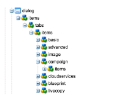

# Adobe Campaign 양식 구성 요소를 사용하여 사용자 지정 AEM 페이지 템플릿 만들기{#creating-custom-aem-page-template-with-adobe-campaign-form-components}

>[!CAUTION]
>
>AEM 6.4가 확장 지원이 종료되었으며 이 설명서는 더 이상 업데이트되지 않습니다. 자세한 내용은 [기술 지원 기간](https://helpx.adobe.com/kr/support/programs/eol-matrix.html). 지원되는 버전 찾기 [여기](https://experienceleague.adobe.com/docs/).

이 페이지에서는 를 사용하는 사용자 지정 페이지 템플릿을 작성하는 방법을 설명합니다 [Adobe Campaign 양식](/help/sites-authoring/adobe-campaign-components.md) Geometrixx-outdoors 템플릿 방법을 검사하여 구성 요소( `/apps/geometrixx-outdoors/components/page_campaign_profile`)가 구현되고, 사용자 지정 템플릿을 만들 때 필요한 중요한 정보를 알려줍니다.

>[!NOTE]
>
>[전자 메일 및 양식 샘플은 Geometrixx에서만 사용할 수 있습니다](/help/sites-developing/we-retail.md). 패키지 공유에서 샘플 Geometrixx 콘텐츠를 다운로드하십시오.

Adobe Campaign 양식 구성 요소를 사용하여 사용자 지정 AEM 페이지 템플릿을 만들려면 다음 항목이 있는지 확인하십시오.

1. **올바른 resourceSuperType**

   페이지 구성 요소가 `mcm/campaign/components/profile`.

   정보를 가져오고 저장하는 데에는 서블릿이 필요합니다

   * `com.day.cq.mcm.campaign.servlets.TemplateListServlet`
   * `com.day.cq.mcm.campaign.servlets.SaveProfileServlet`

   

1. **ClientContext 설정**

   clientcontext 설정을 볼 때( `/etc/designs/geometrixx-outdoors/jcr:content/page_campaign_profile`) 다음 설정이 표시됩니다.

   * ClientContext 지점 `/etc/clientcontext/campaign`
   * 추가 요금도 있습니다 *config* 노드 아래에 있어야 합니다.

   

1. **head.jsp (/apps/geometrixx-outdoors/components/page_campaign_profile/head.jsp)**

   in **head.jsp**&#x200B;를 사용하는 다음 줄이 표시됩니다 **clientcontext-config** 그리고 **cloudservice-hook**:

   ```
   <cq:include path="config" resourceType="cq/personalization/components/clientcontext_optimized/config"/>
   <sling:include path="contexthub" resourceType="granite/contexthub/components/contexthub"/>
   <cq:include script="/libs/cq/cloudserviceconfigs/components/servicelibs/servicelibs.jsp"/>
   ```

1. **body.jsp (/apps/geometrixx-outdoors/components/page_campaign_profile/body.jsp)**

   in **body.jsp**&#x200B;로 설정하는 경우 클라우드 서비스는 페이지 하단에 로드됩니다.

   ```
   <cq:include path="cloudservices" resourceType="cq/cloudserviceconfigs/components/servicecomponents"/>
   ```

1. **Campaign 페이지 속성**

   Adobe Campaign 템플릿을 선택하려면 페이지 속성이 **캠페인** 탭:

   `/apps/geometrixx-outdoors/components/page_campaign_profile/dialog/items/tabs/items/campaign`

   

1. **템플릿 설정**.

   템플릿( `/apps/geometrixx-outdoors/templates/campaign_profile/jcr:content`) 다음 기본값이 표시됩니다.

   | **acMapping** | mapRecipient(Adobe Campaign 6.1용), 프로필(Adobe Campaign Standard용) |
   |---|---|
   | **acTemplateId** | 메일 |

   
