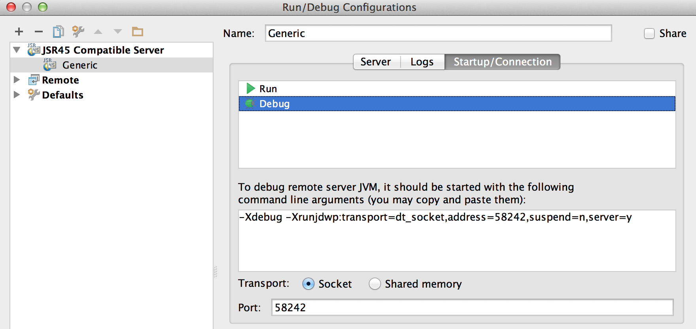

# IntelliJ IDEA를 사용하여 AEM 프로젝트를 개발하는 방법{#how-to-develop-aem-projects-using-intellij-idea}

## 개요 {#overview}

IntelliJ에서 AEM 개발을 시작하려면 다음 단계가 필요합니다.

각 방법은 본 사용 방법(How-To)의 나머지 부분에서 더 자세히 설명합니다.

* IntelliJ 설치
* Maven을 기반으로 AEM 프로젝트 설정
* Maven POM에서 IntelliJ에 대한 JSP 지원 준비
* IntelliJ로 Maven 프로젝트 가져오기

>[!NOTE]
>
>이 안내서는 IntelliJ IDEA Ultimate Edition 12.1.4 및 AEM 5.6.1을 기반으로 합니다.

### IntelliJ IDEA 설치 {#install-intellij-idea}

JetBrain의 다운로드 페이지 [에서 IntelliJ IDEA를 다운로드합니다](https://www.jetbrains.com/idea/download/index.html).

그런 다음 해당 페이지의 설치 지침을 따릅니다.

### Maven을 기반으로 AEM 프로젝트 설정 {#set-up-your-aem-project-based-on-maven}

그런 다음 Apache Maven을 사용하여 AEM 프로젝트를 빌드하는 방법 [에 설명된 대로 Maven을 사용하여 프로젝트를 설정하십시오](/help/sites-developing/ht-projects-maven.md).

IntelliJ IDEA에서 AEM 프로젝트 작업을 시작하려면 5분 [후 시작의 기본 설정만](https://maven.apache.org/guides/getting-started/maven-in-five-minutes.html) 있으면 됩니다.

### IntelliJ IDEA에 대한 JSP 지원 준비 {#prepare-jsp-support-for-intellij-idea}

IntelliJ IDEA는 JSP 작업(예:

* 태그 라이브러리의 자동 완성
* 및 `<cq:defineObjects />` 에 의해 정의된 개체 인식 `<sling:defineObjects />`

이 작업을 수행하려면 Apache Maven을 사용하여 AEM 프로젝트 [를 만드는 방법](/help/sites-developing/ht-projects-maven.md#how-to-work-with-jsps) 의 JSP를 사용한 작업 [방법에 대한 지침을 따르십시오](/help/sites-developing/ht-projects-maven.md).

### Maven 프로젝트 가져오기 {#import-the-maven-project}

1. IntelliJ IDEA에서 **가져오기** 대화 상자 열기

   * 아직 **열려** 있는 프로젝트가 없으면 시작 화면에서 프로젝트 가져오기 선택
   * 기본 **메뉴에서 파일 선택 -> 프로젝트** 가져오기

1. 가져오기 대화 상자에서 프로젝트의 POM 파일을 선택합니다.

   

1. 아래 대화 상자에 표시된 대로 기본 설정을 계속 사용하십시오.

   

1. 다음 및 **마침을 클릭하여 다음 대화 상자** 를 **계속 진행합니다**.
1. 이제 IntelliJ IDEA를 사용하여 AEM 개발을 사용하도록 설정되었습니다.

   

### IntelliJ IDEA를 사용하여 JSP 디버깅 {#debugging-jsps-with-intellij-idea}

IntelliJ IDEA를 사용하여 JSP를 디버깅하는 데 다음 단계가 필요합니다.

* 프로젝트에서 웹 패싯 설정
* JSR45 지원 플러그인 설치
* 디버그 프로필 구성
* 디버그 모드용 AEM 구성

#### 프로젝트에서 웹 패싯 설정 {#set-up-a-web-facet-in-the-project}

IntelliJ IDEA는 디버깅을 위해 JSP를 찾아야 하는 위치를 이해해야 합니다. IDEA가 설정을 해석할 수 없으므로 `content-package-maven-plugin` 수동으로 구성해야 합니다.

1. 파일 **-> 프로젝트 구조로 이동**
1. 컨텐츠 **모듈** 선택
1. 모듈 목록 **위** 를 클릭하고 **웹 선택**
1. 웹 리소스 디렉터리로 아래 스크린샷에 표시된 대로 프로젝트 `content/src/main/content/jcr_root subdirectory` 를 선택합니다.


#### JSR45 지원 플러그인 설치 {#install-the-jsr-support-plugin}

1. IntelliJ **IDEA** 설정의 플러그인 창으로 이동
1. JSR45 **통합** 플러그인으로 이동하고 그 옆에 있는 확인란을 선택합니다
1. 적용을 **클릭합니다**
1. 요청 시 IntelliJ IDEA를 다시 시작합니다.


#### 디버그 프로필 구성 {#configure-a-debug-profile}

1. 실행 **-> 구성 편집으로 이동**
1. 키를 **+** 누르고 **JSR45 Remote 선택**
1. 구성 대화 상자에서 응용 프로그램 서버 **옆에** 있는 구성 **을** 선택하고 일반 서버구성을 선택합니다.
1. 디버깅을 시작할 때 브라우저를 열려면 시작 페이지를 적절한 URL로 설정합니다
1. vlt **autosync를 사용하는 경우 실행** 전에 모든 작업을 제거하거나,
1. 필요한 경우 **시작/연결** 창에서 포트 조정
1. IntelliJ IDEA에서 제안하는 명령줄 인수를 복사합니다.

 

#### 디버그 모드용 AEM 구성 {#configure-aem-for-debug-mode}

필요한 마지막 단계는 IntelliJ IDEA에서 제안한 JVM 옵션으로 AEM을 시작하는 것입니다.

다음과 같이 AEM jar 파일을 직접 시작하고 이러한 옵션을 추가하여 이 작업을 수행할 수 있습니다.

`java -Xdebug -Xrunjdwp:transport=dt_socket,address=58242,suspend=n,server=y -Xmx1024m -XX:MaxPermSize=256M -jar cq-quickstart-5.6.1.jar`

아래와 같이 시작 스크립트에 이러한 옵션을 추가할 수도 `crx-quickstart/bin/start` 있습니다.

```shell
# ...

# default JVM options
if [ -z "$CQ_JVM_OPTS" ]; then
 CQ_JVM_OPTS='-server -Xmx1024m -XX:MaxPermSize=256M -Djava.awt.headless=true'
fi

CQ_JVM_OPTS="$CQ_JVM_OPTS -Xdebug -Xrunjdwp:transport=dt_socket,address=58242,suspend=n,server=y"

# ...
```

#### 디버깅 시작 {#start-debugging}

이제 AEM에서 JSP를 디버깅하도록 설정되어 있습니다.

1. 실행 **-> 디버그 -> 디버그 프로필을 선택합니다.**
1. 구성 요소 코드에서 중단점 설정
1. 브라우저에서 페이지 액세스


### IntelliJ IDEA를 사용한 번들 디버깅 {#debugging-bundles-with-intellij-idea}

번들의 코드는 표준 범용 원격 디버그 연결을 사용하여 디버깅할 수 있습니다. 원격 디버깅에 대한 [Jetbrain 설명서를 참조할 수 있습니다](https://www.jetbrains.com/idea/webhelp/run-debug-configuration-remote.html).
