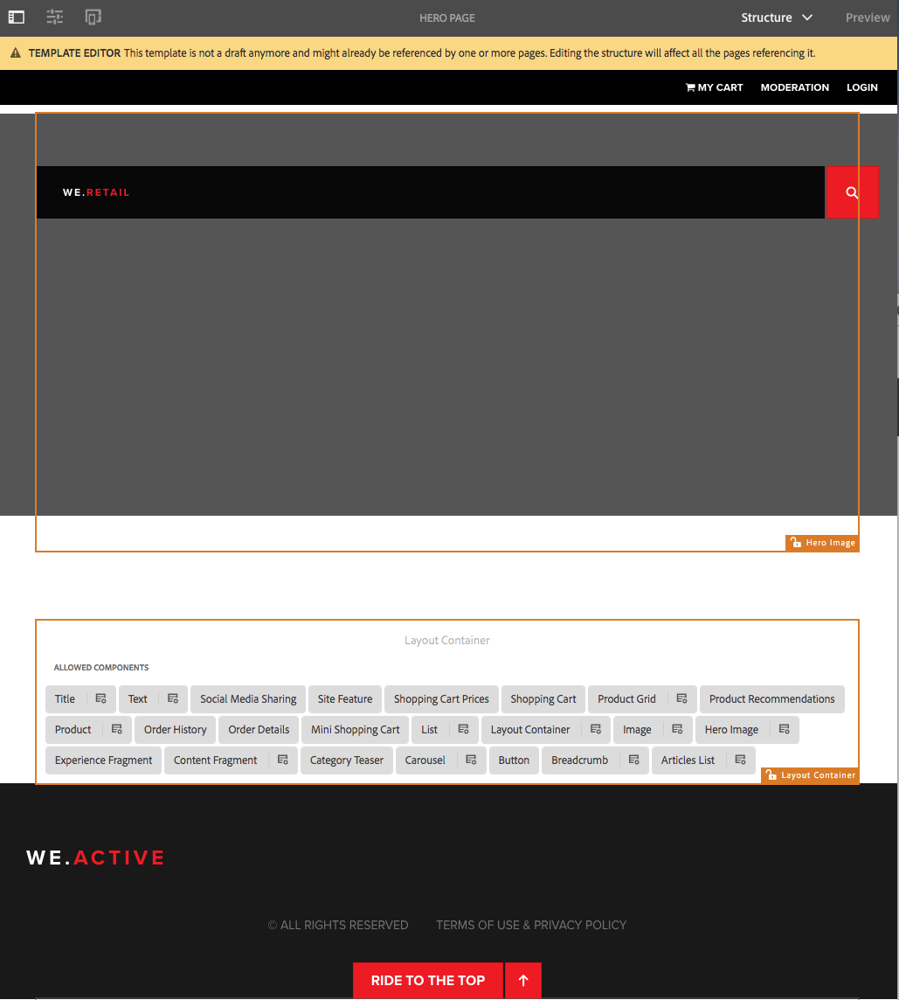

# We.Retail에서 편집 가능한 템플릿 시험 사용{#trying-out-editable-templates-in-we-retail}

>[!CAUTION]
>
>AEM 6.4가 확장 지원이 종료되었으며 이 설명서는 더 이상 업데이트되지 않습니다. 자세한 내용은 [기술 지원 기간](https://helpx.adobe.com/kr/support/programs/eol-matrix.html). 지원되는 버전 찾기 [여기](https://experienceleague.adobe.com/docs/).

편집 가능한 템플릿을 사용하면 템플릿을 만들고 유지 관리하는 것이 더 이상 개발자 전용 작업이 아닙니다. 템플릿 작성자라고 하는 고급 사용자 유형이 이제 템플릿을 만들 수 있습니다. Developers are still required to setup the environment, create client libraries, and create the components to be used, but once these basics are in place the template author has the flexibility to create and configure templates without a development project.

We.Retail의 모든 페이지는 편집 가능한 템플릿을 기반으로 하므로 개발자가 아닌 사용자가 템플릿을 조정하고 사용자 지정할 수 있습니다.

## 사용해 보기 {#trying-it-out}

1. 언어 마스터 분기의 장비 페이지를 편집합니다.

   http://localhost:4502/editor.html/content/we-retail/language-masters/en/equipment.html

1. 모드 선택기는 더 이상 디자인 모드를 제공하지 않습니다. We.Retail용 모든 페이지는 편집 가능한 템플릿을 기반으로 하며, 편집 가능한 템플릿의 디자인을 변경하려면 템플릿 편집기에서 편집해야 합니다.
1. 에서 **페이지 정보** 메뉴 선택 **템플릿 편집**.
1. 이제 대표 페이지 템플릿을 편집 중입니다.

   페이지의 구조 모드에서 템플릿의 구조를 수정할 수 있습니다. 여기에는 레이아웃 컨테이너에서 허용되는 구성 요소 등이 포함됩니다.

   

1. 레이아웃 컨테이너에 대한 정책을 구성하여 컨테이너에 허용된 구성 요소를 정의합니다.

   정책은 디자인 구성과 같습니다.

   

1. 레이아웃 컨테이너의 디자인 대화 상자에서 다음을 수행할 수 있습니다

   * 기존 정책을 선택하거나 컨테이너에 대한 새 정책을 만듭니다
   * 컨테이너에서 허용되는 구성 요소를 선택합니다
   * 자산을 컨테이너로 드래그할 때 배치할 기본 구성 요소를 정의합니다

   

1. 템플릿 편집기에서 레이아웃 컨테이너 내에 있는 텍스트 구성 요소의 정책을 편집할 수 있습니다.

   이를 통해 다음을 수행할 수 있습니다.

   * 기존 정책을 선택하거나 컨테이너에 대한 새 정책을 만듭니다
   * 다음과 같이 이 구성 요소를 사용할 때 페이지 작성자가 사용할 수 있는 기능을 정의합니다.

      * 허용되는 붙여넣기 소스
      * 서식 옵션
      * 허용된 단락 스타일
      * 허용되는 특수 문자

   핵심 구성 요소를 기반으로 하는 많은 구성 요소를 사용하면 편집 가능한 템플릿을 통해 구성 요소 수준에서 옵션을 구성할 수 있으므로 개발자의 사용자 지정 필요성을 제거할 수 있습니다.

   

1. 템플릿 편집기로 돌아가면 모드 선택기를 사용하여 **초기 컨텐츠** 모드에서 페이지에 필요한 컨텐츠를 정의합니다.

   **레이아웃** 모드는 일반 페이지에서처럼 사용하여 템플릿의 레이아웃을 정의할 수 있습니다.

## 자세한 내용 {#more-information}

자세한 내용은 작성 문서를 참조하십시오 [페이지 템플릿 만들기](/help/sites-authoring/templates.md) 또는 개발자 문서 페이지 [템플릿 - 편집 가능](/help/sites-developing/page-templates-editable.md) 편집 가능한 템플릿에 대한 전체 기술 세부 정보

당신은 또한 조사하기를 원할 수도 있습니다 [핵심 구성 요소](/help/sites-developing/we-retail-core-components.md). 작성 문서를 참조하십시오 [핵심 구성 요소](https://experienceleague.adobe.com/docs/experience-manager-core-components/using/introduction.html?lang=ko) 핵심 구성 요소 및 개발자 문서의 기능에 대한 개요 [핵심 구성 요소 개발](https://helpx.adobe.com/experience-manager/core-components/using/developing.html) 기술 개요
