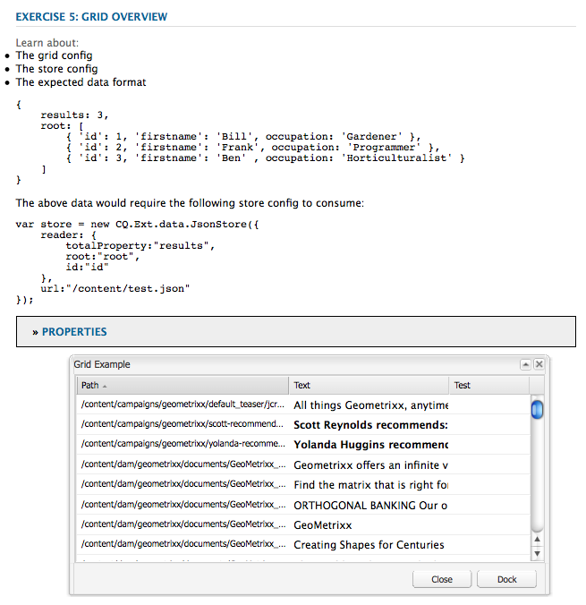

# 위젯 사용 및 확장(클래식 UI){#using-and-extending-widgets-classic-ui}

Adobe Experience Manager의 웹 기반 인터페이스는 AJAX 및 기타 최신 브라우저 기술을 사용하므로 웹 페이지에서 작성자가 컨텐츠를 편집하고 서식을 지정할 수 있습니다.

Adobe Experience Manager(AEM)은 가장 중요한 모든 브라우저에서 작동하고 [데스크탑급 UI](https://www.sencha.com/) 경험을 만들 수 있는 세련된 유저 인터페이스 요소를 제공하는 ExtJS 위젯 라이브러리를 사용합니다.

이러한 위젯은 AEM에 포함되어 있으며 AEM 자체에서 사용되는 것 외에도 AEM을 사용하여 구축한 모든 웹 사이트에서 사용할 수 있습니다.

AEM에서 사용 가능한 모든 위젯을 완벽하게 참조하려면 [위젯 API 문서](https://helpx.adobe.com/experience-manager/6-4/sites/developing/using/reference-materials/widgets-api/index.html) 또는 기존 xtype [목록을 참조하십시오](/help/sites-developing/xtypes.md). 또한 ExtJS 프레임워크를 사용하는 방법을 보여주는 많은 예는 [프레임워크의](https://www.sencha.com/products/extjs/examples/) 소유자인 Sencha 사이트에서 사용할 수 있습니다.

이 페이지에서는 위젯을 사용하고 확장하는 방법에 대한 몇 가지 통찰력을 제공합니다. 먼저 페이지에 클라이언트 측 코드를 [포함하는 방법을 설명합니다](#including-the-client-sided-code-in-a-page). 그런 다음 몇 가지 기본 사용 및 확장 기능을 설명하기 위해 만들어진 몇 가지 샘플 구성 요소에 대해 설명합니다. 이러한 구성 요소는 패키지 공유에서 **ExtJS 위젯** 사용 패키지에서 사용할 수 **있습니다**.

이 패키지에는 다음과 같은 예가 포함됩니다.

* [기본](#basic-dialogs) 위젯을 사용하여 만든 기본 대화 상자
* [간편하게 사용할 수 있는 위젯 및 사용자 정의된 javascript 로직을 사용하여 만든 다이내믹한 대화 상자](#dynamic-dialogs) .
* 사용자 [정의 위젯을 기반으로 하는 대화 상자](#custom-widgets).
* 지정된 경로 아래에 JCR 트리를 표시하는 [트리 패널](#tree-overview) .
* 데이터를 표 형식으로 표시하는 [격자 패널](#grid-overview) .

>[!NOTE]
>
>Adobe Experience Manager의 클래식 UI는 [ExtJS 3.4.0을 기반으로 구축됩니다](https://extjs.cachefly.net/ext-3.4.0/docs/).

>[!NOTE]
>
>이 페이지에서는 클래식 UI 내의 위젯 사용에 대해 설명합니다. Adobe에서는 Coral UI 및 [ [Granite UI]](/help/sites-developing/touch-ui-concepts.md) 기반 [의 최신](/help/sites-developing/touch-ui-concepts.md#coral-ui) 터치 지원 UI를 [활용할](/help/sites-developing/touch-ui-concepts.md#granite-ui-foundation-components)것을 권장합니다.

## 페이지에 클라이언트측 코드 포함 {#including-the-client-sided-code-in-a-page}

클라이언트 측 javascript 및 스타일시트 코드는 클라이언트 라이브러리에 배치되어야 합니다.

클라이언트 라이브러리를 만들려면:

1. 다음 속성을 사용하여 아래 노드 `/apps/<project>` 를 만듭니다.

   ```
       name="clientlib"
       jcr:mixinTypes="[mix:lockable]"
       jcr:primaryType="cq:ClientLibraryFolder" 
       sling:resourceType="widgets/clientlib" 
       categories="[<category-name>]" 
       dependencies="[cq.widgets]"
   ```

   >[!NOTE]
   >
   >참고: `<category-name>` 은 사용자 정의 라이브러리의 이름입니다(예: &quot;cq.extjfringing&quot;) 및 페이지에 라이브러리를 포함하는 데 사용됩니다.

1. 아래에서 `clientlib` `css` 및 `js` 폴더(nt:folder)를 만듭니다.

1. 아래에서 `clientlib` `css.txt` 및 `js.txt` 파일(nt:files)을 만듭니다. 이러한 .txt 파일에는 라이브러리에 포함된 파일이 나열됩니다.

1. 편집 `js.txt`: CQ 클라이언트 라이브러리 서비스에 의해 집계되는 파일 목록이 다음에 &#39; `#base=js`&#39;로 시작해야 합니다(예:

   ```
   #base=js
    components.js
    exercises.js
    CustomWidget.js
    CustomBrowseField.js
    InsertTextPlugin.js
   ```

1. 편집 `css.txt`: CQ 클라이언트 라이브러리 서비스에 의해 집계되는 파일 목록이 다음에 &#39; `#base=css`&#39;로 시작해야 합니다(예:

   ```
   #base=css
    components.css
   ```

1. 폴더 아래에 라이브러리에 속한 javascript 파일을 `js` 배치합니다.

1. 폴더 `css` 아래에 css 파일에 사용되는 `.css` 파일과 리소스를 배치합니다(예: `my_icon.png`).

>[!NOTE]
>
>앞에서 설명한 스타일 시트 처리는 선택 사항입니다.

페이지 구성 요소 jsp에 클라이언트 라이브러리를 포함하려면:

* javascript 코드와 스타일 시트 모두를 포함하려면 다음을 수행합니다.

   `<ui:includeClientLib categories="<category-name1>, <category-name2>, ..."/>`

   여기서 `<category-nameX>` 는 클라이언트측 라이브러리의 이름입니다.

* javascript 코드만 포함:

   `<ui:includeClientLib js="<category-name>"/>`

자세한 내용은 [&lt;ui:includeClientLib>](/help/sites-developing/taglib.md#amp-lt-ui-includeclientlib) 태그의 설명을 참조하십시오.

경우에 따라 클라이언트 라이브러리는 작성 모드에서만 사용할 수 있고 게시 모드에서 제외되어야 합니다. 다음과 같이 수행할 수 있습니다.

```xml
    if (WCMMode.fromRequest(request) != WCMMode.DISABLED) {
        %><ui:includeClientLib categories="cq.collab.blog"/><%
    }
```

### 샘플 시작하기 {#getting-started-with-the-samples}

이 페이지의 자습서를 따르려면 로컬 AEM 인스턴스에 **ExtJS 위젯** 사용이라는 패키지를 설치하고 구성 요소가 포함될 샘플 페이지를 만듭니다. 이렇게 하려면:

1. AEM 인스턴스의 패키지 공유에서 **ExtJS 위젯(v01** 사용)이라는 패키지를 다운로드하고 패키지를 설치합니다. 저장소 `extjstraining` 에 아래 `/apps` 의 프로젝트를 만듭니다.

1. 샘플 구성 요소를 **Geometrixx** 분기의 새 페이지에 포함하듯이 geometrixx 페이지 jsp의 헤드 태그에 스크립트(js)와 스타일시트(css)가 포함된 클라이언트 라이브러리를 포함합니다.

   CRXDE Lite **에서** 파일 `/apps/geometrixx/components/page/headlibs.jsp` 을 열고 다음 `cq.extjstraining` 과 같이 기존 `<ui:includeClientLib>` 태그에 카테고리를 추가합니다.

   `%><ui:includeClientLib categories="apps.geometrixx-main, cq.extjstraining"/><%`

1. 아래 **Geometrixx** 분기에 새 페이지를 만들고 ExtJS 위젯 `/content/geometrixx/en/products` 사용 **으로**&#x200B;지정합니다.

1. 디자인 모드로 전환하고 ExtJS 위젯 **사용이라는 그룹의 모든 구성 요소를 Geometrixx 디자인에** 추가합니다
1. 편집 모드로 돌아가기: 사이드 킥에서 ExtJS 위젯 **사용** 그룹의 구성 요소를 사용할 수 있습니다.

>[!NOTE]
>
>이 페이지의 예는 더 이상 AEM과 함께 제공되지 않으며 We.Retail로 대체된 Geometrixx 샘플 컨텐츠를 기반으로 합니다. Geometrixx을 다운로드하고 설치하는 방법은 [We.Retail](/help/sites-developing/we-retail.md#we-retail-geometrixx) 참조 구현 문서를 참조하십시오.

### 기본 대화 상자 {#basic-dialogs}

대화 상자는 일반적으로 컨텐츠를 편집하는 데 사용되지만 정보를 표시하기만 하면 됩니다. 전체 대화 상자를 손쉽게 볼 수 있는 방법은 json 형식으로 표현물을 이용하는 것입니다. 이렇게 하려면 브라우저에서 다음을 가리킵니다.

`http://localhost:4502/<path-to-dialog>.-1.json`

사이드 킥에서 ExtJS **위젯** 그룹을 사용하는 첫 번째 구성 요소를 **1이라고 합니다. Dialog Basics** 및 includes four basic dialogs that are built-of-the-box widgets and without customized javascript logic. 대화 상자는 아래에 저장됩니다 `/apps/extjstraining/components/dialogbasics`. 기본 대화 상자는 다음과 같습니다.

* 전체 대화 상자( `full` 노드): 3개의 탭이 있는 창이 표시되고 각 탭에는 2개의 텍스트 필드가 있습니다.

* 단일 패널 대화 상자( `singlepanel` 노드): 2개의 텍스트 필드가 있는 1개의 탭이 있는 창이 표시됩니다.
* 다중 패널 대화 상자( `multipanel` 노드): 전체 대화 상자와 같지만 다르게 만들어집니다.
* 디자인 대화 상자( `design` 노드): 2개의 탭이 있는 창이 표시됩니다. 첫 번째 탭에는 텍스트 필드, 드롭다운 메뉴 및 축소 가능한 텍스트 영역이 있습니다. 두 번째 탭에는 4개의 텍스트 필드가 있는 필드 세트와 2개의 텍스트 필드가 있는 축소 가능한 필드가 있습니다.

1을 **포함합니다. 샘플 페이지의** 대화 상자 기본 구성 요소:

1. 1을 **추가합니다. 사이드킥의 ExtJS 위젯** 사용 **탭에서 샘플 페이지에 대한 대화** 기본 사항 **구성 요소를 참조하십시오**.

1. 구성 요소에는 제목, 일부 텍스트 및 **속성** 링크가 표시됩니다. 링크를 클릭하여 저장소에 저장된 단락의 속성을 표시합니다. 속성을 숨기려면 링크를 다시 클릭합니다.

구성 요소는 다음과 같이 표시됩니다.


#### 예 1: 전체 대화 상자 {#example-full-dialog}

전체 **대화** 상자에 3개의 탭이 있는 창이 표시되고 각 탭에는 2개의 텍스트 필드가 있습니다. 대화 상자 기본 **구성 요소의 기본 대화 상자입니다** . 이것의 특징은 다음과 같다.

* Is defined by a node: node type = `cq:Dialog`, xtype = [`dialog`](/help/sites-developing/xtypes.md#dialog).

* 3개의 탭(노드 유형 = `cq:Panel`)을 표시합니다.
* 각 탭에는 2개의 텍스트 필드가 있습니다(노드 유형 = `cq:Widget`, xtype = [`textfield`](/help/sites-developing/xtypes.md#textfield)).

* Is defined by the node:

   `/apps/extjstraining/components/dialogbasics/full`

* 다음을 요청하여 JSON 형식으로 렌더링됩니다.

   `http://localhost:4502/apps/extjstraining/components/dialogbasics/full.-1.json`

대화 상자는 다음과 같이 표시됩니다.


#### 예 2: 단일 패널 대화 상자 {#example-single-panel-dialog}

단일 **패널** 대화 상자에는 두 개의 텍스트 필드가 있는 하나의 탭이 있는 창이 표시됩니다. 이것의 특징은 다음과 같다.

* 1개의 탭 표시(노드 유형 = `cq:Dialog`, xtype = [`panel`](/help/sites-developing/xtypes.md#panel))

* 탭에는 2개의 텍스트 필드가 있습니다(노드 유형 = `cq:Widget`, xtype = [`textfield`](/help/sites-developing/xtypes.md#textfield)).

* Is defined by the node:

   `/apps/extjstraining/components/dialogbasics/singlepanel`

* 다음과 같은 요청을 통해 json 형식으로 렌더링됩니다.

   `http://localhost:4502/apps/extjstraining/components/dialogbasics/singlepanel.-1.json`

* 전체 대화 상자보다 **더 적은 구성이** 필요하다는 장점이 있습니다.
* 권장 사용: 를 사용하여 정보를 표시하거나 몇 개의 필드만 포함하는 간단한 대화 상자에만 사용할 수 있습니다.

단일 패널 대화 상자를 사용하려면

1. 대화 상자 기본 **구성 요소의 대화 상자를** **단일 패널** 대화 상자로 바꿉니다.

   1. CRXDE Lite에서 **노드를**&#x200B;삭제합니다. `/apps/extjstraining/components/dialogbasics/dialog`
   1. 모두 **저장을** 클릭하여 변경 사항을 저장합니다.
   1. 노드 복사: `/apps/extjstraining/components/dialogbasics/singlepanel`
   1. 복사한 노드를 아래에 붙여넣습니다. `/apps/extjstraining/components/dialogbasics`
   1. 노드를 선택합니다. `/apps/extjstraining/components/dialogbasics/Copy of singlepanel`이름을 변경합니다 `dialog`.

1. 구성 요소 편집: 대화 상자는 다음과 같이 표시됩니다.


#### 예 3: 다중 패널 대화 상자 {#example-multi-panel-dialog}

[ **다중 패널** ] 대화 상자의 표시 **는 [전체** ] 대화 상자와 동일하지만 다르게만들어집니다. 이것의 특징은 다음과 같다.

* 노드(노드 유형 =, xtype = `cq:Dialog`)에 의해 [`tabpanel`](/help/sites-developing/xtypes.md#tabpanel)정의됩니다.

* 3개의 탭(노드 유형 = `cq:Panel`)을 표시합니다.
* 각 탭에는 2개의 텍스트 필드가 있습니다(노드 유형 = `cq:Widget`, xtype = [`textfield`](/help/sites-developing/xtypes.md#textfield)).

* Is defined by the node:

   `/apps/extjstraining/components/dialogbasics/multipanel`

* 다음과 같은 요청을 통해 json 형식으로 렌더링됩니다.

   `http://localhost:4502/apps/extjstraining/components/dialogbasics/multipanel.-1.json`

* 전체 대화 상자 **의** 장점 중 하나는 구조가 단순화된다는 것입니다.

* 권장 사용: 다중 탭 대화 상자용.

다중 패널 대화 상자를 사용하려면

1. 대화 상자 기본 **구성 요소의 대화 상자를** 다중 패널 **대화 상자로** 바꿉니다.

   다음 단계에 따라 [예 2: 단일 패널 대화 상자](#example-single-panel-dialog)

1. 구성 요소 편집: 대화 상자는 다음과 같이 표시됩니다.


#### 예 4: 풍부한 대화 상자 {#example-rich-dialog}

[ **리치** ] 대화 상자에 두 개의 탭이 있는 창이 표시됩니다. 첫 번째 탭에는 텍스트 필드, 드롭다운 메뉴 및 축소 가능한 텍스트 영역이 있습니다. 두 번째 탭에는 4개의 텍스트 필드가 있는 필드 세트와 2개의 텍스트 필드가 있는 축소 가능한 필드가 있습니다. 이것의 특징은 다음과 같다.

* 노드(노드 유형 =, xtype = `cq:Dialog`)에 의해 [`dialog`](/help/sites-developing/xtypes.md#dialog)정의됩니다.

* 2개의 탭(노드 유형 = `cq:Panel`)을 표시합니다.
* 첫 번째 탭에는 3개의 옵션이 있는 위젯 [`dialogfieldset`](/help/sites-developing/xtypes.md#dialogfieldset) 과 [`textfield`](/help/sites-developing/xtypes.md#textfield) 위젯이 있고 위젯이 있는 축소 가능 [`selection`](/help/sites-developing/xtypes.md#selection) 이 [`dialogfieldset`](/help/sites-developing/xtypes.md#dialogfieldset) [`textarea`](/help/sites-developing/xtypes.md#textarea) 있습니다.

* 두 번째 탭에는 4개의 위젯이 있는 [`dialogfieldset`](/help/sites-developing/xtypes.md#dialogfieldset) 위젯과 2개의 위젯 [`textfield`](/help/sites-developing/xtypes.md#textfield) 이 있는 축소 가능한 `dialogfieldset` [`textfield`](/help/sites-developing/xtypes.md#textfield) 위젯이 있습니다.

* Is defined by the node:

   `/apps/extjstraining/components/dialogbasics/rich`

* 다음과 같은 요청을 통해 json 형식으로 렌더링됩니다.

   `http://localhost:4502/apps/extjstraining/components/dialogbasics/rich.-1.json`

리치 **대화 상자를** 사용하려면

1. 대화 상자 기본 **구성 요소의 대화 상자를** 리치 **대화 상자로** 바꿉니다.

   다음 단계에 따라 [예 2: 단일 패널 대화 상자](#example-single-panel-dialog)

1. 구성 요소 편집: 대화 상자는 다음과 같이 표시됩니다.

 

### 동적 대화 상자 {#dynamic-dialogs}

사이드 킥에서 ExtJS **위젯** 그룹을 사용하는 두 번째 구성 요소를 **2라고 합니다. 다이내믹 대화 상자** 및 3개의 다이내믹 대화 상자가 포함되어 있으며 바로 사용 가능한 위젯과 사용자 정의된 javascript 논리 **를 사용하여 만들어집니다**. 대화 상자는 아래에 저장됩니다 `/apps/extjstraining/components/dynamicdialogs`. 동적 대화 상자는 다음과 같습니다.

* 탭 전환 대화 상자( `switchtabs` 노드): 2개의 탭이 있는 창이 표시됩니다. 첫 번째 탭에는 세 가지 옵션이 있는 라디오 선택 사항이 있습니다. 옵션을 선택하면 옵션과 관련된 탭이 표시됩니다. 두 번째 탭에는 두 개의 텍스트 필드가 있습니다.
* 임의 대화 상자( `arbitrary` 노드): 하나의 탭이 있는 창이 표시됩니다. 탭에는 자산을 놓거나 업로드할 필드와 포함된 페이지에 대한 일부 정보와 자산이 참조되는 경우 자산에 대한 정보가 표시되는 필드가 있습니다.
* 필드 전환 대화 상자( `togglefield` 노드): 하나의 탭이 있는 창이 표시됩니다. 탭에는 다음과 같은 확인란이 있습니다. 이 확인란을 선택하면 두 개의 텍스트 필드가 있는 필드 세트가 표시됩니다.

를 **2로 포함합니다. 샘플 페이지의** 동적 대화 상자 구성 요소:

1. 2를 **추가합니다. 동적 대화 상자** 구성 요소를 사이드 킥의 ExtJS 위젯 **사용** 탭에서 **샘플 페이지에**&#x200B;추가합니다.

1. 구성 요소에는 제목, 일부 텍스트 및 **속성** 링크가 표시됩니다. 을 클릭하여 저장소에 저장된 단락의 속성을 표시합니다. 속성을 숨기려면 다시 클릭합니다.

구성 요소는 다음과 같이 표시됩니다.


#### 예 1: 탭 전환 대화 상자 {#example-switch-tabs-dialog}

탭 **전환** 대화 상자에는 탭이 두 개 있는 창이 표시됩니다. 첫 번째 탭에는 세 가지 옵션이 있는 라디오 선택 사항이 있습니다. 옵션을 선택하면 옵션과 관련된 탭이 표시됩니다. 두 번째 탭에는 두 개의 텍스트 필드가 있습니다.

주요 특징:

* 노드(노드 유형 =, xtype = `cq:Dialog`)에 의해 [`dialog`](/help/sites-developing/xtypes.md#dialog)정의됩니다.

* 2개의 탭(노드 유형 = `cq:Panel`) 표시: 1개의 선택 탭, 2번째 탭은 1번째 탭의 선택(3개 옵션)에 따라 다릅니다.
* 옵션 탭 3개(노드 유형 = `cq:Panel`)가 있으며 각 탭에는 2개의 텍스트 필드가 있습니다(노드 유형 = `cq:Widget`, xtype = [`textfield`](/help/sites-developing/xtypes.md#textfield)). 한 번에 하나의 선택 탭만 표시됩니다.

* Is defined by the `switchtabs` node at:

   `/apps/extjstraining/components/dynamicdialogs/switchtabs`

* 다음과 같은 요청을 통해 json 형식으로 렌더링됩니다.

   `http://localhost:4502/apps/extjstraining/components/dynamicdialogs/switchtabs.-1.json`

논리는 다음과 같이 이벤트 리스너와 javascript 코드를 통해 구현됩니다.

* 대화 상자 노드에는 대화 상자가 표시되기 전에 모든 선택적 탭을 숨기는 &quot; `beforeshow`&quot; 리스너가 있습니다.

   `beforeshow="function(dialog){Ejst.x2.manageTabs(dialog.items.get(0));}"`

   `dialog.items.get(0)` [선택] 패널과 3개의 선택 사항 패널이 포함된 표를 가져옵니다.

* 이 `Ejst.x2` 개체는 다음 위치의 `exercises.js` 파일에 정의됩니다.

   `/apps/extjstraining/clientlib/js/exercises.js`

* 이 `Ejst.x2.manageTabs()` `index` 방식에서는 값이 -1이므로 모든 선택적 탭이 숨겨집니다(1에서 3으로 이동).

* 선택 탭에는 2개의 리스너가 있습니다. 대화 상자가 로드될 때 선택한 탭(&quot; `loadcontent`&quot; 이벤트)과 선택 사항이 변경될 때 선택한 탭을 표시하는 탭(&quot; `selectionchanged`&quot; 이벤트).

   `loadcontent="function(field,rec,path){Ejst.x2.showTab(field);}"`

   `selectionchanged="function(field,value){Ejst.x2.showTab(field);}"`

* 메서드에서 `Ejst.x2.showTab()` 다음을 수행합니다.

   `field.findParentByType('tabpanel')` 탭( 선택 위젯을 `field` 나타냅니다)이 모두 포함된 탭 패널을 가져옵니다.

   `field.getValue()` 선택 항목의 값을 가져옵니다(예: tab2

   `Ejst.x2.manageTabs()` 선택한 탭을 표시합니다.

* 각 선택적 탭에는 &quot;&quot; `render`&quot; 이벤트의 탭을 숨기는 리스너가 있습니다.

   `render="function(tab){Ejst.x2.hideTab(tab);}"`

* 메서드에서 `Ejst.x2.hideTab()` 다음을 수행합니다.

   `tabPanel` 는 모든 탭이 포함된 탭 패널

   `index` 은 선택 탭의 색인입니다.

   `tabPanel.hideTabStripItem(index)` 탭 숨기기

다음과 같이 표시됩니다.


#### 예 2: 임의 대화 상자 {#example-arbitrary-dialog}

대화 상자에는 기본 구성 요소의 콘텐츠가 표시되는 경우가 많습니다. 여기서 설명한 대화 상자( **임의의** 대화 상자)는 다른 구성 요소에서 컨텐츠를 가져옵니다.

임의 **대화 상자에** 탭이 한 개 있는 창이 표시됩니다. 탭에는 두 개의 필드가 있습니다. 여기에는 포함된 페이지와 자산에 대한 일부 정보를 표시하는 자산 및 자산이 참조되는 경우 자산에 대한 정보가 표시됩니다.

주요 특징:

* 노드(노드 유형 =, xtype = `cq:Dialog`)에 의해 [`dialog`](/help/sites-developing/xtypes.md#dialog)정의됩니다.

* 1개의 패널 위젯(노드 유형 = `cq:Widget`, xtype = [`tabpanel`](/help/sites-developing/xtypes.md#tabpanel))을 표시합니다(노드 유형 = `cq:Panel`).

* 패널에는 스마트 파일 위젯(노드 유형 = `cq:Widget`, xtype = [`smartfile`](/help/sites-developing/xtypes.md#smartfile))과 소유자 드로잉 위젯(노드 유형 = `cq:Widget`, xtype = [`ownerdraw`](/help/sites-developing/xtypes.md#ownerdraw))이 있습니다.

* Is defined by the `arbitrary` node at:

   `/apps/extjstraining/components/dynamicdialogs/arbitrary`

* 다음과 같은 요청을 통해 json 형식으로 렌더링됩니다.

   `http://localhost:4502/apps/extjstraining/components/dynamicdialogs/arbitrary.-1.json`

논리는 다음과 같이 이벤트 리스너와 javascript 코드를 통해 구현됩니다.

* 소유자 그리기 위젯에는 구성 요소가 포함된 페이지와 컨텐츠를 로드할 때 스마트 파일 위젯에서 참조하는 자산에 대한 정보를 표시하는 &quot; `loadcontent`&quot; 리스너가 있습니다.

   `loadcontent="function(field,rec,path){Ejst.x2.showInfo(field,rec,path);}"`

   `field` ownerdraw 객체로 설정됨

   `path` 은 구성 요소의 컨텐츠 경로로 설정됩니다(예:: /content/geometrixx/en/products/triangle/ui-tutorial/jcr:content/par/dynamicdialogs)

* 이 `Ejst.x2` 개체는 다음 위치의 `exercises.js` 파일에 정의됩니다.

   `/apps/extjstraining/clientlib/js/exercises.js`

* 메서드에서 `Ejst.x2.showInfo()` 다음을 수행합니다.

   `pagePath` 은 구성 요소를 포함하는 페이지의 경로입니다.

   `pageInfo` json 형식의 페이지 속성을 나타냅니다.

   `reference` 는 참조된 자산의 경로입니다.

   `metadata` json 형식의 자산의 메타데이터를 나타냅니다.

   `ownerdraw.getEl().update(html);` 대화 상자에 만든 html을 표시합니다.

임의 대화 **상자를** 사용하려면

1. 동적 대화 **구성 요소의 대화 상자를** 임의의 대화 **상자로** 바꿉니다.

   다음 단계에 따라 [예 2: 단일 패널 대화 상자](#example-single-panel-dialog)

1. 구성 요소 편집: 대화 상자는 다음과 같이 표시됩니다.


#### 예 3: 필드 전환 대화 상자 {#example-toggle-fields-dialog}

[ **필드** 전환] 대화 상자에 탭이 한 개인 창이 표시됩니다. 탭에는 다음과 같은 확인란이 있습니다. 이 확인란을 선택하면 두 개의 텍스트 필드가 있는 필드 세트가 표시됩니다.

주요 특징:

* 노드(노드 유형 =, xtype = `cq:Dialog`)에 의해 [`dialog`](/help/sites-developing/xtypes.md#dialog)정의됩니다.

* 1개의 패널 위젯(노드 유형 = `cq:Widget`, xtype = [`tabpanel`](/help/sites-developing/xtypes.md#textpanel))을 표시합니다(노드 유형 = `cq:Panel`).

* 패널에는 선택/확인란 위젯(노드 유형 = `cq:Widget`, xtype = [`selection`](/help/sites-developing/xtypes.md#selection), type = [`checkbox`](/help/sites-developing/xtypes.md#checkbox))과 2개의 textfield 위젯(노드 유형 = `cq:Widget`, xtype = [`dialogfieldset`](/help/sites-developing/xtypes.md#dialogfieldset))을 사용하여 기본적으로 숨겨지는 축소 가능한 dialogfieldset 위젯(노드 유형 = `cq:Widget`, xtype = [`textfield`](/help/sites-developing/xtypes.md#textfield))이있습니다.

* Is defined by the `togglefields` node at:

   `/apps/extjstraining/components/dynamicdialogs/togglefields`

* 다음과 같은 요청을 통해 json 형식으로 렌더링됩니다.

   `http://localhost:4502/apps/extjstraining/components/dynamicdialogs/togglefields.-1.json`

논리는 다음과 같이 이벤트 리스너와 javascript 코드를 통해 구현됩니다.

* 선택 탭에는 2개의 리스너가 있습니다. 콘텐트를 로드할 때 dialogfieldset(&quot; `loadcontent`&quot; 이벤트)을 표시하고 선택 사항이 변경될 때 dialogfieldset를 표시하는 필드(&quot; `selectionchanged`&quot; 이벤트):

   `loadcontent="function(field,rec,path){Ejst.x2.toggleFieldSet(field);}"`

   `selectionchanged="function(field,value){Ejst.x2.toggleFieldSet(field);}"`

* 이 `Ejst.x2` 개체는 다음 위치의 `exercises.js` 파일에 정의됩니다.

   `/apps/extjstraining/clientlib/js/exercises.js`

* 메서드에서 `Ejst.x2.toggleFieldSet()` 다음을 수행합니다.

   * `box` is the selection object
   * `panel` 은 선택 영역과 dialogfieldset 위젯이 포함된 패널입니다.
   * `fieldSet` dialogfieldset 개체임
   * `show` 은 선택 값(true 또는 false)입니다.
   * &#39; `show`&#39;에 따라 dialogfieldset이 표시되거나 표시되지 않습니다.

필드 **전환 대화 상자를** 사용하려면

1. 동적 대화 상자 구성 요소의 대화 상자를 **필드** 전환 **대화 상자로** 바꿉니다.

   다음 단계에 따라 [예 2: 단일 패널 대화 상자](#example-single-panel-dialog)

1. 구성 요소 편집: 대화 상자는 다음과 같이 표시됩니다.


### 사용자 정의 위젯 {#custom-widgets}

AEM과 함께 제공되는 기본 위젯은 대부분의 사용 사례를 포함해야 합니다. 하지만 프로젝트별 요구 사항을 처리하기 위해 사용자 정의 위젯을 만들어야 할 수도 있습니다. 기존 위젯을 확장하여 사용자 정의 위젯을 만들 수 있습니다. 이러한 사용자 지정을 시작하는 데 도움이 되도록 ExtJS **위젯** 사용 패키지에는 세 개의 서로 다른 사용자 정의 위젯을 사용하는 대화 상자가 포함되어 있습니다.

* 다중 필드 대화 상자( `multifield` 노드)는 하나의 탭이 있는 창을 표시합니다. 이 탭에는 두 개의 필드가 있는 사용자 정의된 다중 필드 위젯이 있습니다. 두 개의 옵션과 텍스트 필드가 포함된 드롭다운 메뉴. 텍스트 필드만 있는 기본 `multifield` 위젯을 기반으로 하므로 위젯의 모든 기능이 `multifield` 포함되어 있습니다.

* 트리 찾아보기 대화 상자( `treebrowse` 노드)는 경로 검색 위젯이 포함된 하나의 탭이 있는 창을 표시합니다. 화살표를 클릭하면 계층을 탐색하고 항목을 선택할 수 있는 창이 열립니다. 그런 다음 항목의 경로가 경로 필드에 추가되고 대화 상자가 닫히면 유지됩니다.
* 리치 텍스트 편집기에 사용자 정의 단추를 추가하여 기본 텍스트에 일부 사용자 정의 텍스트를 삽입하는 리치 텍스트 편집기 플러그인 기반 대화 상자( `rteplugin` 노드)입니다. RTE( `richtext` Widget) 및 RTE 플러그인 메커니즘을 통해 추가되는 사용자 정의 기능으로 구성됩니다.

사용자 정의 위젯 및 플러그인은 **3이라는 구성 요소에 포함되어 있습니다. ExtJS 위젯** 사용 **패키지의 사용자 정의** 위젯 샘플 페이지에 이 구성 요소를 포함하려면 다음을 수행하십시오.

1. 3을 **추가합니다. 사용자 정의 위젯** 구성 요소를 사이드킥의 ExtJS 위젯 **사용** 탭에서 샘플 페이지에 **추가할 수**&#x200B;있습니다.

1. 구성 요소에는 제목, 일부 텍스트 및 **속성** 링크를 클릭하면 저장소에 저장된 단락의 속성이 표시됩니다. 다시 클릭하면 속성이 숨겨집니다.

   구성 요소는 다음과 같이 표시됩니다.


#### 예 1: 사용자 정의 멀티필드 위젯 {#example-custom-multifield-widget}

사용자 **지정 멀티필드** 위젯 기반 대화 상자에는 탭이 한 개 있는 창이 표시됩니다. 이 탭에는 필드가 한 개인 표준 위젯과 달리 두 개의 필드가 있는 사용자 지정된 다중 필드 위젯이 있습니다. 두 개의 옵션과 텍스트 필드가 포함된 드롭다운 메뉴.

사용자 **지정 멀티필드** 위젯 기반 대화 상자:

* 노드(노드 유형 =, xtype = `cq:Dialog`)에 의해 [`dialog`](/help/sites-developing/xtypes.md#dialog)정의됩니다.

* 패널(노드 유형 = `cq:Widget`, xtype = [`tabpanel`](/help/sites-developing/xtypes.md#tabpanel))을 포함하는 1개의 탭 패널 위젯(노드 유형 = `cq:Widget`, xtype = [`panel`](/help/sites-developing/xtypes.md#panel))을 표시합니다.

* 패널에는 `multifield` 위젯(노드 유형 = `cq:Widget`, xtype = [`multifield`](/help/sites-developing/xtypes.md#multifield))이 있습니다.

* 위젯에는 사용자 지정 xtype &#39; `multifield` &#39; `nt:unstructured`을 기반으로 하는 fieldconfig(노드 유형 = `ejstcustom`, xtype = `Ejst.x3.provideOptions`, optionsProvider = `ejstcustom`)가있습니다.

   * &#39; `fieldconfig`&#39;은(는) [`CQ.form.MultiField`](https://helpx.adobe.com/experience-manager/6-4/sites/developing/using/reference-materials/widgets-api/index.html?class=CQ.form.MultiField) 개체의 구성 옵션입니다.
   * &#39; `optionsProvider`&#39;은 위젯의 `ejstcustom` 구성입니다. 다음 위치에 정의된 `Ejst.x3.provideOptions` 메서드로 `exercises.js` 설정됩니다.

      `/apps/extjstraining/clientlib/js/exercises.js`

      2개의 옵션을 반환합니다.

* Is defined by the `multifield` node at:

   `/apps/extjstraining/components/customwidgets/multifield`

* 다음과 같은 요청을 통해 json 형식으로 렌더링됩니다.

   `http://localhost:4502/apps/extjstraining/components/customwidgets/multifield.-1.json`

사용자 정의 다중 필드 위젯(xtype = `ejstcustom`):

* Is a javascript object called `Ejst.CustomWidget`.

* Is defined in the javascript file at: `CustomWidget.js`

   `/apps/extjstraining/clientlib/js/CustomWidget.js`

* 위젯을 [`CQ.form.CompositeField`](https://helpx.adobe.com/experience-manager/6-4/sites/developing/using/reference-materials/widgets-api/index.html?class=CQ.form.CompositeField) 확장합니다.

* 3개의 필드가 있습니다. `hiddenField` (텍스트 필드), `allowField` (콤보 상자) 및 `otherField` (텍스트 필드)

* 3개의 필드 `CQ.Ext.Component#initComponent` 를 추가하려면 무시합니다.

   * `allowField` 은 [&#39;select&#39; 유형의 CQ.form.Selection](https://helpx.adobe.com/experience-manager/6-4/sites/developing/using/reference-materials/widgets-api/index.html?class=CQ.form.Selection) 개체입니다. optionsProvider는 대화 상자에 정의된 CustomWidget의 optionsProvider 구성으로 인스턴스화된 Selection 개체의 구성입니다
   * `otherField` 는 [CQ.Ext.form.TextField](https://helpx.adobe.com/experience-manager/6-4/sites/developing/using/reference-materials/widgets-api/index.html?class=CQ.Ext.form.TextField) 개체입니다.

* 형식 `setValue`으로 `getValue` CustomWidget의 값 `getRawValue` 을 설정하고 검색하기 위해 [CQ.form.CompositeField](https://helpx.adobe.com/experience-manager/6-4/sites/developing/using/reference-materials/widgets-api/index.html?class=CQ.form.CompositeField) 메서드 및 메서드를 재정의합니다.

   `<allowField value>/<otherField value>, e.g.: 'Bla1/hello'`.

* 자신을 &#39;&#39; xtype `ejstcustom`으로 등록합니다.

   `CQ.Ext.reg('ejstcustom', Ejst.CustomWidget);`

사용자 **지정 멀티필드** 위젯 기반 대화 상자가 다음과 같이 표시됩니다.


#### 예 2: 사용자 정의 트리 검색 위젯 {#example-custom-treebrowse-widget}

사용자 지정 **트리 검색** 위젯 기반 대화 상자에는 사용자 지정 경로 검색 위젯이 포함된 하나의 탭이 있는 창이 표시됩니다. 화살표를 클릭하면 계층을 탐색하고 항목을 선택할 수 있는 창이 열립니다. 그런 다음 항목의 경로가 경로 필드에 추가되고 대화 상자가 닫히면 유지됩니다.

사용자 정의 트리 검색 대화 상자:

* 노드(노드 유형 =, xtype = `cq:Dialog`)에 의해 [`dialog`](/help/sites-developing/xtypes.md#dialog)정의됩니다.

* 패널(노드 유형 = `cq:Widget`, xtype = [`tabpanel`](/help/sites-developing/xtypes.md#tabpanel))을 포함하는 1개의 탭 패널 위젯(노드 유형 = `cq:Widget`, xtype = [`panel`](/help/sites-developing/xtypes.md#panel))을 표시합니다.

* 패널에는 사용자 정의 위젯이 있습니다(노드 유형 = `cq:Widget`, xtype = `ejstbrowse`).

* Is defined by the `treebrowse` node at:

   `/apps/extjstraining/components/customwidgets/treebrowse`

* 다음과 같은 요청을 통해 json 형식으로 렌더링됩니다.

   `http://localhost:4502/apps/extjstraining/components/customwidgets/treebrowse.-1.json`

사용자 정의 트리 검색 위젯(xtype = `ejstbrowse`):

* Is a javascript object called `Ejst.CustomWidget`.
* Is defined in the javascript file at: `CustomBrowseField.js`

   `/apps/extjstraining/clientlib/js/CustomBrowseField.js`

* 확장 [`CQ.Ext.form.TriggerField`](https://helpx.adobe.com/experience-manager/6-4/sites/developing/using/reference-materials/widgets-api/index.html?class=CQ.Ext.form.TriggerField).
* 호출된 찾아보기 창을 정의합니다 `browseWindow`.

* 화살표 [`CQ.Ext.form.TriggerField`](https://helpx.adobe.com/experience-manager/6-4/sites/developing/using/reference-materials/widgets-api/index.html?class=CQ.Ext.form.TriggerField#onTriggerClick) 를 클릭할 때 검색 창을 표시하도록 무시합니다.
* 개체를 [`CQ.Ext.tree.TreePanel`](https://helpx.adobe.com/experience-manager/6-4/sites/developing/using/reference-materials/widgets-api/index.html?class=CQ.Ext.tree.TreePanel) 정의합니다.

   * 에 등록된 서블릿을 호출하여 데이터를 가져옵니다 `/bin/wcm/siteadmin/tree.json`.
   * 그 뿌리가 &quot; `apps/extjstraining`&quot;입니다.

* 개체 `window` ([`CQ.Ext.Window`](https://helpx.adobe.com/experience-manager/6-4/sites/developing/using/reference-materials/widgets-api/index.html?class=CQ.Ext.Window))를 정의합니다.

   * 미리 정의된 패널을 기반으로 합니다.
   * 선택한 패스의 값을 **설정하고** 패널을 숨기는 확인 단추가 있습니다.

* 창문이 **경로** 필드 아래에 고정되어 있다.
* 선택한 경로가 검색 필드에서 이벤트 시 창으로 `show` 전달됩니다.

* 자신을 &#39;&#39; xtype `ejstbrowse`으로 등록합니다.

   `CQ.Ext.reg('ejstbrowse', Ejst.CustomBrowseField);`

사용자 **지정 트리 검색** 위젯 기반 대화 상자를 사용하려면:

1. 사용자 정의 위젯 구성 요소의 대화 상자 **를 사용자 정의** 트리 탐색 **대화 상자로** 바꿉니다.

   다음 단계에 따라 [예 2: 단일 패널 대화 상자](#example-single-panel-dialog)

1. 구성 요소 편집: 대화 상자는 다음과 같이 표시됩니다.


#### 예 3: RTE(Rich Text Editor) 플러그인 {#example-rich-text-editor-rte-plug-in}

RTE( **Rich Text Editor) 플러그인** 기반 대화 상자는 대괄호 안에 사용자 정의 텍스트를 삽입하기 위한 사용자 정의 단추가 있는 리치 텍스트 편집기 기반 대화 상자입니다. 사용자 지정 텍스트는 일부 서버측 로직(이 예에서는 구현되지 않음)에서 구문 분석할 수 있습니다. 예를 들어 지정된 경로에 정의된 일부 텍스트를 추가합니다.

RTE **플러그인** 기반 대화 상자:

* Is defined by the rteplugin node at:

   `/apps/extjstraining/components/customwidgets/rteplugin`

* 다음과 같은 요청을 통해 json 형식으로 렌더링됩니다.

   `http://localhost:4502/apps/extjstraining/components/customwidgets/rteplugin.-1.json`

* 이 `rtePlugins` 노드에는 플러그인 `inserttext` 의 이름을 딴 하위 노드(노드 유형 = `nt:unstructured`)가 있습니다. RTE에 사용할 수 있는 플러그인 기능 중 어느 것을 정의하 `features`는 속성이 있습니다.

RTE 플러그인:

* Is a javascript object called `Ejst.InsertTextPlugin`.

* Is defined in the javascript file at: `InsertTextPlugin.js`

   `/apps/extjstraining/clientlib/js/InsertTextPlugin.js`

* 개체를 [`CQ.form.rte.plugins.Plugin`](https://helpx.adobe.com/experience-manager/6-4/sites/developing/using/reference-materials/widgets-api/index.html?class=CQ.form.rte.plugins.Plugin) 확장합니다.
* 다음 메서드는 개체를 [`CQ.form.rte.plugins.Plugin`](https://helpx.adobe.com/experience-manager/6-4/sites/developing/using/reference-materials/widgets-api/index.html?class=CQ.form.rte.plugins.Plugin) 정의하며 구현 플러그인에서 재정의됩니다.

   * `getFeatures()` 플러그인이 사용할 수 있도록 하는 모든 기능의 배열을 반환합니다.
   * `initializeUI()` 새 단추를 RTE 도구 모음에 추가합니다.
   * `notifyPluginConfig()` 단추를 마우스로 가리키면 제목과 텍스트를 표시합니다.
   * `execute()` is called when button is click and performes the plugin action: 포함할 텍스트를 정의하는 데 사용되는 창이 표시됩니다.

* `insertText()` 해당 대화 상자 개체를 사용하여 텍스트를 `Ejst.InsertTextPlugin.Dialog` 삽입합니다(이후 참조).

* `executeInsertText()` 을 호출하면 대화 상자 `apply()` 의 방법으로 호출됩니다. [ **확인] 단추를 클릭할 때** 트리거됩니다.

* 자신을 &#39; `inserttext`&#39; 플러그인으로 등록:

   `CQ.form.rte.plugins.PluginRegistry.register("inserttext", Ejst.InsertTextPlugin);`

* the object defines the dialog that is opened when the plugin button is click. `Ejst.InsertTextPlugin.Dialog` 대화 상자는 패널, 양식, 텍스트 필드 및 2개의 버튼(**확인** 및 **취소**)으로 구성됩니다.

RTE( **Rich Text Editor) 플러그인** 기반 대화 상자를 사용하려면

1. 사용자 **정의 위젯** 구성 요소의 대화 상자를 **RTE(Rich Text Editor) 플러그인** 기반 대화 상자로바꿉니다.

   다음 단계에 따라 [예 2: 단일 패널 대화 상자](#example-single-panel-dialog)

1. 구성 요소를 편집합니다.
1. 오른쪽에 있는 마지막 아이콘(4개의 화살표가 있는 아이콘)을 클릭합니다. 경로를 입력하고 **확인을 클릭합니다**.

   이 경로는 대괄호(`[]`) 내에 표시됩니다.

1. 확인 **을** 클릭하여 리치 텍스트 편집기를 닫습니다.

RTE( **Rich Text Editor) 플러그인** 기반 대화 상자가 다음과 같이 표시됩니다.


>[!NOTE]
>
>이 예는 로직의 클라이언트측 부분을 구현하는 방법만 보여줍니다. 그러면 자리 표시자(*[텍스트]*)를 명시적으로 서버측에서 구문 분석해야 합니다(예: 구성 요소 JSP).

### 트리 개요 {#tree-overview}

기본 객체는 트리 구조의 데이터를 트리 구조의 UI로 표시합니다. [`CQ.Ext.tree.TreePanel`](https://helpx.adobe.com/experience-manager/6-4/sites/developing/using/reference-materials/widgets-api/index.html?class=CQ.Ext.tree.TreePanel) ExtJS 위젯 **사용** `TreePanel` 패키지에 포함된 트리 개요 구성 요소는 개체를 사용하여 지정된 경로 아래에 JCR 트리를 표시하는 방법을 보여줍니다. 창 자체는 도킹하거나 도킹할 수 있습니다. 이 예에서, 윈도우 로직은 &lt;script>&lt;/script> 태그 사이에 구성 요소 jsp에 포함됩니다.

트리 **개요** 구성 요소를 샘플 페이지에 포함하려면:

1. 4를 **추가합니다. 사이드킥의 ExtJS 위젯** **사용 탭에서 샘플 페이지에 대한 트리 개요** 구성 **요소**.

1. 구성 요소가 표시됩니다.

   * 텍스트가 있는 제목
   * 속성 **** 링크: 을 클릭하여 저장소에 저장된 단락의 속성을 표시합니다. 속성을 숨기려면 다시 클릭합니다.
   * 저장소에 대한 트리 표현이 있는 부동 창으로, 확장할 수 있습니다.

구성 요소는 다음과 같이 표시됩니다.


트리 개요 구성 요소:

* 정의 위치:

   `/apps/extjstraining/components/treeoverview`

* 이 대화 상자에서는 창의 크기를 설정하고 창을 고정/도킹 해제할 수 있습니다(아래 세부 정보 참조).

구성 요소 jsp:

* 저장소에서 너비, 높이 및 도킹 속성을 검색합니다.
* 트리 개요 데이터 형식에 대한 일부 텍스트를 표시합니다.
* javascript 태그 사이에 구성 요소 jsp에 창 논리를 포함합니다.
* 정의 위치:

   `apps/extjstraining/components/treeoverview/content.jsp`

구성 요소 jsp에 포함된 javascript 코드:

* 페이지에서 트리 창을 검색하여 `tree` 개체를 정의합니다.

* 트리를 표시하는 창이 존재하지 않으면 `treePanel` ([CQ.Ext.tree.TreePanel](https://helpx.adobe.com/experience-manager/6-4/sites/developing/using/reference-materials/widgets-api/index.html?class=CQ.Ext.tree.TreePanel))가 만들어집니다.

   * `treePanel` 에는 창을 만드는 데 사용되는 데이터가 들어 있습니다.
   * 데이터는 다음 위치에 등록된 서블릿을 호출하여 검색됩니다.
      `/bin/wcm/siteadmin/tree.json`

* 리스너는 `beforeload` 클릭한 노드가 로드되는지 확인합니다.
* 이 `root` 개체는 경로를 트리 루트 `apps/extjstraining` 로 설정합니다.
* `tree` ([`CQ.Ext.Window`](https://helpx.adobe.com/experience-manager/6-4/sites/developing/using/reference-materials/widgets-api/index.html?class=CQ.Ext.Window))는 사전 정의된 `treePanel`을 기반으로 설정되며 다음과 함께 표시됩니다.

   `tree.show();`

* 창이 이미 존재하는 경우 저장소에서 검색된 너비, 높이 및 도킹 속성을 기반으로 표시됩니다.

구성 요소 대화 상자:

* 트리 개요 창의 크기(너비 및 높이)를 설정하는 필드 2개가 있는 탭 1을 표시하고 창을 도킹하거나 도킹할 필드 1개를 표시합니다
* 노드(노드 유형 =, xtype = `cq:Dialog`)에 의해 [`panel`](/help/sites-developing/xtypes.md#panel)정의됩니다.

* 패널에는 크기가 작은 필드 위젯(노드 유형 = `cq:Widget`, xtype = [`sizefield`](/help/sites-developing/xtypes.md#sizefield))과 옵션 2개가 있는 선택 위젯(노드 유형 = `cq:Widget`, xtype = [`selection`](/help/sites-developing/xtypes.md#selection), type = `radio`)이 있습니다(true/false).

* Is defined by the dialog node at:

   `/apps/extjstraining/components/treeoverview/dialog`

* 다음과 같은 요청을 통해 json 형식으로 렌더링됩니다.

   `http://localhost:4502/apps/extjstraining/components/treeoverview/dialog.-1.json`

* 다음과 같이 표시됩니다.


### 격자 개요 {#grid-overview}

격자 패널은 행과 열의 표 형식으로 데이터를 나타냅니다. 다음과 같이 구성됩니다.

* 스토어: 데이터 레코드를 포함하는 모델(행)입니다.
* 열 모델: 열 메이크업.
* 보기: 사용자 인터페이스를 캡슐화합니다.
* 선택 모델: 선택 동작입니다.

ExtJS 위젯 **사용** 패키지에 포함된 그리드 개요 구성 요소는 데이터를 표 형식으로 표시하는 방법을 보여줍니다.

* 예제 1에서는 정적 데이터를 사용합니다.
* 예제 2에서는 저장소에서 검색한 데이터를 사용합니다.

그리드 개요 구성 요소를 샘플 페이지에 포함하려면 다음을 수행합니다.

1. 5를 **추가합니다. 사이드 킥의 ExtJS 위젯** **사용 탭에서 샘플 페이지에 대한 격자 개요** 구성 **요소를**&#x200B;참조하십시오.

1. 구성 요소가 표시됩니다.

   * 텍스트가 있는 제목
   * 속성 **** 링크: 을 클릭하여 저장소에 저장된 단락의 속성을 표시합니다. 속성을 숨기려면 다시 클릭합니다.
   * 데이터를 표 형식으로 표시하는 부동 창

구성 요소는 다음과 같이 표시됩니다.


#### 예 1: 기본 격자 {#example-default-grid}

기본 버전에서 **그리드 개요** 구성 요소는 정적 데이터가 있는 창을 표 형식으로 표시합니다. 이 예에서는 두 가지 방법으로 구성 요소 jsp에 로직이 포함됩니다.

* 일반 로직은 &lt;script>&lt;/script> 태그 사이에 정의됩니다.
* 특정 로직은 별도의 .js 파일에서 사용할 수 있으며 jsp에 링크됩니다. 이 설정을 사용하면 원하는 &lt;script> 태그에 댓글을 달아서 두 논리(정적/동적)를 쉽게 전환할 수 있습니다.

그리드 개요 구성 요소:

* 정의 위치:

   `/apps/extjstraining/components/gridoverview`

* 이 대화 상자에서는 창의 크기를 설정하고 창을 고정/도킹 해제할 수 있습니다.

구성 요소 jsp:

* 저장소에서 너비, 높이 및 도킹 속성을 검색합니다.
* 격자 개요 데이터 형식에 대한 소개로 일부 텍스트를 표시합니다.
* GridPanel 개체를 정의하는 javascript 코드를 참조합니다.

   `<script type="text/javascript" src="/apps/extjstraining/components/gridoverview/defaultgrid.js"></script>`

   `defaultgrid.js` 일부 정적 데이터를 GridPanel 개체의 기초로 정의합니다.

* GridPanel 개체를 사용하는 Window 개체를 정의하는 javascript 태그 사이에 javascript 코드를 삽입합니다.
* 정의 위치:

   `apps/extjstraining/components/gridoverview/content.jsp`

구성 요소 jsp에 포함된 javascript 코드:

* 페이지에서 창 구성 요소를 `grid` 검색하려고 하여 개체를 정의합니다.

   `var grid = CQ.Ext.getCmp("<%= node.getName() %>-grid");`

* 존재하지 `grid` 않는 경우 메서드 [를 호출하여 CQ.Ext.grid.GridPanel](https://helpx.adobe.com/experience-manager/6-4/sites/developing/using/reference-materials/widgets-api/index.html?class=CQ.Ext.grid.GridPanel) 개체( `gridPanel`)를 `getGridPanel()` 정의합니다(아래 참조). 이 메서드는 `defaultgrid.js`

* `grid` 는 미리 정의된 GridPanel을 기반으로 하는 [`CQ.Ext.Window`](https://helpx.adobe.com/experience-manager/6-4/sites/developing/using/reference-materials/widgets-api/index.html?class=CQ.Ext.Window)개체이며, 표시됩니다. `grid.show();`

* 이미 존재하는 경우 저장소에서 검색된 너비, 높이 및 고정 속성을 기반으로 표시됩니다. `grid`

구성 요소 jsp에서 참조되는 javascript 파일( `defaultgrid.js`)은 JSP에 내장된 스크립트에 의해 호출되고 정적 데이터를 기반으로 `getGridPanel()` [`CQ.Ext.grid.GridPanel`](https://helpx.adobe.com/experience-manager/6-4/sites/developing/using/reference-materials/widgets-api/index.html?class=CQ.Ext.grid.GridPanel) 객체를 반환하는 메서드를 정의합니다. 논리는 다음과 같습니다.

* `myData` 은 5열 및 4개의 행으로 구성된 표 형식의 정적 데이터 배열입니다.
* `store` 는 `CQ.Ext.data.Store` 필요한 개체입니다 `myData`.

* `store` 을(를) 메모리로 로드했습니다.

   `store.load();`

* `gridPanel` 는 다음 [`CQ.Ext.grid.GridPanel`](https://helpx.adobe.com/experience-manager/6-4/sites/developing/using/reference-materials/widgets-api/index.html?class=CQ.Ext.grid.GridPanel) 을 사용하는 개체입니다 `store`.

   * 열 너비는 항상 비례가 조정됩니다.

      `forceFit: true`

   * 한 번에 하나의 행만 선택할 수 있습니다.

      `singleSelect:true`

#### 예 2: 참조 검색 그리드 {#example-reference-search-grid}

패키지를 설치하면 `content.jsp` 격자 개요 **구성 요소** 에 정적 데이터를 기반으로 하는 그리드가 표시됩니다. 다음 특성을 사용하여 격자를 표시하도록 구성 요소를 수정할 수 있습니다.

* 3개의 열이 있습니다.
* 서블릿을 호출하여 저장소에서 검색된 데이터를 기반으로 합니다.
* 마지막 열의 셀을 편집할 수 있습니다. 값은 첫 번째 열에 표시된 경로로 정의된 노드 아래의 `test` 속성에 유지됩니다.

앞의 섹션에 설명된 대로 window 개체는 다음 위치에 있는 파일에 정의된 메서드를 호출하여 해당 [`CQ.Ext.grid.GridPanel`](https://helpx.adobe.com/experience-manager/6-4/sites/developing/using/reference-materials/widgets-api/index.html?class=CQ.Ext.grid.GridPanel) 개체를 가져옵니다 `getGridPanel()` `defaultgrid.js` `/apps/extjstraining/components/gridoverview/defaultgrid.js`. 그리드 **개요** 구성 요소는 의 파일에 정의된 `getGridPanel()` 메서드에 대해 다른 구현을 `referencesearch.js` 제공합니다 `/apps/extjstraining/components/gridoverview/referencesearch.js`. 구성 요소 jsp에서 참조되는 .js 파일을 전환함으로써 그리드는 저장소에서 검색된 데이터를 기반으로 하게 됩니다.

구성 요소 jsp에서 참조되는 .js 파일을 전환합니다.

1. CRXDE Lite **에서 구성 요소의**&#x200B;파일에서 `content.jsp` `defaultgrid.js` 파일이 포함된 줄에 주석을 달면 다음과 같이 보입니다.

   `<!-- script type="text/javascript" src="/apps/extjstraining/components/gridoverview/defaultgrid.js"></script-->`

1. 다음과 같이 보이도록 파일을 포함하는 행에서 `referencesearch.js` 주석을 제거합니다.

   `<script type="text/javascript" src="/apps/extjstraining/components/gridoverview/referencesearch.js"></script>`

1. 변경 사항을 저장합니다.
1. 샘플 페이지를 새로 고칩니다.

구성 요소는 다음과 같이 표시됩니다.



구성 요소 jsp(`referencesearch.js`)에서 참조되는 javascript 코드는 구성 요소 jsp에서 호출되는 `getGridPanel()` 메서드를 정의하고 보관소에서 동적으로 검색된 데이터를 기반으로 [`CQ.Ext.grid.GridPanel`](https://helpx.adobe.com/experience-manager/6-4/sites/developing/using/reference-materials/widgets-api/index.html?class=CQ.Ext.grid.GridPanel) 개체를 반환합니다. 의 논리 `referencesearch.js` 는 일부 동적 데이터를 GridPanel의 기초로 정의합니다.

* `reader` 는 3개의 열에 대한 json 형식의 servlet 응답을 읽는 [`CQ.Ext.data.JsonReader`](https://helpx.adobe.com/experience-manager/6-4/sites/developing/using/reference-materials/widgets-api/index.html?class=CQ.Ext.data.JsonReader) 개체입니다.

* `cm` 은 3개의 열에 대한 [`CQ.Ext.grid.ColumnModel`](https://helpx.adobe.com/experience-manager/6-4/sites/developing/using/reference-materials/widgets-api/index.html?class=CQ.Ext.grid.ColumnModel) 개체입니다.

   &quot;테스트&quot; 열 셀은 편집기로 정의되면 편집할 수 있습니다.

   `editor: new `[`CQ.Ext.form.TextField`](https://helpx.adobe.com/experience-manager/6-4/sites/developing/using/reference-materials/widgets-api/index.html?class=CQ.Ext.form.TextField)`({})`

* 열은 정렬 가능:

   `cm.defaultSortable = true;`

* `store` 는 [`CQ.Ext.data.GroupingStore`](https://helpx.adobe.com/experience-manager/6-4/sites/developing/using/reference-materials/widgets-api/index.html?class=CQ.Ext.data.GroupingStore) 개체입니다.

   * 쿼리를 필터링하는 데 사용되는 몇 개의 매개 변수와 함께 &quot; `/bin/querybuilder.json`&quot;에 등록된 서블릿을 호출하여 해당 데이터를 가져옵니다
   * it is based on `reader`, defined predefined
   * 테이블은 &#39;jcr:path ****&#39; 열에 따라 오름차순으로 정렬됩니다.

* `gridPanel` 는 편집할 수 있는 [`CQ.Ext.grid.EditorGridPanel`](https://helpx.adobe.com/experience-manager/6-4/sites/developing/using/reference-materials/widgets-api/index.html?class=CQ.Ext.grid.EditorGridPanel) 개체입니다.

   * 미리 정의된 열 모델 `store` 을 기반으로 합니다. `cm`
   * 한 번에 하나의 행만 선택할 수 있습니다.

      `sm: new `[`CQ.Ext.grid.RowSelectionModel`](https://helpx.adobe.com/experience-manager/6-4/sites/developing/using/reference-materials/widgets-api/index.html?class=CQ.Ext.grid.RowSelectionModel)`({singleSelect:true})`

   * 리스너는 `afteredit` &quot;**테스트**&quot; 열의 셀이 편집된 후에 다음을 수행합니다.

      * &quot;jcr:path `test`****&quot; 열에 의해 정의된 경로에 있는 노드의 속성 &#39;&#39;가 저장소의 셀 값으로 설정됩니다.
      * POST이 성공하면 값이 개체에 추가되고 그렇지 않으면 `store` 거부됩니다

