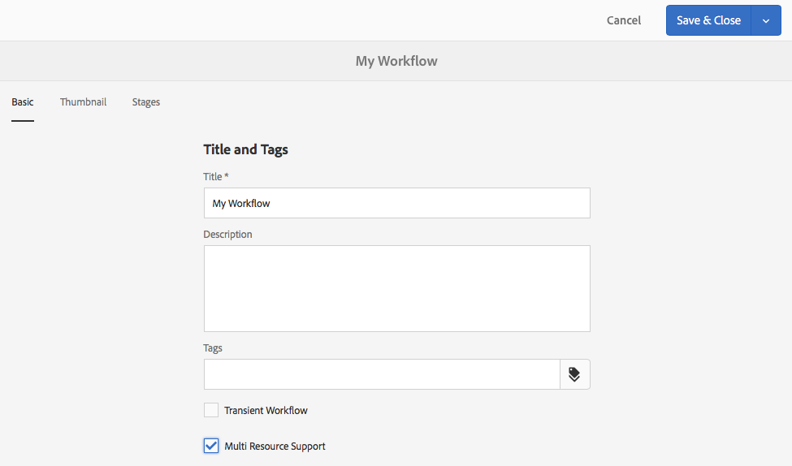
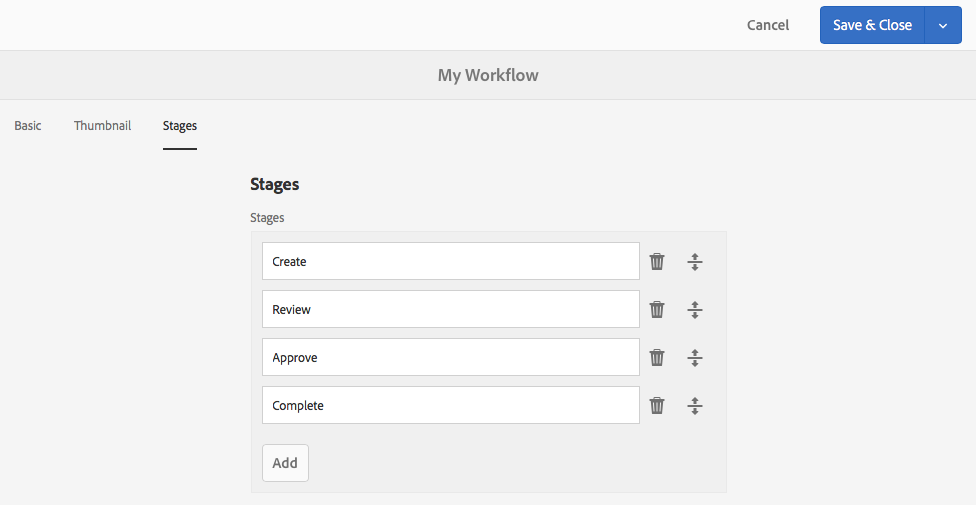

# 워크플로우 모델 만들기{#creating-workflow-models}

>[!CAUTION]
>
>클래식 UI를 사용하려면 [AEM 6.3 설명서를](https://helpx.adobe.com/experience-manager/6-3/sites-developing/workflows-models.html) 참조하십시오.

사용자가 워크플로우를 시작할 때 실행되는 일련의 단계를 정의하는 [워크플로우 모델을](/help/sites-developing/workflows.md#model) 만듭니다. 워크플로우가 일시적인지 또는 여러 리소스를 사용하는지 등의 모델 속성을 정의할 수도 있습니다.

사용자가 워크플로우를 시작하면 인스턴스가 시작됩니다. 변경 내용을 동기화할 때 [만든](#sync-your-workflow-generate-a-runtime-model) 해당 런타임 모델입니다.

## Creating a New Workflow {#creating-a-new-workflow}

새 워크플로우 모델을 처음 만들면 다음과 같은 내용이 포함됩니다.

* 흐름 시작 및 **[!UICONTROL 흐름 끝]** 단계입니다 ****.

   워크플로우의 시작과 끝을 나타냅니다. 이러한 단계는 필수이며 편집하거나 제거할 수 없습니다.

* 1단계라는 이름의 **참가자** 단계 **예**.

   이 단계는 작업 항목을 워크플로우 이니시에이터에 할당하도록 구성됩니다. 이 단계를 편집하거나 삭제하고 필요에 따라 단계를 추가합니다.

편집기로 새 워크플로우를 만들려면

1. 워크플로우 **[!UICONTROL 모델]** 콘솔을 엽니다. 도구, **[!UICONTROL 워크플로우]**, **[!UICONTROL 모델]****[!UICONTROL 또는]** 예를사용하여 다음을 수행할 수 있습니다.

   [http://localhost:4502/aem/workflow](http://localhost:4502/aem/workflow)

1. Select **[!UICONTROL Create]**, then **[!UICONTROL Create Model]**.
1. 워크플로우 모델 **[!UICONTROL 추가]** 대화 상자가 나타납니다. 완료를 선택하기 전에 **[!UICONTROL 제목]** 및 **[!UICONTROL 이름]** (선택 사항)을 **[!UICONTROL 입력합니다]**.
1. 새 모델은 워크플로우 모델 **[!UICONTROL 콘솔에]** 나열됩니다.
1. 새 워크플로우를 선택한 다음 [**[!UICONTROL 편집을&#x200B;]**사용하여 구성을 위해 엽니다](#editing-a-workflow).

   

>[!NOTE]
>
>프로그래밍 방식으로 모델을 만드는 경우(crx 패키지 사용) 다음 내에서 하위 폴더를 만들 수도 있습니다.
>
>`/var/workflow/models`
>
>예, `/var/workflow/models/prototypes`
>
>그러면 이 폴더를 사용하여 해당 폴더의 모델에 [대한 액세스를 관리할 수 있습니다](/help/sites-administering/workflows-managing.md#create-a-subfolder-in-var-workflow-models-and-apply-the-acl-to-that).

## 워크플로우 편집 {#editing-a-workflow}

기존 워크플로우 모델을 편집하여 다음을 수행할 수 있습니다.

* [단계](#adding-a-step-to-a-model) 및 해당 [매개변수 정의](#configuring-a-workflow-step)

* 작업 과정이 임시적인지 [](#configuring-workflow-stages-that-show-workflow-progress)여부 및/또는 [여러 리소스를](#creating-a-transient-workflow) 사용하는지 [여부를 포함한 작업 과정 속성을 구성합니다.](#configuring-a-workflow-for-multi-resource-support)

기본 [**또는 기존&#x200B;**(기본) 작업 과정](#editing-a-default-or-legacy-workflow-for-the-first-time)편집 작업 과정에는 추가 단계가 있어[안전한 복사본](/help/sites-developing/workflows-best-practices.md#locations-workflow-models)을 변경 전에사용할 수 있습니다.

워크플로우에 대한 업데이트가 완료되면 **[!UICONTROL 동기화]** 를 사용하여 런타임 모델 **[!UICONTROL 을 생성해야 합니다]**. 자세한 [내용은 워크플로우](#sync-your-workflow-generate-a-runtime-model) 동기화를 참조하십시오.

### 워크플로우 동기화 - 런타임 모델 생성 {#sync-your-workflow-generate-a-runtime-model}

**동기화** (편집기 도구 모음의 오른쪽)는 [런타임 모델을 생성합니다](/help/sites-developing/workflows.md#runtime-model). 런타임 모델은 사용자가 워크플로우를 시작할 때 실제로 사용되는 모델입니다. 변경 내용을 **[!UICONTROL 동기화하지]** 않으면 변경 내용을 런타임에 사용할 수 없습니다.

사용자(또는 다른 사용자)가 작업 과정을 변경하면 개별 대화 상자(예: 단계)에 **[!UICONTROL 자체 저장]** 옵션이 있는 경우에도 Sync를 사용하여 런타임 모델을 생성해야 합니다.

변경 사항이 런타임(저장된) 모델과 동기화되면 대신 **[!UICONTROL 동기화된]** 것이 표시됩니다.

일부 단계에는 필수 필드와/또는 유효성 검사가 내장되어 있습니다. 이러한 조건이 충족되지 않으면 모델 동기화를 시도하면 **[!UICONTROL 오류가]** 표시됩니다. 예를 들어, 참가자 단계에 대해 정의된 참가자가 없을 **[!UICONTROL 때]** :


### 처음 기본 또는 이전 워크플로우 편집 {#editing-a-default-or-legacy-workflow-for-the-first-time}

편집을 위해 [기본값 및/또는 이전 모델을](/help/sites-developing/workflows.md#workflow-types) 열 때:

* 단계 **** 브라우저는 사용할 수 없습니다(왼쪽).
* 도구 모음(오른쪽) **[!UICONTROL 에서]** 사용 가능한 편집 작업이 있습니다.
* 처음에는 모델 및 해당 속성이 다음과 같이 읽기 전용 모드로 표시됩니다.

   * 기본 워크플로우는 `/libs`
   * 기존 워크플로우는 `/etc`

편집을 **[!UICONTROL 선택하면]** 다음 작업이 수행됩니다.

* 워크플로우의 사본을 `/conf`
* 단계 **[!UICONTROL 브라우저]** 사용 가능
* 변경

>[!NOTE]
>
>자세한 [내용은 워크플로우 모델의](/help/sites-developing/workflows-best-practices.md#locations-workflow-models) 위치를 참조하십시오.


### 모델에 단계 추가 {#adding-a-step-to-a-model}

수행할 활동을 나타내려면 모델에 단계를 추가해야 합니다. 각 단계는 특정 활동을 수행합니다. 표준 AEM 인스턴스에서 여러 단계 구성 요소를 선택할 수 있습니다.

모델을 편집할 때 사용 가능한 단계가 단계 브라우저의 다양한 그룹에 **** 나타납니다. 예:


>[!NOTE]
>
>AEM과 함께 설치되는 기본 단계 구성 요소에 대한 자세한 내용은 워크플로우 단계 [참조를 참조하십시오](/help/sites-developing/workflows-step-ref.md).

**모델에 단계를 추가하려면 다음을 수행하십시오**.

1. 편집할 기존 워크플로우 모델을 엽니다. 워크플로우 **[!UICONTROL 모델]** 콘솔에서 필요한 모델을 선택한 다음 **[!UICONTROL 편집을 선택합니다]**.
1. 단계 **[!UICONTROL 브라우저를]** 엽니다. 위쪽 **[!UICONTROL 도구 모음]**&#x200B;맨 왼쪽에 있는 [사이드 패널 전환]을 사용합니다. 여기에서 다음을 수행할 수 있습니다.

   * **[!UICONTROL 특정 단계에 대해 필터링합니다]** .
   * 드롭다운 선택기를 사용하여 선택 사항을 특정 단계 그룹으로 제한합니다.
   * 해당 단계에 대한 자세한 내용을 표시하려면 설명 표시 아이콘  아이콘을 선택합니다.

   

1. 모델의 필요한 위치로 적절한 단계를 드래그합니다.

   참가자 단계 **[!UICONTROL 와 같은 작업을 할 수 있습니다]**.

   흐름에 추가되면 단계를 [구성할 수 있습니다](#configuring-a-workflow-step).

   

1. 필요에 따라 단계 또는 기타 업데이트를 추가합니다.

   런타임 시 단계에 따라 모델에 나타나는 순서대로 실행됩니다. 단계 구성 요소를 추가한 후 모델에서 다른 위치로 드래그할 수 있습니다.

   기존 단계를 복사, 잘라내기, 붙여넣기, 그룹 또는 삭제할 수도 있습니다. 를 [페이지 편집기와 연결합니다.](/help/sites-authoring/editing-content.md)

   도구 모음 옵션을 사용하여 분할 단계를 축소/확장할 수도 있습니다. 

1. 런타임 모델을 생성하기 위해 **[!UICONTROL 동기화]** (편집기 도구 모음)로 변경 사항을 확인합니다.

   자세한 [내용은 워크플로우](#sync-your-workflow-generate-a-runtime-model) 동기화를 참조하십시오.

### 워크플로우 단계 구성 {#configuring-a-workflow-step}

단계 **속성** 대화 상자를 사용하여 워크플로우 단계의 동작을 구성하고 사용자 **[!UICONTROL 지정할]** 수 있습니다.

1. 단계 **[!UICONTROL 속성]** 대화 상자를 열려면 다음 중 하나를 수행합니다.

   * 워크플로우 모델의 단계를 누르고 구성 요소 도구 모음 **[!UICONTROL 에서 구성을]** 선택합니다.
   * 단계를 두 번 클릭합니다.

   >[!NOTE]
   >
   >AEM과 함께 설치되는 기본 단계 구성 요소에 대한 자세한 내용은 워크플로우 단계 [참조를 참조하십시오](/help/sites-developing/workflows-step-ref.md).

1. 필요에 따라 **[!UICONTROL 단계 속성을]** 구성합니다. 사용 가능한 속성은 단계 유형에 따라 다르며, 사용 가능한 여러 탭이 있을 수도 있습니다. 예를 들어, 새 워크플로우에서 기본 **[!UICONTROL 참가자]**&#x200B;단계가 다음과 같이 표시됩니다 `Step 1`.

   

1. 확인 표시를 사용하여 업데이트를 확인합니다.
1. 런타임 모델을 생성하기 위해 **[!UICONTROL 동기화]** (편집기 도구 모음)로 변경 사항을 확인합니다.

   자세한 [내용은 워크플로우](#sync-your-workflow-generate-a-runtime-model) 동기화를 참조하십시오.

### 임시 워크플로우 만들기 {#creating-a-transient-workflow}

새 모델을 [생성하거나 기존](/help/sites-developing/workflows.md#transient-workflows) 모델을 편집하여 임시 워크플로우 모델을 생성할 수 있습니다.

1. 편집할 워크플로우 모델을 [엽니다](#editing-a-workflow).
1. 도구 **[!UICONTROL 모음에서 워크플로우 모델]** 속성을 선택합니다.
1. 대화 상자에서 임시 워크플로우 **[!UICONTROL 를 활성화]** (또는 필요한 경우 비활성화)합니다.

   

1. 저장 및 닫기로 변경 **[!UICONTROL 확인]**; 뒤에 **[!UICONTROL 동기화]** (편집기 도구 모음)가 표시되어 런타임 모델을 생성합니다.

   자세한 [내용은 워크플로우](#sync-your-workflow-generate-a-runtime-model) 동기화를 참조하십시오.

>[!NOTE]
>
>임시 [모드](/help/sites-developing/workflows.md#transient-workflows) AEM에서 워크플로우를 실행하면 워크플로우 내역이 저장되지 않습니다. 따라서 [타임라인은](/help/sites-authoring/basic-handling.md#timeline) 해당 워크플로우와 관련된 정보를 표시하지 않습니다. [](/help/sites-authoring/basic-handling.md#timeline)

### Touch UI에서 워크플로우 모델 사용 가능 {#make-workflow-models-available-in-touchui}

워크플로우 모델이 클래식 UI에 있지만 터치 UI의 **[!UICONTROL 타임라인]** 레일의 선택 팝업 메뉴에서 누락된 경우 구성에 따라 사용 가능하게 만듭니다. 다음 단계에서는 활성화 요청이라는 워크플로우 모델 **[!UICONTROL 을 사용하는 방법을 보여 줍니다]**.

1. 모델이 터치 가능 UI에서 사용할 수 없는지 확인합니다. 경로를 사용하여 자산에 `/assets.html/content/dam` 액세스합니다. 자산을 선택합니다. 왼쪽 **[!UICONTROL 레일에서]** 타임라인을 엽니다. 워크플로우 **[!UICONTROL 시작을]** 클릭하고 **[!UICONTROL 활성화]** 모델이 팝업 목록에 없는지 확인합니다.

1. 도구 > **[!UICONTROL 일반 > 태깅을 탐색합니다]**. 워크플로우 **[!UICONTROL 를 선택합니다]**.

1. 만들기 **[!UICONTROL > 태그 만들기를 선택합니다]**. [ **[!UICONTROL 제목]** ] `DAM` 과 [ **[!UICONTROL 이름]을]** 로 설정합니다 `dam`. **[!UICONTROL 제출]**을 선택합니다.
   

1. 도구 > **[!UICONTROL 워크플로우 > 모델로 이동합니다]**. 활성화 **[!UICONTROL 요청]**&#x200B;을 선택한 다음 편집을 **[!UICONTROL 선택합니다]**.

1. 편집 **[!UICONTROL 을]** 선택한 다음 워크플로우 모델 **[!UICONTROL 속성을 엽니다]**. 기본 **[!UICONTROL 탭으로]** 이동합니다.

1. 태그 `Workflow : DAM` 필드 **** 추가. 확인(확인 표시)을 사용하여 선택을 확인합니다.

1. 저장 및 닫기로 태그 추가 **[!UICONTROL 를 확인합니다]**.
   

1. Sync를 통해 프로세스를 **[!UICONTROL 완료합니다]**. 이제 터치 가능 UI에서 워크플로우를 사용할 수 있습니다.

### 다중 리소스 지원을 위한 워크플로우 구성 {#configuring-a-workflow-for-multi-resource-support}

새 모델을 만들거나 기존 모델을 편집할 때 [다중 리소스](/help/sites-developing/workflows.md#multi-resource-support) 지원에 대한 워크플로우 모델을 구성할 수 있습니다.

1. Open the workflow model for [editing](#editing-a-workflow).
1. 도구 **[!UICONTROL 모음에서 워크플로우 모델]** 속성을 선택합니다.

1. In the dialog box, activate **[!UICONTROL Multi Resource Support]** (or deactivate if required):

   

1. Confirm the change with **[!UICONTROL Save &amp; Close]**; followed by **[!UICONTROL Sync]** (editor toolbar) to generate the runtime model.

   자세한 [내용은 워크플로우](#sync-your-workflow-generate-a-runtime-model) 동기화를 참조하십시오.

### 워크플로우 단계 구성(워크플로우 진행 상태 표시) {#configuring-workflow-stages-that-show-workflow-progress}

[워크플로우 단계는](/help/sites-developing/workflows.md#workflow-stages) 작업을 처리할 때 워크플로우의 진행 상황을 시각화하는 데 도움이 됩니다.

>[!CAUTION]
>
>If workflow stages are defined in **[!UICONTROL Page Properties]**, but not used for any of the workflow steps, then the progress bar will not show any progress (regardless of the current workflow step).

사용 가능한 단계는 워크플로우 모델에서 정의됩니다. 기존 워크플로우 모델을 업데이트하여 단계 정의를 포함할 수 있습니다. 워크플로우 모델에 대해 원하는 단계 수를 정의할 수 있습니다.

워크플로우의 **[!UICONTROL 단계를]** 정의하려면

1. 편집할 워크플로우 모델을 엽니다.
1. 도구 **[!UICONTROL 모음에서 워크플로우 모델]** 속성을 선택합니다. 그런 다음 단계 **[!UICONTROL 탭을]** 엽니다.
1. 필요한 단계를 추가(및 위치) **[!UICONTROL 합니다]**. 워크플로우 모델에 대해 원하는 단계 수를 정의할 수 있습니다.

   예:

   

1. 저장 **[!UICONTROL 및 닫기를]** 클릭하여 속성을 저장합니다.
1. 워크플로우 모델의 각 단계에 스테이지를 지정합니다. 예:

   

   스테이지를 둘 이상의 단계에 할당할 수 있습니다. 예:

   | **단계** | **단계** |
   |---|---|
   | 1단계 | 만들기 |
   | 2단계 | 만들기 |
   | 3단계 | 리뷰 |
   | 4단계 | 승인 |
   | 5단계 | 승인 |
   | 6단계 | 완료 |

1. 런타임 모델을 생성하기 위해 **[!UICONTROL 동기화]** (편집기 도구 모음)로 변경 사항을 확인합니다.

   자세한 [내용은 워크플로우](#sync-your-workflow-generate-a-runtime-model) 동기화를 참조하십시오.

## 패키지에서 워크플로우 모델 내보내기 {#exporting-a-workflow-model-in-a-package}

1. 패키지 관리자를 사용하여 새 [패키지를 만듭니다](/help/sites-administering/package-manager.md#package-manager).

   1. 도구, 배포, 패키지 **[!UICONTROL 를]**&#x200B;통해 **[!UICONTROL 패키지]**&#x200B;관리자로 **[!UICONTROL 이동합니다]**.
   1. 패키지 **[!UICONTROL 만들기를 클릭합니다]**.
   1. 필요에 따라 **[!UICONTROL 패키지 이름]**&#x200B;및 기타 세부 사항을 지정합니다.
   1. **[!UICONTROL 확인]**&#x200B;을 클릭합니다.

1. 새 **[!UICONTROL 패키지의]** 도구 모음에서 편집을 클릭합니다.

1. Open the **[!UICONTROL Filters]** tab.

1. 필터 **[!UICONTROL 추가를]** 선택하고 워크플로우 모델 *디자인*&#x200B;경로를 지정합니다.

   `/conf/global/settings/workflow/models/<*your-model-name*>`

   완료를 **[!UICONTROL 클릭합니다]**.

1. 필터 **[!UICONTROL 추가를]** 선택하고 *런타임* 워크플로우 모델의 경로를 지정합니다.

   `/var/workflow/models/<*your-model-name*>`

   완료를 **[!UICONTROL 클릭합니다]**.

1. 모델에서 사용되는 사용자 정의 스크립트에 대한 필터를 추가합니다.
1. 저장 **[!UICONTROL 을]** 클릭하여 필터 정의를 확인합니다.
1. 패키지 정의 **[!UICONTROL 도구 모음에서]** 빌드를 선택합니다.
1. 패키지 **[!UICONTROL 도구 모음에서]** 다운로드를 선택합니다.

## 워크플로우를 사용하여 양식 제출 처리 {#using-workflows-to-process-form-submissions}

선택한 워크플로우에서 처리할 양식을 구성할 수 있습니다. 사용자가 양식을 제출하면 새 워크플로우 인스턴스가 만들어지고 양식 제출 데이터가 페이로드로 생성됩니다.

양식에 사용할 워크플로우를 구성하려면 다음을 수행하십시오.

1. 새 페이지를 만들고 열어 편집합니다.
1. Add a **[!UICONTROL Form]** component to the page.
1. 페이지에 **[!UICONTROL 나타나는 양식 시작]** 구성 요소를 구성합니다.
1. 워크플로우 **[!UICONTROL 시작을]** 사용하여 사용 가능한 워크플로우 중에서 원하는 워크플로우를 선택합니다.

   

1. 확인 표시를 사용하여 새 양식 구성을 확인합니다.

## 테스트 워크플로우 {#testing-workflows}

다양한 페이로드 유형을 사용하기 위해 워크플로우를 테스트할 때는 좋은 방법입니다. 개발되는 유형과 다른 유형을 포함합니다. 예를 들어, 워크플로우를 통해 자산을 처리하려면 페이지를 페이로드로 설정하여 테스트하고 오류가 발생하지 않도록 하십시오.

예를 들어 다음과 같이 새 워크플로우를 테스트합니다.

1. [콘솔에서 워크플로우 모델을](/help/sites-administering/workflows-starting.md) 시작합니다.
1. 페이로드를 **[!UICONTROL 정의하고]** 확인합니다.

1. 워크플로우가 진행될 수 있도록 필요에 따라 조치를 취합니다.
1. 워크플로가 실행되는 동안 로그 파일을 모니터링합니다.

로그 파일에 **[!UICONTROL DEBUG]** 메시지를 표시하도록 AEM을 구성할 수도 있습니다. 자세한 [내용은](/help/sites-deploying/configure-logging.md) 로깅을 **** 참조하고 개발이 끝나면 **[!UICONTROL 로그 수준을 다시 정보로]**&#x200B;설정합니다.

## 예 {#examples}

### 예: (단순) 게시 요청을 수락하거나 거부할 워크플로우 만들기 {#example-creating-a-simple-workflow-to-accept-or-reject-a-request-for-publication}

워크플로우를 만들 수 있는 몇 가지 가능성을 설명하기 위해 다음 예에서는 워크플로우의 변형을 `Publish Example` 만듭니다.

1. [새 워크플로우 모델을 만듭니다](#creating-a-new-workflow).

   새 워크플로우에는 다음이 포함됩니다.

   * **[!UICONTROL 플로우 시작]**
   * `Step 1`
   * **[!UICONTROL 플로우 끝]**

1. 삭제 `Step 1` (이 예제의 잘못된 단계 유형이므로):

   * 단계를 클릭하고 구성 요소 도구 모음에서 **[!UICONTROL 삭제를]** 선택합니다. 동작을 확인합니다.

1. 단계 브라우저의 **[!UICONTROL 워크플로우]** 선택 **[!UICONTROL 사항에서]** 참가자 단계를 **[!UICONTROL 워크플로우로 드래그한 다음 흐름 시작]** 및 **흐름 끝*에 배치합니다.
1. 속성 대화 상자를 열려면 다음 중 하나를 수행합니다.

   * 참가자 단계를 클릭하고 구성 요소 도구 모음 **[!UICONTROL 에서 구성을]** 선택합니다.
   * 참가자 단계를 두 번 클릭합니다.

1. 공통 **[!UICONTROL 탭]**`Validate Content` 에서 **[!UICONTROL 제목]** 및 설명 **[!UICONTROL 을 모두]**&#x200B;입력합니다.
1. 사용자/ **[!UICONTROL 그룹]** 탭을 엽니다.

   * Activate **[!UICONTROL Notify user via email]**.
   * 사용자/ `Administrator` 그룹 `admin`필드에서 **[!UICONTROL ()를]** 선택합니다.

   >[!NOTE]
   >
   >이메일을 전송하려면 메일 서비스 [와 사용자 계정 세부 사항을 구성해야 합니다](/help/sites-administering/notification.md).

1. 확인 표시를 사용하여 업데이트를 확인합니다.

   그러면 워크플로우 모델의 개요로 돌아갑니다. 이 경우 참가자 단계의 이름이 다음으로 바뀝니다 `Validate Content`.

1. 워크플로우로 **[!UICONTROL 또는 분할을]** 드래그하고 흐름 끝 `Validate Content` 간에 **[!UICONTROL 위치를 지정합니다]**.
1. 구성을 위해 **[!UICONTROL 또는 분할을]** 엽니다.
1. 구성:

   * **[!UICONTROL 일반]**: 분기 **[!UICONTROL 2개 선택]**
   * **[!UICONTROL 분기 1]**: 기본 경로 **[!UICONTROL 를 선택합니다]**.
   * **[!UICONTROL 지점 2]**: 기본 경로 **[!UICONTROL 가]** 선택되지 않았는지 확인합니다.

1. OR 분할에 대한 업데이트 **[!UICONTROL 를 확인합니다]**.
1. 참가자 단계 **[!UICONTROL 를]** 왼쪽 분기로 드래그하고 속성을 열고 다음 값을 지정한 다음 변경 사항을 확인합니다.

   * **[!UICONTROL 제목]**: `Reject Publish Request`
   * **[!UICONTROL 사용자/그룹]**: 예를 들면 `projects-administrators`
   * **[!UICONTROL 이메일을 통해 사용자에게 알림]**: 사용자가 이메일을 통해 알림을 받도록 활성화하십시오.

1. 프로세스 **[!UICONTROL 단계를]** 오른쪽 분기로 드래그하고 속성을 열고 다음 값을 지정한 다음 변경 사항을 확인합니다.

   * **[!UICONTROL 제목]**: `Publish Page as Requested`
   * **[!UICONTROL 프로세스]**: 선택합니다 `Activate Page`. 이 프로세스에서는 선택한 페이지를 게시자 인스턴스에 게시합니다.

1. 동기화 **** (편집기 도구 모음)를 클릭하여 런타임 모델을 생성합니다.

   자세한 [내용은 워크플로우](#sync-your-workflow-generate-a-runtime-model) 동기화를 참조하십시오.

   새로운 워크플로우 모델은 다음과 같습니다.

   

1. 사용자가 컨텐츠 유효성 **[!UICONTROL 확인 완료]** 단계로 이동할 **[!UICONTROL 때 페이지]** 를 요청된 ****&#x200B;로 게시할지 또는 게시 요청 **[!UICONTROL 게시]**&#x200B;를거부할지 여부를 선택할 수 있도록 이 워크플로우를 페이지에적용합니다.

   

### 예: OR 분할에 대한 규칙 정의 {#example-defining-a-rule-for-an-or-split}

**[!UICONTROL 또는 분할]** 단계를 통해 조건부 처리 경로를 워크플로우에 도입할 수 있습니다.

OR 규칙을 정의하려면

1. 두 개의 스크립트를 만들어 저장소에 저장합니다(예: 아래).

   `/apps/myapp/workflow/scripts`

   >[!NOTE]
   >
   >스크립트에는 부울 [를 반환하는 `check()`](#function-check) 함수가 있어야 합니다.

1. 워크플로우를 편집하고 모델에 **[!UICONTROL OR 분할을]** 추가합니다.
1. OR 분할의 **[!UICONTROL 분기 1]** 속성을 **[!UICONTROL 편집합니다]**.

   * 값 **[!UICONTROL 을 다음으로 설정하여]** 기본 경로 **[!UICONTROL 로]** 정의할 `true`수있습니다.
   * [ **[!UICONTROL 규칙]**]으로 스크립트 경로를 설정합니다. 예:

      `/apps/myapp/workflow/scripts/myscript1.ecma`
   >[!NOTE]
   >
   >필요한 경우 분기 주문을 전환할 수 있습니다.

1. OR 분할의 **[!UICONTROL 분기 2]** 속성을 **[!UICONTROL 편집합니다]**.

   * [ **[!UICONTROL 규칙]**]으로 다른 스크립트에 대한 경로를 설정합니다. 예:

      `/apps/myapp/workflow/scripts/myscript2.ecma`

1. 각 분기에서 개별 단계의 속성을 설정합니다. 사용자/ **[!UICONTROL 그룹이]** 설정되어 있는지 확인합니다.
1. 런타임 모델에 대한 변경 사항을 **유지하려면 동기화** (편집기 도구 모음)를 클릭합니다.

   자세한 [내용은 워크플로우](#sync-your-workflow-generate-a-runtime-model) 동기화를 참조하십시오.

#### Function Check() {#function-check}

>[!NOTE]
>
>ECMAScript [사용을 참조하십시오](/help/sites-developing/workflows-customizing-extending.md#using-ecmascript).

다음 샘플 스크립트에서는 노드가 아래 `true` 에 있는 `JCR_PATH` 경우 반환됩니다 `/content/we-retail/us/en`.

```
function check() {
    if (workflowData.getPayloadType() == "JCR_PATH") {
      var path = workflowData.getPayload().toString();
      var node = jcrSession.getItem(path);

      if (node.getPath().indexOf("/content/we-retail/us/en") >= 0) {
       return true;
      } else {
       return false;
      } 
     } else {
      return false;
     }
}
```

### Example: Customized Request for Activation {#example-customized-request-for-activation}

You can customize any of the out-of-the-box workflows. 사용자 지정된 비헤이비어를 만들려면 적절한 워크플로우의 세부 사항을 오버레이합니다.

For example, **[!UICONTROL Request for Activation]**. This workflow is used for publishing pages within **[!UICONTROL Sites]** and is automatically triggered when a content author does not have the appropriate replication rights. See [Customizing Page Authoring - Customizing the Request for Activation Workflow](/help/sites-developing/customizing-page-authoring-touch.md#customizing-the-request-for-activation-workflow) for further details.
