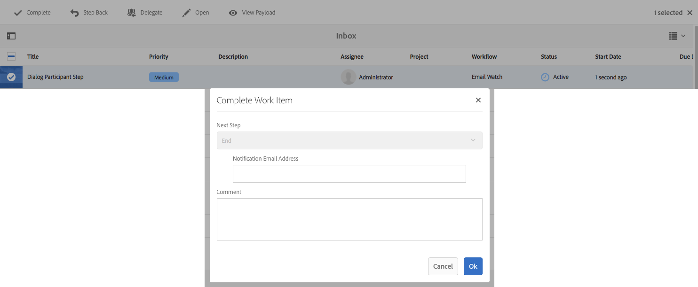

# 워크플로우 단계 참조{#workflow-step-reference}

워크플로우 모델은 다양한 유형의 일련의 단계로 구성됩니다. 유형에 따라, 이러한 단계는 필요한 기능과 컨트롤을 제공하기 위해 매개 변수 및 스크립트로 구성 및 확장할 수 있습니다.

>[!NOTE]
>
>이 섹션에서는 표준 워크플로우 단계를 다룹니다.
>
>모듈별 단계는 다음을 참조하십시오.
>
>* [AEM Forms 워크플로우 단계 참조](/help/forms/using/aem-forms-workflow-step-reference.md)
>* [Processing Assets Using Media Handlers and Workflows](/help/assets/media-handlers.md)

>


## 단계 속성 {#step-properties}

각 단계 구성 요소에는 필요한 속성을 정의하고 편집할 수 있는 **[!UICONTROL 단계 속성]** 대화 상자가 있습니다.

### 단계 속성 - 공통 탭 {#step-properties-common-tab}

대부분의 워크플로우 단계 구성 요소에는 속성 대화 상자의 **[!UICONTROL 공통]** 탭에서 다음 속성의 조합을 사용할 수 있습니다.

* **[!UICONTROL 제목]**

   단계의 제목입니다.

* **[!UICONTROL 설명]**

   단계에 대한 설명입니다.

* **[!UICONTROL 워크플로우 단계]**

   단계에 [스테이지](/help/sites-developing/workflows.md#workflow-stages) 적용을 위한 드롭다운 선택기.

* **[!UICONTROL 시간 초과]**

   단계가 &quot;시간 초과&quot;될 기간.

   다음 중에서 선택할 수 있습니다. **[!UICONTROL 꺼짐]**, **[!UICONTROL 1일]**, **[!UICONTROL 6h]**, **[!UICONTROL 6h]**, 12h ********,, 24h..

* **[!UICONTROL 시간 초과 핸들러]**

   단계가 시간 초과될 때 워크플로우를 제어하는 핸들러;예를 들면 다음과 같습니다.

   `Auto Advancer`

* **[!UICONTROL 핸들러 진행]**

   실행 후 워크플로우를 다음 단계로 자동 진행하려면 이 옵션을 선택합니다. 선택하지 않으면 구현 스크립트가 워크플로우 진행에 대해 처리되어야 합니다.

#### 단계 속성 - 사용자/그룹 탭 {#step-properties-user-group-tab}

속성 대화 상자의 **[!UICONTROL 사용자/그룹]** 탭에서 많은 워크플로우 단계 구성 요소에 대해 다음 속성을 사용할 수 있습니다.

* **[!UICONTROL 사용자에게 이메일로 알립니다]**

   * 워크플로우가 단계에 도달하면 참가자에게 이메일을 보내 참가자에게 통지할 수 있습니다.
   * 활성화된 경우, 그룹이 정의된 경우 **[!UICONTROL 사용자/그룹]** 또는 그룹의 각 구성원에 의해 정의된 사용자에게 이메일이 전송됩니다.

* **[!UICONTROL 사용자/그룹]**

   * 드롭다운 선택 상자를 사용하면 사용자나 그룹을 탐색하고 선택할 수 있습니다.
   * 특정 사용자에게 단계를 지정하는 경우 이 사용자만 단계에서 작업을 수행할 수 있습니다.
   * 단계를 전체 그룹에 지정하는 경우 워크플로우가 이 단계에 도달하면 이 그룹의 모든 사용자가 **[!UICONTROL Workflow 받은 편지함에 해당 작업을 갖게 됩니다]**.
   * 자세한 [내용은 워크플로우](/help/sites-authoring/workflows-participating.md) 참여를 참조하십시오.

## AND 분할 {#and-split}

AND **[!UICONTROL 분할은]** 워크플로우에서 분할을 생성하며 그 후에는 두 분기가 모두 활성화됩니다. 필요에 따라 각 분기에 워크플로우 단계를 추가합니다. 이 단계를 통해 워크플로우에 여러 처리 경로를 도입할 수 있습니다. 예를 들어 특정 검토 단계가 동시에 수행되도록 할 수 있으므로 시간을 절약할 수 있습니다.


### AND 분할 - 구성 {#and-split-configuration}

* AND **[!UICONTROL 분할]** 속성을 편집합니다.

   * **[!UICONTROL 분할 이름]**:설명을 위해 이름을 지정합니다.
   * 필요한 분기 수를 선택합니다.2, 3, 4 또는 5

* 필요에 따라 분기에 워크플로우 단계를 추가합니다.

   

## 컨테이너 단계 {#container-step}

컨테이너 **** 단계에서는 하위 워크플로로 실행되는 다른 워크플로우 모델을 시작합니다.

이 **[!UICONTROL 컨테이너를]** 사용하면 워크플로우 모델을 재사용하여 일반적인 단계 시퀀스를 구현할 수 있습니다. 예를 들어 여러 편집 워크플로우에서 번역 워크플로우 모델을 사용할 수 있습니다.


### 컨테이너 단계 - 구성 {#container-step-configuration}

단계를 구성하려면 다음 탭을 편집하고 사용하십시오.

* [**[!UICONTROL 일반]**](#step-properties-common-tab)
* **[!UICONTROL 컨테이너]**

   * **[!UICONTROL 하위 워크플로우]**:시작할 워크플로우를 선택합니다.

## 이동 단계 {#goto-step}

이동 단계 **[!UICONTROL 를]** 사용하면 ECMAScript의 결과에 따라 워크플로우 모델에서 다음 단계를 지정하여 실행할 수 있습니다.

* `true`:이동 **[!UICONTROL 단계가]** 완료되고 워크플로우 엔진은 지정된 단계를 실행합니다.

* `false`:이동 **[!UICONTROL 단계가]** 완료되고 일반 라우팅 로직이 실행할 다음 단계를 결정합니다.

이동 단계 **[!UICONTROL 를]** 사용하면 워크플로우 모델에서 고급 라우팅 구조를 구현할 수 있습니다. 예를 들어 루프를 구현하기 위해 루프 조건을 평가하는 스크립트와 함께 **[!UICONTROL 이동 단계를]** 정의하면 워크플로우의 이전 단계를 실행할 수 있습니다.

### 이동 단계 - 구성 {#goto-step-configuration}

단계를 구성하려면 다음 탭을 편집하고 사용하십시오.

* [**[!UICONTROL 일반]**](#step-properties-common-tab)
* **[!UICONTROL 프로세스]**

   * **[!UICONTROL 이동할 단계]**:실행할 단계를 선택합니다.
   * **[!UICONTROL 스크립트 경로]**:이동 단계 실행 여부를 결정하는 ECMAScript **[!UICONTROL 의 경로입니다]**.
   * **[!UICONTROL 스크립트]**:이동 단계 실행 여부를 결정하는 **[!UICONTROL ECMAScript]**.

>[!CAUTION]
>
>스크립트 **[!UICONTROL 경로]** 또는 **[!UICONTROL 스크립트를 지정합니다]**. 두 옵션을 동시에 사용할 수 없습니다. 두 속성에 대한 값을 지정하는 경우 이 단계에서는 **[!UICONTROL 스크립트 경로를 사용합니다]**.

#### 루프 시뮬레이션 {#simulating-a-for-loop}

for 루프를 시뮬레이션하려면 발생한 루프 반복 횟수의 카운트를 유지해야 합니다.

* 개수는 일반적으로 워크플로우에서 작동하는 항목의 인덱스를 나타냅니다.
* 개수는 루프의 종료 기준으로 평가됩니다.

예를 들어 여러 JCR 노드에서 작업을 수행하는 워크플로우를 구현하려면 루프 카운터를 노드의 인덱스로 사용할 수 있습니다. 카운트를 유지하려면 워크플로우 인스턴스의 데이터 맵에 `integer` 값을 저장합니다. 이동 단계 **[!UICONTROL 의]** 스크립트를 사용하여 카운트를 늘리고 종료 기준과 카운트를 비교할 수 있습니다.

```
function check(){
   var count=0;
   var keyname="loopcount"
   try{
      if (workflowData.getMetaDataMap().containsKey(keyname)){ 
        log.info("goto script: found loopcount key");
        count= parseInt(workflowData.getMetaDataMap().get(keyname))+1;
      } 
 
     workflowData.getMetaDataMap().put(keyname,count);
 
     }catch(err) {
         log.info(err.message);
         return false;
    }
   if (parseInt(count) <7){
       return true;
   } else {
      return false;
   }
}
```

## OR 분할 {#or-split}

OR **[!UICONTROL 분할은]** 워크플로우에서 분할을 생성하며 그 이후로는 하나의 분기만 활성화됩니다. 이 단계에서는 조건부 처리 경로를 워크플로에 도입할 수 있습니다. 필요에 따라 각 분기에 워크플로우 단계를 추가합니다.

>[!NOTE]
>
>OR 분할 만들기에 대한 자세한 내용은 다음을 참조하십시오. [https://helpx.adobe.com/experience-manager/using/aem64_workflow_servlet.html](https://helpx.adobe.com/experience-manager/using/aem64_workflow_servlet.html)


### OR 분할 - 구성 {#or-split-configuration}

* OR **[!UICONTROL 분할]** 속성을 편집합니다.

   * **[!UICONTROL 일반]**

      * 필요한 분기 수를 선택합니다.2, 3, 4 또는 5
   * **[!UICONTROL 분기:*x*>]**

      * **[!UICONTROL 스크립트 경로]**:스크립트를 포함하는 파일의 경로입니다.
      * **[!UICONTROL 스크립트]**:상자에 스크립트를 추가합니다.
      * **[!UICONTROL 기본 경로]**:여러 분기가 true로 평가되면 기본 분기 뒤에 옵니다. 분기를 기본값으로 하나만 지정할 수 있습니다.

   >[!NOTE]
   >
   >각 분기에는 별도의 탭이 있습니다.
   >
   >* 각 분기의 스크립트는 한 번에 하나씩 평가됩니다.
   >* 분기는 왼쪽에서 오른쪽으로 평가됩니다.
   >* true로 평가되는 첫 번째 스크립트가 실행됩니다.
   >* 분기가 true로 평가되지 않으면 워크플로우가 진행되지 않습니다.


   >[!CAUTION]
   >
   >스크립트 **[!UICONTROL 경로]** 또는 **[!UICONTROL 스크립트를 지정합니다]**. 두 옵션을 동시에 사용할 수 없습니다. 두 속성에 대한 값을 지정하는 경우 이 단계에서는 **[!UICONTROL 스크립트 경로를 사용합니다]**.

   >[!NOTE]
   >
   >OR [분할에 대한 규칙 정의를 참조하십시오](/help/sites-developing/workflows-models.md#example-defining-a-rule-for-an-or-split).

* 필요에 따라 분기에 워크플로우 단계를 추가합니다.

## 참가자 단계 및 선택기 {#participant-steps-and-choosers}

### 참가자 단계 {#participant-step}

참가자 단계 **[!UICONTROL 를]** 사용하면 특정 작업에 대한 소유권을 지정할 수 있습니다. 사용자가 단계를 수동으로 확인한 경우에만 워크플로우가 계속됩니다. 다른 사람이 워크플로우에 대해 조치를 취하도록 할 때 사용됩니다.예를 들어 검토 단계입니다.

직접 관련이 없지만 작업을 지정할 때는 사용자 인증을 고려해야 합니다.사용자는 워크플로우 페이로드인 페이지에 액세스할 수 있어야 합니다.

#### 참가자 단계 - 구성 {#participant-step-configuration}

단계를 구성하려면 다음 탭을 편집하고 사용하십시오.

* [**[!UICONTROL 일반]**](#step-properties-common-tab)
* [**[!UICONTROL 사용자/그룹]**](#step-properties-user-group-tab)

>[!NOTE]
>
>다음과 같은 경우 워크플로우 이니시에이터에 항상 알림 메시지가 표시됩니다.
>
>* 워크플로가 완료됨(완료).
>* 워크플로가 중단됩니다(종료됨).

>


>[!NOTE]
>
>이메일 알림을 활성화하려면 일부 속성을 구성해야 합니다. 이메일 템플릿을 사용자 정의하거나 새 언어의 이메일 템플릿을 추가할 수도 있습니다. See [Configuring Email Notification](/help/sites-administering/notification.md) to configure email notifications in AEM.

### 대화 상자 참가자 단계 {#dialog-participant-step}

대화 **[!UICONTROL 상자 참가자 단계를]** 사용하여 작업 항목이 지정된 사용자로부터 정보를 수집합니다. 이 단계는 나중에 워크플로우에서 사용되는 적은 양의 데이터를 수집하는 데 유용합니다.

단계를 완료하면 작업 항목 **[!UICONTROL 완료]** 대화 상자에 대화 상자에서 정의한 필드가 포함됩니다. 필드에 수집된 데이터는 워크플로우 페이로드의 노드에 저장됩니다. 이후 워크플로우 단계에서는 저장소에서 값을 읽을 수 있습니다.

단계를 구성하려면 작업 항목을 지정할 그룹 또는 사용자와 대화 상자의 경로를 지정합니다.

#### 대화 상자 참가자 단계 - 구성 {#dialog-participant-step-configuration}

단계를 구성하려면 다음 탭을 편집하고 사용하십시오.

* [**[!UICONTROL 일반]**](#step-properties-common-tab)
* [**[!UICONTROL 사용자/그룹]**](#step-properties-user-group-tab)
* **[!UICONTROL 대화 상자]**

   * **[!UICONTROL 대화 상자 경로**]:생성하는 [대화 상자의 대화 상자 노드에 대한 경로입니다](#dialog-participant-step-creating-a-dialog).

#### 대화 상자 참가자 단계 - 대화 상자 만들기{#dialog-participant-step-creating-a-dialog}

대화 상자를 만들려면:

* 결과 데이터가 페이로드에서 [저장되는 위치를 결정합니다](#dialog-participant-step-storing-data-in-the-payload).
* [대화 상자 정의;여기에는 데이터를 수집(및 저장)하는 데 사용되는 필드 정의가 포함됩니다](#dialog-participant-step-dialog-definition).

#### 대화 상자 참가자 단계 - 페이로드에 데이터 저장 {#dialog-participant-step-storing-data-in-the-payload}

워크플로우 페이로드 또는 작업 항목 메타데이터에 위젯 데이터를 저장할 수 있습니다. widget 노드의 `name` 속성 형식은 데이터가 저장되는 위치를 결정합니다.

* **[!UICONTROL 페이로드를 사용하여 데이터 저장]**

   * 위젯 데이터를 워크플로우 페이로드의 속성으로 저장하려면 위젯 노드의 이름 속성 값에 다음 형식을 사용하십시오.

      `./jcr:content/nodename`

   * 데이터는 페이로드 노드의 `nodename` 속성에 저장됩니다. 노드에 해당 속성이 없으면 속성이 만들어집니다.
   * 페이로드와 함께 저장된 경우, 동일한 페이로드를 사용하는 대화 상자가 속성 값을 덮어씁니다.

* **[!UICONTROL 작업 항목을 사용하여 데이터 저장]**

   * 위젯 데이터를 작업 항목 메타데이터의 속성으로 저장하려면 이름 속성 값에 다음 형식을 사용하십시오.

      `nodename`

   * 데이터는 작업 항목의 `nodename` 속성에 저장됩니다 `metadata`. 이후에 동일한 페이로드와 함께 대화 상자가 사용되는 경우 데이터가 유지됩니다.

#### 대화 상자 참가자 단계 - 대화 상자 정의 {#dialog-participant-step-dialog-definition}

1. **[!UICONTROL 대화 상자 구조]**

   대화 상자 참가자 단계에 대한 대화 상자는 구성 요소를 작성하기 위해 만드는 대화 상자와 유사합니다. 이러한 템플릿은 다음 위치에 저장됩니다.

   `/apps/myapp/workflow/dialogs`

   표준 터치 지원 UI에 대한 대화 상자의 노드 구조는 다음과 같습니다.

   ```xml
   newComponent (cq:Component)
     |- cq:dialog (nt:unstructured)
       |- content 
         |- layout 
           |- items 
             |- column 
               |- items 
                 |- component0
                 |- component1
                 |- ...
   ```

   >[!NOTE]
   >
   >자세한 내용은 대화 [상자 만들기 및 구성을 참조하십시오](/help/sites-developing/developing-components.md#creating-and-configuring-a-dialog).

1. **[!UICONTROL 대화 상자 경로 속성]**

   대화 **[!UICONTROL 참가자 단계에는]** **[!UICONTROL 대화 상자 경로]** 속성(참가자 단계 [의 속성과 함께)이](#participant-step)있습니다. Dialog Path **[!UICONTROL 속성]** 값은 대화 상자 `dialog` 노드의 경로입니다.

   예를 들어 대화 상자는 노드에 저장되는 이름이 지정된 구성 요소 `EmailWatch` 에 포함됩니다.

   `/apps/myapp/workflows/dialogs`

   터치 지원 UI의 경우 대화 상자 경로 **[!UICONTROL 속성에 다음 값이]** 사용됩니다.

   `/apps/myapp/workflow/dialogs/EmailWatch/cq:dialog`

   

1. **대화 상자 정의 예**

   다음 XML 코드 조각은 페이로드 컨텐츠의 노드 `String` 에 값을 저장하는 대화 `watchEmail` 상자를 나타냅니다. 제목 노드는 TextField [구성 요소를](https://helpx.adobe.com/experience-manager/6-4/sites/developing/using/reference-materials/granite-ui/api/jcr_root/libs/granite/ui/components/coral/foundation/form/textfield/index.html) 나타냅니다.

   ```xml
   jcr:primaryType="nt:unstructured" 
       jcr:title="Watcher Email Address Dialog" 
       sling:resourceType="cq/gui/components/authoring/dialog">
       <content jcr:primaryType="nt:unstructured"
           sling:resourceType="granite/ui/components/foundation/container">
           <layout jcr:primaryType="nt:unstructured" 
               margin="false" 
               sling:resourceType="granite/ui/components/foundation/layouts/fixedcolumns"
           />
           <items jcr:primaryType="nt:unstructured">
               <column jcr:primaryType="nt:unstructured"
                   sling:resourceType="granite/ui/components/foundation/container">
                   <items jcr:primaryType="nt:unstructured">
                       <title jcr:primaryType="nt:unstructured" 
                           fieldLabel="Notification Email Address" 
                           name="./jcr:content/watchEmails"
                           sling:resourceType="granite/ui/components/foundation/form/textfield"
                       />
                   </items>
               </column>
           </items>
       </content>
   </cq:dialog>
   ```

   이 예제는 터치 지원 UI의 경우 다음과 같은 대화 상자가 나타납니다.

   

### 동적 참가자 단계 {#dynamic-participant-step}

동적 **[!UICONTROL 참가자 단계]** 구성 요소는 **[!UICONTROL 참가자 단계와]** 유사하며, 이는 런타임 시 참가자가 자동으로 선택된다는 차이점입니다.

단계를 구성하려면 대화 상자와 함께 **[!UICONTROL 작업 항목을 지정할 참가자를]** 식별하는 참가자 선택기를 선택합니다.

#### 동적 참가자 단계 - 구성 {#dynamic-participant-step-configuration}

단계를 구성하려면 다음 탭을 편집하고 사용하십시오.

* [**[!UICONTROL 일반]**](#step-properties-common-tab)
* **[!UICONTROL 참가자 선택기]**

   * **[!UICONTROL 참가자 선택기]**:만든 [참가자 선택기의 이름입니다](#dynamic-participant-step-developing-the-participant-chooser).
   * **[!UICONTROL 인수]**:필요한 인수입니다.
   * **[!UICONTROL 이메일]**:사용자에게 이메일 알림을 전송할지 여부.

* **[!UICONTROL 대화 상자]**

   * **[!UICONTROL 대화 상자 경로]**:대화 상자 참가자 단계와 같이 사용자가 [생성하는 대화 **상자 노드**&#x200B;경로입니다](#dialog-participant-step-creating-a-dialog).

#### 동적 참가자 단계 - 참가자 선택기 개발 {#dynamic-participant-step-developing-the-participant-chooser}

참가자 선택기를 만듭니다. 따라서 선택 로직이나 기준을 사용할 수 있습니다. 예를 들어, 참가자 선택자는 가장 적은 작업 항목이 있는 사용자(그룹 내)를 선택할 수 있습니다. 워크플로우 모델에서 다른 **동적 참가자 단계 구성 요소 인스턴스에 사용할 참가자 선택기를** 원하는 수만큼 만들 수 있습니다.

작업 항목을 할당할 사용자를 선택하는 OSGi 서비스 또는 ECMAScript를 만듭니다.

* **[!UICONTROL ECMAscript]**

   스크립트에는 사용자 ID를 `String` 값으로 반환하는 getParticipant라는 함수가 포함되어야 합니다. 사용자 정의 스크립트를 폴더 또는 하위 폴더 `/apps/myapp/workflow/scripts` 에 저장합니다.

   샘플 스크립트는 표준 AEM 인스턴스에 포함됩니다.

   `/libs/workflow/scripts/initiator-participant-chooser.ecma`

   >[!CAUTION]
   >
   >경로 *에서 어떤 것도 변경하지* 않아야 `/libs` 합니다.
   >
   >
   >이는 다음에 인스턴스를 업그레이드할 때 `/libs` 의 콘텐트가 덮어쓰기되기 때문입니다(핫픽스 또는 기능 팩을 적용할 때 덮어쓸 수 있습니다).

   이 스크립트는 Workflow 초기자를 참가자로 선택합니다.

   ```
   function getParticipant() {
       return workItem.getWorkflow().getInitiator();
   }
   ```

   >[!NOTE]
   >
   >워크플로우 **[!UICONTROL 개시자 참가자 선택기]** 구성 요소는 **[!UICONTROL 동적 참가자 단계를]** 확장하고 이 스크립트를 단계 구현으로 사용합니다.

* **[!UICONTROL OSGi 서비스]**

   서비스는 com.day.cq.workflow.exec. [ParticipantStepChooser 인터페이스를 구현해야](https://helpx.adobe.com/experience-manager/6-4/sites/developing/using/reference-materials/javadoc/com/day/cq/workflow/exec/ParticipantStepChooser.html) 합니다. 인터페이스는 다음 멤버를 정의합니다.

   * `SERVICE_PROPERTY_LABEL` field:이 필드를 사용하여 참가자 선택자의 이름을 지정합니다. 이 이름은 **[!UICONTROL 동적 참가자 단계 속성에 있는 사용 가능한 참가자 선택기 목록에]** 나타납니다.
   * `getParticipant` method:동적으로 해결된 주체 ID를 값으로 `String` 반환합니다.

   >[!CAUTION]
   >
   >이 `getParticipant` 메서드는 동적으로 해결된 주체 ID를 반환합니다. 그룹 ID 또는 사용자 ID일 수 있습니다.
   >
   >
   >하지만 참가자 목록이 반환되는 경우 **[!UICONTROL 참가자 단계에만]**&#x200B;그룹 ID를 사용할 수 있습니다. 동적 **[!UICONTROL 참가자 단계의 경우]** 빈 목록이 반환되며 이 목록은 위임에 사용할 수 없습니다.

   동적 **[!UICONTROL 참가자 단계]** 구성 요소에서 구현을 사용할 수 있도록 하려면 서비스를 내보내는 OSGi 번들에 Java 클래스를 추가하고 번들을 AEM 서버에 배포합니다.

   >[!NOTE]
   >
   >**[!UICONTROL 임의 참가자 선택기]** 는 임의의 사용자()를 선택하는 샘플 `com.day.cq.workflow.impl.process.RandomParticipantChooser`서비스입니다. 임의 **[!UICONTROL 참가자 선택기]** 단계 구성 요소 샘플에서는 **[!UICONTROL 동적 참가자 단계를]** 확장하고 이 서비스를 단계 구현으로 사용합니다.

#### 동적 참가자 단계 - 예제 참가자 선택기 서비스 {#dynamic-participant-step-example-participant-chooser-service}

다음 Java 클래스는 `ParticipantStepChooser` 인터페이스를 구현합니다. 클래스는 워크플로우를 시작한 참가자의 이름을 반환합니다. 코드는 샘플 스크립트()에서 사용하는 것과 동일한 로직을 사용합니다. `initator-participant-chooser.ecma`

주석을 `@Property` 사용하면 필드 값 `SERVICE_PROPERTY_LABEL` 을 설정할 수 `Workflow Initiator Participant Chooser`있습니다.

```java
package com.adobe.example;

import org.apache.felix.scr.annotations.Component;
import org.apache.felix.scr.annotations.Properties;
import org.apache.felix.scr.annotations.Property;
import org.apache.felix.scr.annotations.Service;
import org.osgi.framework.Constants;
import org.slf4j.Logger;
import org.slf4j.LoggerFactory;

import com.adobe.granite.workflow.WorkflowException;
import com.adobe.granite.workflow.WorkflowSession;
import com.adobe.granite.workflow.exec.ParticipantStepChooser;
import com.adobe.granite.workflow.exec.WorkItem;
import com.adobe.granite.workflow.metadata.MetaDataMap;

@Component
@Service
@Properties({
        @Property(name = Constants.SERVICE_DESCRIPTION, value = "An example implementation of a dynamic participant chooser."),
        @Property(name = ParticipantStepChooser.SERVICE_PROPERTY_LABEL, value = "Workflow Initiator Participant Chooser (service)") })
public class InitiatorParticipantChooser implements ParticipantStepChooser {

 private Logger logger = LoggerFactory.getLogger(this.getClass());

 public String getParticipant(WorkItem arg0, WorkflowSession arg1,
   MetaDataMap arg2) throws WorkflowException {

  String initiator = arg0.getWorkflow().getInitiator();
  logger.info("Assigning Dynamic Participant Step work item to {}",initiator);

  return initiator;
 }
}
```

[ **[!UICONTROL 동적 참가자 단계]** 속성] 대화 상자의 **[!UICONTROL 참가자 선택기]** 목록에는 이 서비스를 나타내는 항목 `Workflow Initiator Participant Chooser (script)`이 포함되어 있습니다.

&quot;워크플로우 모델이 시작되면, 로그는 워크플로우를 시작한 사용자 및 작업 항목을 할당한 사용자의 ID를 나타냅니다. 이 예에서는 사용자가 `admin` 워크플로우를 시작했습니다.

`13.09.2015 15:48:53.037 *INFO* [10.176.129.223 [1347565733037] POST /etc/workflow/instances HTTP/1.1] com.adobe.example.InitiatorParticipantChooser Assigning Dynamic Participant Step work item to admin`

### 양식 참가자 단계 {#form-participant-step}

양식 **[!UICONTROL 참가자 단계에서는]** 작업 항목이 열리면 양식을 보여 줍니다. 사용자가 양식을 채우고 제출하면 필드 데이터는 워크플로우 페이로드 노드에 저장됩니다.

단계를 구성하려면 작업 항목을 지정할 그룹 또는 사용자와 양식의 경로를 지정합니다.

>[!CAUTION]
>
>이 섹션에서는 페이지 작성을 위한 기초 구성 요소의 [Forms 섹션에 대해 설명합니다](/help/sites-authoring/default-components-foundation.md#form).

#### 양식 참가자 단계 - 구성 {#form-participant-step-configuration}

단계를 구성하려면 다음 탭을 편집하고 사용하십시오.

* [**[!UICONTROL 일반]**](#step-properties-common-tab)
* [**[!UICONTROL 사용자/그룹]**](#step-properties-user-group-tab)
* **[!UICONTROL 양식]**

   * **[!UICONTROL 양식 경로]**:만든 [양식의 경로입니다](#form-participant-step-creating-the-form).

#### 양식 참가자 단계 - 양식 만들기 {#form-participant-step-creating-the-form}

양식 참가자 단계와 함께 **[!UICONTROL 사용할 양식을]** 만듭니다. 그러나 양식 참가자 단계의 양식에는 다음 구성이 있어야 합니다.

* 양식 **[!UICONTROL 시작 구성]** 요소에는 **[!UICONTROL 작업 유형]** 속성이 `Edit Workflow Controlled Resource(s)`설정되어 있어야합니다.

* 양식 **[!UICONTROL 시작]** 구성 요소에는 `Form Identifier` 속성 값이 있어야 합니다.

* 양식 구성 요소에는 **요소 이름** 속성이 필드 데이터가 저장되는 노드의 경로에 설정되어 있어야 합니다. 경로는 워크플로우 페이로드 컨텐츠에서 노드를 찾아야 합니다. 값은 다음 형식을 사용합니다.

   `./jcr:content/path_to_node`

* 양식에는 **[!UICONTROL 워크플로우 제출 단추 구성 요소가 포함되어야]** 합니다. 구성 요소의 속성은 구성하지 않습니다.

워크플로우의 요구 사항에 따라 필드 데이터를 저장할 위치가 결정됩니다. 예를 들어 필드 데이터를 사용하여 페이지 컨텐츠의 속성을 구성할 수 있습니다. 다음 요소 이름 **[!UICONTROL 속성]** 값은 필드 데이터를 `redirectTarget` 노드의 `jcr:content` 속성 값으로 저장합니다.

`./jcr:content/redirectTarget`

다음 예에서 필드 데이터는 페이로드 페이지에서 **[!UICONTROL 텍스트]** 구성 요소의 컨텐츠로 사용됩니다.

`./jcr:content/par/text_3/text`

&quot;첫 번째 예는 구성 요소가 렌더링하는 페이지에 사용할 수 `cq:Page` 있습니다. 두 번째 예는 페이로드 페이지에 ID가 있는 **텍스트** 구성 요소가 포함된 경우에만 사용할 수 `text_3`있습니다.

양식은 저장소의 어느 곳에서든 찾을 수 있지만 워크플로우 사용자는 양식을 읽을 수 있는 권한을 부여받아야 합니다.

### 임의 참가자 선택기 {#random-participant-chooser}

임의 **[!UICONTROL 참가자 선택기]** 단계는 목록에서 임의로 선택한 사용자에게 생성된 작업 항목을 할당하는 참가자 선택기입니다.


#### 임의 참가자 선택기 - 구성 {#random-participant-chooser-configuration}

단계를 구성하려면 다음 탭을 편집하고 사용하십시오.

* [**[!UICONTROL 일반]**](#step-properties-common-tab)
* **[!UICONTROL 인수]**

   * **[!UICONTROL 참가자]**:선택할 수 있는 사용자 목록을 지정합니다. 목록에 사용자를 추가하려면 항목 **[!UICONTROL 추가]** 를 클릭하고 사용자 노드 또는 사용자 ID의 홈 경로를 입력합니다. 사용자 순서는 작업 항목을 할당할 가능성에 영향을 주지 않습니다.

### 워크플로우 개시자 참가자 선택기 {#workflow-initiator-participant-chooser}

워크플로우 **[!UICONTROL 개시자 참가자 선택기]** 단계는 워크플로우를 시작한 사용자에게 생성된 작업 항목을 할당하는 참가자 선택기입니다. 공통 속성 외에 구성할 **[!UICONTROL 속성이]** 없습니다.

#### Workflow Initiator Participant Chooser - Configuration {#workflow-initiator-participant-chooser-configuration}

단계를 구성하려면 다음 탭을 사용하여 편집합니다.

* [**[!UICONTROL 일반]**](#step-properties-common-tab)

## 프로세스 단계 {#process-step}

프로세스 **[!UICONTROL 단계는]** ECMAScript를 실행하거나 OSGi 서비스를 호출하여 자동 처리를 수행합니다.


### 프로세스 단계 - 구성 {#process-step-configuration}

단계를 구성하려면 다음 탭을 편집하고 사용하십시오.

* [**[!UICONTROL 일반]**](#step-properties-common-tab)
* **[!UICONTROL 프로세스]**

   * **[!UICONTROL 프로세스]**:실행할 프로세스 구현입니다. 드롭다운 메뉴를 사용하여 ECMAScript 또는 OSGi 서비스를 선택합니다. 에 대한 자세한 내용:

      * 표준 ECMAScripts 및 OSGi 서비스는 [처리 단계에 대한 기본 제공 프로세스를 참조하십시오](/help/sites-developing/workflows-process-ref.md).
      * 프로세스 단계를 위한 ECMAScripts **[!UICONTROL 생성]** , ECMAScript [를 사용한 프로세스 단계 구현을 참조하십시오](/help/sites-developing/workflows-customizing-extending.md#using-ecmascript).
      * 프로세스 단계에 대한 OSGi 서비스 **[!UICONTROL 생성]** , Java [클래스를 사용한 프로세스 단계 구현을 참조하십시오](/help/sites-developing/workflows-customizing-extending.md#implementing-a-process-step-with-a-java-class).
   * **[!UICONTROL 처리기 고급]**:실행 후 워크플로우를 다음 단계로 자동 진행하려면 이 옵션을 선택합니다. 선택하지 않으면 구현 스크립트가 워크플로우 진행에 대해 처리되어야 합니다.
   * **[!UICONTROL 인수]**:프로세스에 전달할 인수입니다.


